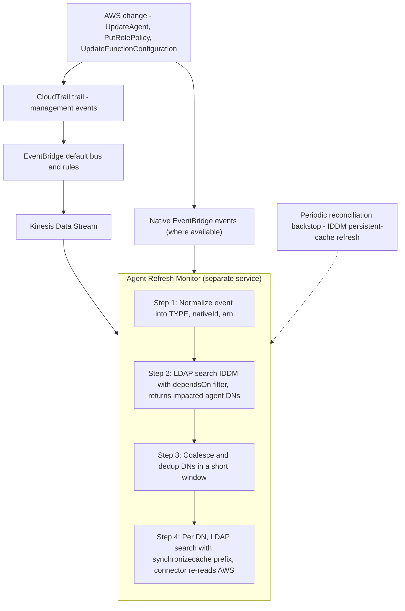
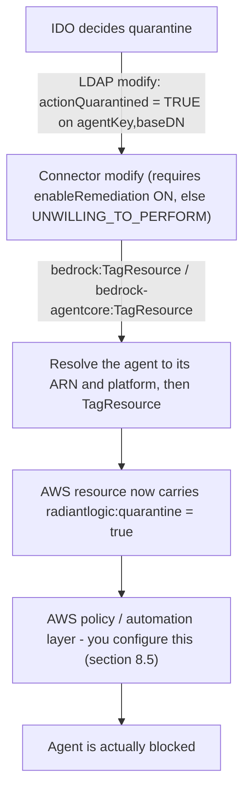
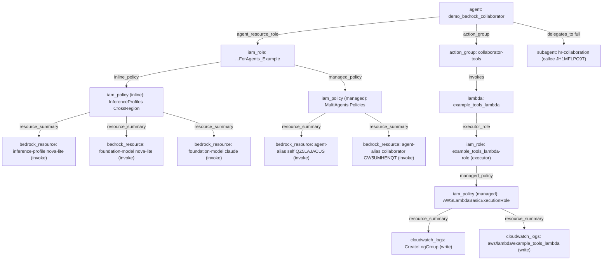
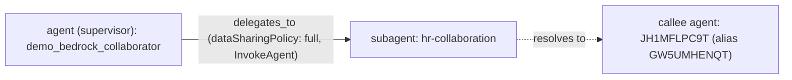

# AWS Bedrock Agent Connector for RadiantOne IDDM — User Guide

**Product:** AWS Bedrock Agent Connector (IDDM custom connector)
**Version:** 1.0.1 (see [release history](readme.md#release-history))
**Author / Publisher:** Radiant Logic

This is the complete, self-contained guide to the AWS Bedrock Agent Connector — a RadiantOne IDDM
custom connector that brings **agentic AI** under Identity Observability (IDO) governance by exposing
AWS Bedrock Agents and Bedrock AgentCore Runtimes as LDAP identities.

It is written for two audiences:

- **Operators** — install, configure, run, troubleshoot: sections 3, 4, 9, 10, 11.
- **Architects & security** — data model, mapping, real-time sync, write-back model: sections 5, 6, 7, 8.

## Table of contents

1. [Introduction — agentic AI identity for IDO](#1-introduction--agentic-ai-identity-for-ido)
2. [Background — AWS Bedrock & AgentCore](#2-background--aws-bedrock--agentcore)
3. [Installation & deployment](#3-installation--deployment)
4. [Configuration reference — all parameters](#4-configuration-reference--all-parameters)
5. [The agent data model](#5-the-agent-data-model)
6. [Data model ↔ AWS mapping](#6-data-model--aws-mapping)
7. [Keeping IDDM in sync](#7-keeping-iddm-in-sync)
8. [Write-back — quarantine remediation](#8-write-back--quarantine-remediation)
9. [Performance & scale](#9-performance--scale)
10. [Capacity planning — memory](#10-capacity-planning--memory)
11. [Logs & troubleshooting](#11-logs--troubleshooting)
12. [Appendices](#12-appendices)

---

## 1. Introduction — agentic AI identity for IDO

### 1.1 What this connector is

The AWS Bedrock Agent Connector is an IDDM **custom connector** that discovers every AI agent in the
configured AWS account(s) and region — one account by default, or several in a single crawl via
assume-role fan-out (§3.5.3) — and presents each one as an LDAP entry inside RadiantOne IDDM. Each
agent becomes an entry of the objectclass **`vdAgentIdentity`**, carrying a rich, normalized
description of the agent: its identity, status, the foundation model it runs, its guardrails, the
tools and data it can reach, the IAM permissions behind it, who created and last changed it, and more.

### 1.2 Why — non-human identity governance for agentic AI

AI agents are a fast-growing class of **non-human identity (NHI)**. They hold credentials, assume IAM
roles, call tools, read data stores, and act on behalf of the organization — often with standing
privilege and little oversight. Identity Observability (IDO) exists to bring humans, services, and now
**agents** into one governable identity fabric. This connector is the AWS arm of that effort: it makes
Bedrock agents *first-class identities* that IDO can inventory, correlate with the IAM roles and
resources they depend on, monitor for risky change, and — through the one opt-in write path —
**quarantine**.

### 1.3 What it produces at a glance

- One LDAP entry per Bedrock Agent and per AgentCore Runtime in the configured **account(s) + region**
  (single account by default; multiple accounts in one crawl via assume-role fan-out).
- Records shaped to a **provider-agnostic agent data model** (see §5), so AWS agents sit alongside
  agents from other platforms in a uniform schema.

### 1.4 Posture — read-only by default, exactly one opt-in write

The connector is **read-only by default**. It exposes exactly **one** optional write: an LDAP `modify`
of the `actionQuarantined` attribute sets or clears a marker tag on the AWS resource, gated by
`enableRemediation` (default **off**). All scanning and enrichment is read-only. See §8 for the full
write-back design and the AWS-side setup that makes a quarantine effective.

`modify` result codes are precise, because **`actionQuarantined` is the only writable attribute**:

| Request | Result code | Meaning |
|---|---|---|
| `modify` of `actionQuarantined`, `enableRemediation` **on** | `SUCCESS` (0) | Marker tag written |
| `modify` of `actionQuarantined`, `enableRemediation` **off** | `UNWILLING_TO_PERFORM` (53) | Writable attribute, but the connector declines; nothing written |
| `modify` of **any other attribute** (all are read-only) | `OPERATIONS_ERROR` (1) | Rejected; nothing written |
| `modify` whose DN carries no `agentKey`/`agentId` RDN | `NO_SUCH_OBJECT` (32) | Target not resolvable |

### 1.5 Scope & non-goals

- **One region per data source**, but **multiple AWS accounts in a single crawl** — via assume-role
  fan-out (`accountIds` + `assumeRoleName`, or `assumeRoleTargets` for heterogeneous accounts; §3.5.3).
  For more regions, configure one data source per region. Multi-account quarantine *write-back* is not
  yet supported (the write targets the primary account).
- **Not a runtime proxy.** The connector reads control-plane metadata; it does not sit in the agent's
  invocation path.
- **The real-time refresh loop is a separate component.** This connector *publishes* a dependency index
  (`dependsOn`) and *serves* fresh data on demand; a companion change-detection service reacts to AWS
  change events and triggers refreshes (§7). That service ships separately.
- **Non-AWS agent platforms are out of scope** — they are covered by their own connectors.

### 1.6 Connector type, target application & supported operations

| Fact | Value |
|---|---|
| **Connector type** | **SDK connector** — built on the IDDM Connector SDK (1.2.0). **Not a legacy plugin**: there is no class name to enter by hand. Its configuration form is **auto-populated on import** from a descriptor embedded in the JAR. |
| **Target application** | **IDDM.** The connector is deployed into IDDM and exposes agents as LDAP entries. The data it produces is designed to be consumed downstream by **IDO** (Identity Observability), whose connector mapping bridges the connector's `camelCase` attribute names to IDO's canonical `snake_case` model — see §6. It is not installed into IDO directly. |
| **Schema authoring** | **Not required.** The connector declares its schema itself, so IDDM **auto-generates the data-source schema** when the data source is created. Do **not** hand-build the schema in the Control Panel, and do not import an ORX file — there isn't one. The generated schema must match the schema reference in §12.5. |
| **Object types exposed** | **One:** `vdAgentIdentity` (48 attributes; IDDM auto-prefixes entity names with `vd`). Both AWS Bedrock Agents and AgentCore Runtimes are exposed as this single type, discriminated by the `platform` attribute. |

**Supported LDAP operations:**

| Operation | Supported | Detail |
|---|---|---|
| **Search** — sub-tree | ✅ Yes | `(objectclass=*)` returns every agent. Subject to `maxAgents` (§4.3) — **see the note below.** |
| **Search** — base | ✅ Yes | Base DN `agentKey=<agent-ARN>,<base-dn>` returns exactly that one entry. |
| **Modify** | ✅ Yes, **opt-in, one attribute** | Only `actionQuarantined`, and only when `enableRemediation=true`. All three sub-operations (add / replace / delete value) are supported; delete clears the flag (= release). Result codes in §1.4. |
| **Add** | ❌ No | The connector cannot create AWS agents. |
| **Delete** | ❌ No | The connector cannot delete AWS agents. |
| **Paging** | ❌ No | Structural: the SDK's search contract is eager single-shot, so there is no paging hook to implement. Bound result size with attribute narrowing, `tagFilter` or `maxAgents` instead (§9.6). |
| **Test connection** | ✅ Yes | Validates credentials and reachability of the enabled agent sources (§11). |

> **⚠️ `maxAgents` and entry counts.** `maxAgents` defaults to **1000** and truncates the candidate set
> *before* enrichment, logging a `WARN` that results are incomplete. **If your account holds more than
> 1000 agents, a sub-tree search will not return them all until you raise it or set `maxAgents=0` (no
> cap).** This matters whenever an entry count must match the backend exactly — see §12.6 for the
> acceptance-test configuration.

---

## 2. Background — AWS Bedrock & AgentCore

The connector reads two distinct AWS agent platforms. Understanding where agents live and how they are
configured explains every attribute the connector emits.

### 2.1 Amazon Bedrock

Amazon Bedrock is AWS's managed foundation-model (FM) service. Beyond raw model inference, Bedrock
offers higher-level **agent** constructs that orchestrate models, instructions, tools, and data. All
agent objects are **regional** — they exist within one AWS region of one account, and the connector
scans exactly that scope.

### 2.2 Bedrock Agents (classic — `platform = BEDROCK_AGENT`)

A **Bedrock Agent** is a configured orchestration unit. Its key parts:

- **Foundation model** — the FM the agent reasons with, referenced by a model id or an
  inference-profile ARN.
- **Instruction** — the natural-language system prompt that defines the agent's behaviour.
- **Action groups** — the agent's **tools**. Each action group exposes an API (an OpenAPI schema or a
  function schema) backed by an executor (typically an AWS Lambda function, or "return control" to the
  caller).
- **Knowledge bases** — retrieval data sources the agent can query (vector stores over a corpus in
  Amazon S3, etc.).
- **Guardrails** — optional content/safety policy (PII filtering, blocked topics/words, content
  filters) attached to the agent.
- **Multi-agent collaboration** — an agent can be a **supervisor** that delegates to **collaborator**
  (sub-)agents.
- **IAM execution role** — the role the agent assumes at runtime; its policies define what AWS
  resources the agent can actually touch. This is the backbone of the connector's `permissionFlow` and
  `resources` enrichment.

**Lifecycle:** a Bedrock agent is edited in a `DRAFT`/`NOT_PREPARED` state, then **prepared** to
compile it into an invocable `PREPARED` version, and **published** via aliases. Importantly, the
foundation model, instruction, and execution-role ARN are **null until the agent has been prepared** —
so a brand-new `NOT_PREPARED` agent legitimately has a null `model` and `runtimeIdentity` (not a
defect; see §11).

**Where configured:** the Bedrock console, the Bedrock agent APIs, CloudFormation/Terraform, or an SDK.

### 2.3 Bedrock AgentCore Runtimes (`platform = AGENTCORE_RUNTIME`)

**AgentCore** is AWS's newer runtime for hosting agents (including custom and framework-built agents)
behind a managed endpoint. An **AgentCore Runtime**:

- Is invoked over HTTP at a managed endpoint, and may speak the **A2A (agent-to-agent) protocol** or
  **MCP**, declared via its protocol configuration.
- For A2A/HTTP runtimes, publishes an **AgentCard** at `/.well-known/agent-card.json` — a standard
  descriptor carrying the agent's provider, skills, declared capabilities (streaming, push
  notifications, …), and endpoint URLs. The connector fetches this with a SigV4-signed GET.
- Has its own IAM role and version.
- Emits an `Invocations` CloudWatch metric per runtime, which the connector reads for `lastInvokedAt`.

### 2.4 Where agent data comes from — the AWS APIs the connector reads

| Purpose | Bedrock Agents | AgentCore Runtimes |
|---|---|---|
| List the fleet | `bedrock:ListAgents` | `bedrock-agentcore:ListAgentRuntimes` |
| Per-agent detail | `bedrock:GetAgent` | `bedrock-agentcore:GetAgentRuntime` |
| Guardrails | `bedrock:GetGuardrail` | — |
| Tools | `bedrock:ListAgentActionGroups` (+ `GetAgentActionGroup`) | — |
| Knowledge / data | `bedrock:ListAgentKnowledgeBases` | — |
| A2A card | — | `bedrock-agentcore:GetAgentCard` |
| Subagents | `bedrock:ListAgentCollaborators` | — |
| Tags | `bedrock:ListTagsForResource` | `bedrock-agentcore:ListTagsForResource` |
| IAM walk | `iam:GetRole`, `iam:ListRolePolicies`, `iam:GetRolePolicy`, `iam:ListAttachedRolePolicies`, `iam:GetPolicy`, `iam:GetPolicyVersion` (+ `lambda:GetFunctionConfiguration` for deep flow) | same |
| History | `cloudtrail:LookupEvents` (account-wide sweep) | same |
| Invocation | — | `cloudwatch:GetMetricData` |
| Account id | `sts:GetCallerIdentity` | same |
| Tag-filtered enumeration | `tag:GetResources` (when `tagFilter` is set) | same |

### 2.5 Agent identifiers & ARNs

Each agent has a short **id** (`agentId` for Bedrock, `agentRuntimeId` for AgentCore) unique within its
region+account, and a full **ARN**. The connector emits the ARN as `externalId` (the cross-platform
correlation key) and as the value of **`agentKey`** — the LDAP **RDN / naming attribute**, because the
ARN is globally unique and therefore keeps DNs distinct in a multi-account crawl. The short id remains
available as the `agentId` attribute (a base-DN lookup also still accepts a legacy `agentId=<id>` RDN).
For Bedrock the ARN is constructed as `arn:aws:bedrock:<region>:<account>:agent/<id>` (which needs the
account id from STS); for AgentCore the ARN comes straight from the listing call.

### 2.6 The two platforms side by side

| Aspect | Bedrock Agent | AgentCore Runtime |
|---|---|---|
| `platform` value | `BEDROCK_AGENT` | `AGENTCORE_RUNTIME` |
| Foundation `model` | Yes (after prepare) | No (runs arbitrary code) |
| Guardrails | Yes | No |
| Tools / action groups | Yes | No |
| Knowledge bases | Yes | No |
| A2A AgentCard / skills | No | Yes (HTTP/A2A runtimes) |
| Subagents (collaboration) | Yes | No |
| `lastInvokedAt` metric | No (no per-agent metric) | Yes (CloudWatch) |
| IAM role + permission flow | Yes | Yes |
| Tags / history / quarantine | Yes | Yes |

---

## 3. Installation & deployment

### 3.1 Prerequisites

- **RadiantOne IDDM 8.2.0+**.
- **An AWS account + region** with Bedrock and/or AgentCore agents.
- **An IAM principal** the data source authenticates as, with the read permissions in §3.4.
- **The connector JAR** shipped with this package —
  [download the AWS Bedrock connector JAR](builds/aws-bedrock-connector-1.0.1.jar)
  (~39 MB, all dependencies embedded). This is the file IDDM loads; nothing needs to be built.

### 3.2 Deploying the JAR into IDDM

1. Open the IDDM **Control Panel → Connector Library** (a.k.a. Connectors).
2. Upload `builds/aws-bedrock-connector-1.0.1.jar`.
3. IDDM reads the descriptor embedded in the JAR and registers the **AWS Bedrock** connector type,
   with its configuration form pre-populated.

### 3.3 Creating the data source

1. Create a new data source of type **AWS Bedrock**.
2. Fill in the configuration form (see §4). The form groups properties into **Connection → Agent
   sources → Filtering → Enrichment → Performance**.
3. Mount the resulting view where you want it in the IDDM namespace; that mount point is the
   `<agentBaseDN>` referenced throughout this guide.

> **Objectclass naming.** IDDM auto-prefixes entity names with `vd`, so the agent entity is exposed as
> objectclass **`vdAgentIdentity`**. This prefix is IDDM's convention and cannot be removed.

### 3.4 IAM setup

The connector needs `sts:GetCallerIdentity` always; everything else is gated by a feature flag, so you
can grant only what you enable. This section gives two policies: a **minimum read-only** policy
covering the default-on enrichment (§3.4.1), and a **maximal** policy granting everything the connector
can ever use when **all options are enabled** (§3.4.2).

#### 3.4.1 Minimum read-only policy (default-on enrichment)

```json
{
  "Version": "2012-10-17",
  "Statement": [{
    "Sid": "BedrockConnectorReadOnly",
    "Effect": "Allow",
    "Action": [
      "sts:GetCallerIdentity",
      "bedrock:ListAgents", "bedrock:GetAgent", "bedrock:GetGuardrail",
      "bedrock:ListAgentActionGroups", "bedrock:ListAgentKnowledgeBases",
      "bedrock-agentcore:ListAgentRuntimes", "bedrock-agentcore:GetAgentRuntime",
      "bedrock-agentcore:GetAgentCard",
      "bedrock:ListTagsForResource", "bedrock-agentcore:ListTagsForResource",
      "cloudtrail:LookupEvents", "cloudwatch:GetMetricData",
      "iam:GetRole", "iam:ListRolePolicies", "iam:GetRolePolicy",
      "iam:ListAttachedRolePolicies", "iam:GetPolicy", "iam:GetPolicyVersion"
    ],
    "Resource": "*"
  }]
}
```

Each opt-in feature adds its own grant on top (full grant → flag map in §12.2):

- `bedrock:ListAgentCollaborators` — `enableSubagents`
- `bedrock:GetAgentActionGroup` + `lambda:GetFunctionConfiguration` — `enableDeepPermissionFlow` / `enableToolDetail`
- `tag:GetResources` — `tagFilter`
- `bedrock:TagResource` + `UntagResource` + `bedrock-agentcore:TagResource` + `UntagResource` — `enableRemediation` (the only write grant)

> **Two read grants are commonly missing on `ReadOnlyAccess` / least-privilege roles:**
> `bedrock-agentcore:GetAgentCard` and `bedrock:ListTagsForResource`. Both back **default-on**
> enrichment. The connector degrades cleanly without them (no scan failure) but the data is silently
> thinner (no AgentCore `skills`, no Bedrock `tags` on a normal scan). Grant them — they are read-only —
> for complete output.

#### 3.4.2 Maximal policy (every option enabled)

Grant this when you turn on **all** flags — `enableSubagents`, `enableDeepPermissionFlow`,
`enableToolDetail`, `enableRemediation` — and use `tagFilter`. It is the read-only set plus the opt-in
reads plus the four quarantine **write** actions. This is the complete set of permissions the connector
can ever exercise — there are no others.

```json
{
  "Version": "2012-10-17",
  "Statement": [
    {
      "Sid": "BedrockConnectorRead",
      "Effect": "Allow",
      "Action": [
        "sts:GetCallerIdentity",

        "bedrock:ListAgents",
        "bedrock:GetAgent",
        "bedrock:GetGuardrail",
        "bedrock:ListAgentActionGroups",
        "bedrock:GetAgentActionGroup",
        "bedrock:ListAgentKnowledgeBases",
        "bedrock:ListAgentCollaborators",
        "bedrock:ListTagsForResource",

        "bedrock-agentcore:ListAgentRuntimes",
        "bedrock-agentcore:GetAgentRuntime",
        "bedrock-agentcore:GetAgentCard",
        "bedrock-agentcore:ListTagsForResource",

        "cloudtrail:LookupEvents",
        "cloudwatch:GetMetricData",

        "lambda:GetFunctionConfiguration",

        "iam:GetRole",
        "iam:ListRolePolicies",
        "iam:GetRolePolicy",
        "iam:ListAttachedRolePolicies",
        "iam:GetPolicy",
        "iam:GetPolicyVersion",

        "tag:GetResources"
      ],
      "Resource": "*"
    },
    {
      "Sid": "BedrockConnectorQuarantineWrite",
      "Effect": "Allow",
      "Action": [
        "bedrock:TagResource",
        "bedrock:UntagResource",
        "bedrock-agentcore:TagResource",
        "bedrock-agentcore:UntagResource"
      ],
      "Resource": [
        "arn:aws:bedrock:*:<ACCOUNT_ID>:agent/*",
        "arn:aws:bedrock-agentcore:*:<ACCOUNT_ID>:runtime/*"
      ],
      "Condition": {
        "ForAllValues:StringEquals": {
          "aws:TagKeys": [
            "radiantlogic:quarantine",
            "radiantlogic:quarantine-at",
            "radiantlogic:quarantine-reason"
          ]
        }
      }
    }
  ]
}
```

Notes on the maximal policy:

- **The write statement is split out and scoped** — only the four `Tag`/`UntagResource` actions, only on
  agent/runtime resources, and `ForAllValues:StringEquals aws:TagKeys` constrains it to the quarantine
  tag keys so the connector can never touch arbitrary tags. Omit this second statement entirely to keep
  the principal strictly read-only (i.e. leave `enableRemediation` off).
- **Replace `<ACCOUNT_ID>`** with your account id. If you customized `quarantineTagKey`, list **that**
  key (and any companion keys) in `aws:TagKeys` instead of `radiantlogic:quarantine`.
- **The read statement uses `Resource: "*"`** because the list/describe/IAM-walk/CloudTrail/CloudWatch
  reads span many resource types and ARNs not known ahead of time. Narrow it per your organization's
  conventions if required (e.g. scope the `iam:*` reads to the agent execution-role path).
- **Enforcement of quarantine is a separate AWS concern** — this policy lets the connector *write* the
  marker tag; it does not by itself block a quarantined agent. See §8.5 for the tag-protection guardrail
  and the enforcement automation, and §8.7 for the connector-enforced `block` alternative.

### 3.5 AWS credentials

The connector resolves credentials in **one of two active modes**, inferred from which properties you
set — there is no explicit "mode" switch:

| Mode | How you select it | Auto-refresh? | Best for |
|---|---|---|---|
| **Static key** | set `awsAccessKeyId` + `awsSecretAccessKey` | no (frozen when the connector loads) | quick tests; hosts outside AWS |
| **Assume-role (STS)** | set `assumeRoleArn` / `accountIds` / `assumeRoleTargets` **on top of** a static base | ✅ yes (assumed-role credentials refresh) | cross-account / multi-account access, long-running connectors |

**`awsRegion` and a static access key are required.** The connector fails fast when the region is
missing, when the access keys are empty, or on a **partial** key pair (one of
`awsAccessKeyId`/`awsSecretAccessKey` without the other — almost always a typo). Attach the IAM policy
from §3.4 to whichever principal ends up making the calls — the IAM user (static) or **the assumed
role** (assume-role).

> **Ambient / passwordless credentials are disabled in this release.** Leaving the key fields empty is
> rejected. On a multi-tenant hosted deployment, an empty key pair would make the AWS default provider
> chain resolve to the **shared host's** identity (IRSA / instance profile / environment) — a
> cross-tenant credential-bleed risk. Cross-account **assume-role** still works on top of the static
> base, which is the recommended posture for production.

> **Never paste credentials into chat, tickets, or source files.** Enter them only into the IDDM
> data-source form (the secret and session-token fields are PASSWORD-typed). Rotate or revoke
> immediately if one is exposed.

#### 3.5.1 Static access key (`AKIA…` / `ASIA…`)

The data source authenticates with an AWS access key. Two forms, distinguished by the access-key-id
prefix:

| Form | `awsAccessKeyId` prefix | `awsSessionToken` | Expiry |
|---|---|---|---|
| **Long-term** (IAM user) | `AKIA…` | leave empty | does not expire (rotate manually) |
| **Temporary** (STS / SSO / assumed role) | `ASIA…` | **required** | 15 min – 12 h |

> **Static credentials are frozen when the connector loads and are never refreshed.** `ASIA…` temporary
> keys expire in 1–12 h → the connector then fails every scan until you supply new keys **and** reload
> it (§11.4). Use `ASIA…` only for short-lived testing. For a running connector prefer a rotated
> `AKIA…` key, or an assumed role (§3.5.3) on a static base, whose credentials auto-refresh.

**Creating a long-term key (`AKIA…`)** — use a dedicated least-privilege IAM user, never a human's keys:

```bash
aws iam create-user --user-name bedrock-connector
aws iam put-user-policy --user-name bedrock-connector \
  --policy-name BedrockConnector --policy-document file://policy.json   # the §3.4 policy
aws iam create-access-key --user-name bedrock-connector   # → AccessKeyId (AKIA…) + SecretAccessKey
```

Put the two values in `awsAccessKeyId` / `awsSecretAccessKey`; leave `awsSessionToken` empty.

**Obtaining a temporary key (`ASIA…`)** — from IAM Identity Center (SSO), typical for testing:

```bash
aws configure sso && aws sso login --profile <your-profile>
aws configure export-credentials --profile <your-profile> --format env
# → AWS_ACCESS_KEY_ID (ASIA…), AWS_SECRET_ACCESS_KEY, AWS_SESSION_TOKEN
```

Map the three values to `awsAccessKeyId` / `awsSecretAccessKey` / `awsSessionToken`.

#### 3.5.2 Cross-account role assumption (STS `AssumeRole`)

Set an assume-role target and the connector uses its **static** base credentials **only** to call
`sts:AssumeRole`, then drives **every** AWS call — including `sts:GetCallerIdentity` — with the
returned, **auto-refreshing** assumed-role credentials. Because `GetCallerIdentity` runs as the assumed
role, `externalId` and `repositoryId` correctly report the **target** account. This is how one IDDM
deployment reads Bedrock across **multiple AWS accounts / organizations**.

There are **two shapes of the same mechanism** — identical AWS setup, differing only in connector
configuration:

| Shape | Set | Result |
|---|---|---|
| **One data source per account** | `assumeRoleArn` (a single target role ARN) | one target account per data source |
| **One data source, many accounts** (crawl) | `accountIds` + `assumeRoleName` (or `assumeRoleTargets`) | all listed accounts scanned in one crawl, merged into one `vdAgentIdentity` subtree, each entry tagged by owning account via `repositoryId` / `repositoryDisplayName` |

**Connector configuration** (Connection section, unless noted):

| Property | Example | Notes |
|---|---|---|
| `assumeRoleArn` | `arn:aws:iam::222222222222:role/RadiantLogicBedrockReader` | *Single-account* shape: the one role to assume in the target account. Leave empty for the multi-account shape. |
| `accountIds` | `111111111111,222222222222,333333333333` | *Multi-account* shape: comma-separated account IDs, each assumed via `assumeRoleName`. Empty ⇒ single-account. |
| `assumeRoleName` | `RadiantLogicBedrockReader` | Role name present in **every** `accountIds` account → `arn:aws:iam::<acct>:role/<name>`. |
| `assumeRoleTargets` | `[{"roleArn":"…","externalId":"…","region":"…"}]` | *Alternative* to `accountIds`+`assumeRoleName`, for heterogeneous accounts (different roles / external IDs / regions). Overrides that pair when set. |
| `assumeRoleExternalId` | `bedrock-crawl` | **Optional** confused-deputy guard — an arbitrary string *you invent*. Set it **only** when the target role's trust policy carries an `sts:ExternalId` condition; leave empty otherwise. Shared across accounts (per-target override via `assumeRoleTargets`). |
| `assumeRoleSessionName` | `radiantlogic-bedrock-connector` | Appears in the target account's CloudTrail (`assumed-role/…/<session>`). |
| `accountThreads` (Performance) | `4` | *Multi-account only*: accounts scanned in parallel — per-account AWS quota buckets are independent, so this is the safe scaling axis. **Peak worker threads ≈ `accountThreads × enrichmentThreads`.** |

**AWS setup — in each target account, create the reader role** (identical whether you use one data
source or the crawl):

- **Permission policy** = the read-only policy from §3.4. Attach it to the **role** — not to the base
  identity.
- **Trust policy** — allow **only** the connector's base principal (the IAM **user** ARN of your static
  key) to assume it:

```json
{
  "Version": "2012-10-17",
  "Statement": [{
    "Effect": "Allow",
    "Principal": { "AWS": "arn:aws:iam::999999999999:user/bedrock-connector" },
    "Action": "sts:AssumeRole"
  }]
}
```

> **Optional external-ID guard.** For third-party / hosted access, add a condition so that merely
> knowing the role ARN isn't enough to assume it — then set `assumeRoleExternalId` to the same value.
> Omit both for internal setups.
> ```json
> "Condition": { "StringEquals": { "sts:ExternalId": "bedrock-crawl" } }
> ```

- **On the base identity** (in the connector-hosting account) grant `sts:AssumeRole` on each target role
  ARN — for a crawl, list **every** target ARN in `Resource`:

```json
{
  "Version": "2012-10-17",
  "Statement": [{
    "Effect": "Allow",
    "Action": "sts:AssumeRole",
    "Resource": "arn:aws:iam::222222222222:role/RadiantLogicBedrockReader"
  }]
}
```

**Verify:** run **Test Connection** — `sts:GetCallerIdentity` should return the **target** account's
assumed-role ARN, and the target account's CloudTrail records an `AssumeRole` event with your session
name. In the multi-account shape, test connection probes **every** account, so a misconfigured one is
caught up front.

**Multi-account behaviour & guarantees:**

- **Per-account isolation:** an account whose role assumption or STS call fails is **skipped** (logged
  as a `failedAccounts` WARN) — zero entries from it, never aborting the crawl.
- **Per-account diagnostics:** `connectorBedrockSourceAvailable` / `connectorAgentcoreSourceAvailable`
  reflect each entry's **own** account.
- **DN uniqueness:** the RDN is **`agentKey`** (the agent ARN), globally unique — two accounts with
  colliding short `agentId`s do not collide as DNs.
- **Caps:** `maxAgents` and the LDAP `sizeLimit` apply to the **merged** result across accounts.
- **Quarantine write-back** (`enableRemediation`) targets the **primary** (first) account only — a
  modify DN carries no account selector.
- **One region per account scope.** `awsRegion` (or a per-target `region` in `assumeRoleTargets`) applies
  to each account; a single crawl does not span regions within an account.
- **Cross-partition** (commercial ↔ GovCloud / sovereign) is **not** possible — assume-role cannot cross
  AWS partitions. There is no AWS Organizations / StackSet auto-discovery.

Leave `assumeRoleArn`, `accountIds` and `assumeRoleTargets` all empty for a classic single-account data
source.

#### 3.5.3 Step-by-step — one key, three accounts (worked example)

**Goal:** one data source that crawls agents from accounts `111111111111`, `222222222222` and
`333333333333`, authenticated with a long-term `AKIA…` IAM-user key. (AWS account IDs are 12 digits —
substitute your real ones.)

**Mental model:** the `AKIA…` user is used for **one thing only — `sts:AssumeRole`.** It never reads
Bedrock directly; the connector assumes a **reader role** in each target account and performs *all*
reads (even `sts:GetCallerIdentity`) **as that role, inside that account**. So the read permissions live
on the roles in the target accounts — never on the key's user.

Choose two shared values: a **role name** — e.g. `RadiantLogicBedrockReader` — identical in all three
accounts, and (optionally) an **external ID** — any string you invent, e.g. `bedrock-crawl`. Let the key
user's ARN be `arn:aws:iam::999999999999:user/bedrock-connector` (it can live in a separate hub account
or in one of the three — see note 1).

1. **In each target account** create the role `RadiantLogicBedrockReader` exactly as in §3.5.2 — the
   §3.4 permission policy plus a trust policy naming the key user's ARN. Add the `sts:ExternalId`
   condition only if you want the external-ID guard.
2. **On the key's IAM user**, attach the assume-role grant listing all three ARNs (its only permission):

   ```json
   {
     "Version": "2012-10-17",
     "Statement": [{
       "Effect": "Allow",
       "Action": "sts:AssumeRole",
       "Resource": [
         "arn:aws:iam::111111111111:role/RadiantLogicBedrockReader",
         "arn:aws:iam::222222222222:role/RadiantLogicBedrockReader",
         "arn:aws:iam::333333333333:role/RadiantLogicBedrockReader"
       ]
     }]
   }
   ```

3. **Configure the data source:**

   | Property | Value |
   |---|---|
   | `awsRegion` | `us-east-2` — one region for all three (note 2) |
   | `awsAccessKeyId` | `AKIA…` |
   | `awsSecretAccessKey` | *(the secret)* |
   | `awsSessionToken` | *empty* (only for `ASIA…` temporary keys) |
   | `accountIds` | `111111111111,222222222222,333333333333` |
   | `assumeRoleName` | `RadiantLogicBedrockReader` |
   | `assumeRoleExternalId` | `bedrock-crawl` **only if** you added the condition in step 1 — else *empty* |
   | `accountThreads` (Performance) | `3` (or leave the default `4`) |
   | `assumeRoleArn` | *empty* — the **single-account** field; do **not** set it here |
   | `assumeRoleTargets` | *empty* — only for heterogeneous accounts (per-account role/region) |

4. **Test Connection** — probes every account; green ⇒ all three assume-role hops work.
5. **Browse** — one subtree with agents from all three accounts; each entry's `repositoryId` /
   `repositoryDisplayName` names its owning account, and the RDN `agentKey` (the ARN) keeps DNs unique.
   A failing account is skipped (WARN + `failedAccounts`); the others still return.

**Notes:**

1. **If the key's user lives inside one of the target accounts**, that account still needs its own reader
   role and trust policy — the crawl assumes *every* listed account uniformly (same-account
   `AssumeRole` is allowed).
2. **One region per account scope.** For different regions per account, use `assumeRoleTargets` with a
   per-target `region` instead of `accountIds` / `assumeRoleName`.
3. **External ID is optional and symmetric** — set it in the trust policy *and* `assumeRoleExternalId`,
   or in neither. A mismatch produces `AccessDenied`, isolated to that account.

### 3.6 First smoke test

1. Run **Test Connection** on the data source — this exercises `sts:GetCallerIdentity` and the listing
   calls.
2. Browse the view — you should see one `vdAgentIdentity` entry per agent, each with the same uniform
   key set (null-valued attributes are dropped at the LDAP wire layer; see §5.5).
3. Check the scan-level diagnostics (`connectorBedrockSourceAvailable`,
   `connectorAgentcoreSourceAvailable`) and per-entry `connectorSourcesUnavailable` to confirm which
   sources succeeded (§11.2).

### 3.7 Upgrading & the schema-recreate rule

The connector's schema (the attribute set IDDM knows about) is **locked when the data source is
created**. Re-deploying a JAR that *adds* attributes does **not** retro-add them to an existing data
source. To surface newly added attributes, the IDDM administrator must **delete and recreate the data
source** (or hand-edit the schema in the Control Panel). Re-deploying a JAR with the *same* schema is a
drop-in replacement.

---

## 4. Configuration reference — all parameters

### 4.1 How the form is organized

The IDDM data-source form groups properties into **Connection → Agent sources → Filtering → Enrichment
→ Performance**. Two display limitations are worth knowing:

- IDDM displays each property by its **uppercased name** (e.g. `AWSREGION`) — there is no separate
  friendly-label field, so labels like "AWS Region" are not possible.
- Each property's description becomes the field's **tooltip**; line breaks render best-effort.

### 4.2 Connection

| Property | Required | Default | Notes |
|---|---|---|---|
| `awsRegion` | **yes** | `us-east-1` | Region to scan, e.g. `us-east-2`. Required together with a static access key — those are the **only required properties**. |
| `awsAccessKeyId` | **yes** | — | `AKIA…` (long-term) or `ASIA…` (STS temporary, + `awsSessionToken`). A partial pair is a hard error; empty is **rejected** (ambient/passwordless mode disabled). |
| `awsSecretAccessKey` | **yes** | — | PASSWORD-typed. Set together with `awsAccessKeyId`. |
| `awsSessionToken` | no | — | Required only when the key starts with `ASIA…`. |
| `assumeRoleArn` | no | — | **Cross-account STS** (§3.5.2). Role assumed on top of the base credentials; every call (including `GetCallerIdentity` → `externalId`/`repositoryId`) then runs as the **target** account. One data source per target account. |
| `assumeRoleExternalId` | no | — | External ID (confused-deputy guard); must match the target role's `sts:ExternalId` trust condition. |
| `assumeRoleSessionName` | no | `radiantlogic-bedrock-connector` | Role session name, visible in the target account's CloudTrail. Used for every assumed role, including a multi-account crawl. |
| `accountIds` | no | — | **Multi-account crawl** (§3.5.2). Comma-separated account IDs scanned in one crawl, each assumed via `assumeRoleName`. Empty = single-account. |
| `assumeRoleName` | no | — | Role name assumed in each `accountIds` account. |
| `assumeRoleTargets` | no | — | Explicit multi-account JSON array `[{roleArn,externalId?,region?}]`; overrides `accountIds`/`assumeRoleName`. |
| `repositoryName` | no | empty | Display name for the scanned AWS account, surfaced as the `repositoryDisplayName` attribute (`repositoryId` = the account ID). Empty ⇒ best-effort `iam:ListAccountAliases`; if that is also unavailable, it defaults to the account ID so it is never blank. |

### 4.3 Source selection & filtering

| Property | Default | Effect |
|---|---|---|
| `enableBedrockAgents` | `true` | Scan classic Bedrock Agents. Off ⇒ no `bedrock:*` calls; not counted as a failure. |
| `enableAgentCoreRuntimes` | `true` | Scan AgentCore Runtimes. Off ⇒ no `bedrock-agentcore:*` calls. |
| `tagFilter` | empty | Comma-separated `Key=Value` pairs (AND'd), e.g. `Environment=prod,Team=ml`. When set, the fleet is enumerated **server-side** via `tag:GetResources` instead of the `List*` calls, returning only matching agents (and capturing their tags for free). Eventually consistent. |
| `maxAgents` | `1000` | Max agents (Bedrock + AgentCore) collected and enriched per scan; **`0` = no cap**. When the fleet exceeds it the candidate set is truncated (Bedrock-first) **before enrichment** and a `WARN` (`maxAgents cap reached…`) is logged — search the log to know the result is incomplete. Bounds enrichment cost and memory; pairs with `tagFilter` (narrow first, then cap). **An account with more than 1000 agents is capped unless you raise this or set `0`.** |

### 4.4 Enrichment depth (all default `true`)

| Property | Adds to the output | Extra AWS calls |
|---|---|---|
| `enableActionGroups` | `tools` + the `actionsEnabled` feature | `bedrock:ListAgentActionGroups` (one 10-RPS call per agent) |
| `enableKnowledgeBases` | knowledge-base `resources` + `knowledgeEnabled` | `bedrock:ListAgentKnowledgeBases` (one 10-RPS call per agent) |
| `enableAgentCardFetch` | `provider`, `skills`, AgentCard-derived features | `bedrock-agentcore:GetAgentCard` |
| `enableIamPolicyWalk` | `permissionFlow` DAG + IAM-discovered `resources` | the six `iam:*` reads (**heaviest stage**, ~54 % of calls) |
| `enableTags` | top-level `tags` object | `ListTagsForResource` (one per agent; free in `tagFilter` mode) |
| `enableHistory` | `createdBy` / `lastUpdatedBy` / `publishedAt` / `statusChangedBy` / `statusChangedAt` | **one** account-wide `cloudtrail:LookupEvents` sweep per scan (90-day window) |
| `enableInvocationHistory` | `lastInvokedAt` (AgentCore only) | **one** batched `cloudwatch:GetMetricData` per scan (90-day, daily granularity) |

### 4.5 Opt-in advanced (default `false` unless noted)

| Property | Default | Effect |
|---|---|---|
| `enableSubagents` | off | `subagents` array from `bedrock:ListAgentCollaborators` (one call per supervisor agent). Bedrock only. |
| `enableDeepPermissionFlow` | off | Extend `permissionFlow` through action-group Lambdas and their IAM roles (`agent → action_group → lambda → role → resources`). Adds `bedrock:GetAgentActionGroup` + `lambda:GetFunctionConfiguration` per action group; requires `enableIamPolicyWalk` and `enableActionGroups`. Bedrock only. |
| `enableToolDetail` | off | Fill each `tools` entry's `toolType` / `executorRef` / `apiSchemaRef` via `bedrock:GetAgentActionGroup` (the call is shared with deep flow when both are on). Requires `enableActionGroups`. Bedrock only. |
| `enableInstruction` | off | Emit the raw agent `instruction` (system prompt) as a top-level attribute (Bedrock only). Off keeps only `metadata.instructionHash` / `instructionLength`, which is privacy-preserving — system prompts can be sensitive and large. |
| `enableDependencyIndex` | off | Emit the multi-valued `dependsOn` index — `<TYPE>:<identifier>` tokens for every object the agent depends on, for reverse change lookup `(dependsOn=<TYPE>:<id>)` (§7). A pure projection of the already-enriched entry: **no extra AWS call, no new IAM permission.** Off ⇒ the attribute is omitted entirely. |
| `quarantineTagKey` | `radiantlogic:quarantine` | The marker-tag key reflected onto — and written by — `actionQuarantined`. Any valid AWS tag key. |
| `enableRemediation` | **off** | **The only write path.** On ⇒ an LDAP `modify` of `actionQuarantined` writes the marker tag via `TagResource`. Off ⇒ that `modify` returns `UNWILLING_TO_PERFORM` (53) and nothing is written. |
| `quarantineMethod` | `tag` | **How a quarantine is enforced.** `tag` = write the marker tag only; enforcement is delegated to an AWS automation layer you configure (§8.5). `block` = **also actively block invocation** — Bedrock flips every alias to `REJECT_INVOCATIONS`, AgentCore adds a Deny statement to the runtime resource policy. The marker tag is written in **both** modes. Allowed values: `tag` \| `block`. `block` needs extra IAM (§12.2). Only consulted when `enableRemediation` is on. |

### 4.6 Performance

| Property | Default | Range | Notes |
|---|---|---|---|
| `enrichmentThreads` | `10` | 1–50 | Per-scan concurrency; `1` = sequential. Bounded by the 15-RPS `GetAgent` quota — values above ~15 rarely help. |
| `accountThreads` | `4` | 1–16 | Multi-account crawl only: accounts scanned in parallel. Peak worker threads ≈ `accountThreads × enrichmentThreads`. |
| `awsMaxRetries` | `3` | 0–10 | Retry budget per call; all AWS clients use **adaptive** retry (proactive client-side rate limiting). |
| `awsApiCallTimeoutSeconds` | `60` | 0–600 | Max seconds for a whole AWS API call including all retries (`0` = unbounded). Stops a hung connection or pathological pagination from wedging a search thread. |
| `awsApiAttemptTimeoutSeconds` | `20` | 0–600 | Max seconds for a single attempt before retry (`0` = unbounded). Should be ≤ `awsApiCallTimeoutSeconds`. |

### 4.7 Recommended configurations

- **Fast / skeleton inventory at very large scale** — request only identity attributes (or use the `1.1`
  no-attributes request); optionally set `enableIamPolicyWalk=false`, `enableActionGroups=false`,
  `enableKnowledgeBases=false`. Millions of agents per hour (§9).
- **Balanced default (out of the box)** — all default-on flags; full enrichment at ~10 agents/s. Right
  for fleets up to a few thousand.
- **Full audit** — additionally turn on `enableSubagents`, `enableDeepPermissionFlow` and
  `enableToolDetail` for the richest possible extract. Slowest; best for periodic deep inventories, not
  high-frequency scans.

---

## 5. The agent data model

### 5.1 What it is and why

The connector's output conforms to a **provider-agnostic agent data model** — the canonical model IDO
uses for AI agents. The point is normalization: an AWS Bedrock agent and an agent from another platform
land in the **same** shape, so IDO can govern a heterogeneous agent fleet without per-provider
special-casing. The connector's job is to map AWS's idiosyncratic APIs onto this shared vocabulary
(the mapping is §6).

### 5.2 The nine model concepts

| Concept | What it captures |
|---|---|
| **Agent** | Core identity, status, lifecycle, ownership, runtime identity. |
| **Model** | The foundation model(s) the agent runs. |
| **GuardRail** | Safety / content policy attached to the agent. |
| **Features** | Positive-signal capability flags (guardrails on, tools on, A2A-compliant, …). |
| **Skills** | Declared skills (from the A2A AgentCard). |
| **Tools** | Callable tools / action groups. |
| **Resources** | Data stores and AWS resources the agent can reach. |
| **Subagents** | Collaborators a supervisor delegates to. |
| **Permission Flow** | The DAG of how permission flows agent → role → policy → resource. |

### 5.3 The entity `vdAgentIdentity` (48 attributes)

Grouped by purpose. These are the **44 canonical / extension** attributes; with the `agentKey` RDN and
the three `connector*` diagnostics the entity carries **48 attributes per entry** — the full row-by-row
reference, including which may be absent, is §12.5.

- **Identity / status:** `agentId`, `externalId`, `name`, `description`, `intent`, `version`, `platform`,
  `status`, `statusReason`, `createdAt`, `lastUpdatedAt`.
- **Location / repository:** `repositoryId` (owning AWS account ID), `repositoryDisplayName` (account
  display name, prefixed `AWS `). Account-scoped, so identical across regions; pair with
  `metadata.region` to locate an agent.
- **Enrichment:** `metadata`, `model`, `runtimeIdentity`, `instruction` (opt-in).
- **Guardrails / features:** `guardrails`, `features`.
- **A2A / AgentCard (AgentCore):** `agentCardUrl`, `url`, `provider`, `skills`.
- **Tools / resources / flow:** `tools`, `resources`, `permissionFlow`.
- **Tags:** `tags`.
- **History:** `createdBy`, `lastUpdatedBy`, `publishedAt`, `publishedBy`, `statusChangedBy`,
  `statusChangedAt`, plus the reserved lifecycle pairs `suspendedAt/By`, `blockedAt/By`, `deletedAt/By`.
- **Invocation:** `lastInvokedAt` (AgentCore only), `lastInvokedBy` (reserved).
- **Subagents:** `subagents` (opt-in).
- **Quarantine:** `actionQuarantined` (read + opt-in write).
- **Dependency index:** `dependsOn` (multi-valued, opt-in; §7.2).
- **Diagnostics:** `connectorBedrockSourceAvailable`, `connectorAgentcoreSourceAvailable`,
  `connectorSourcesUnavailable`.

### 5.4 Connector extensions

A few emitted attributes are deliberate extensions on top of the canonical agent model:

- **`dependsOn`** — the multi-valued dependency index for reverse change lookup (§7.2).
- **`repositoryId` / `repositoryDisplayName`** — owning-account location identifiers. The canonical model
  keeps hosting context in `metadata`; these promote the account to top-level, queryable attributes.
- **`connector*`** — connector-private diagnostics (the `connector` name prefix signals their
  non-canonical status).

### 5.5 Output mechanics that matter to consumers

- **Uniform key set.** Every entry carries the same 48 keys. Attributes that do not apply to a platform
  (e.g. `model` for AgentCore) are present as `null`.
- **Null-dropping at the LDAP wire layer.** Null-valued attributes are **not shown** in the LDAP entry.
  Empty strings (`""`) *do* appear with a blank value. This is why some diagnostic fields use `""`
  rather than null, and why a missing attribute in the browser usually means "null this scan", not
  "schema error".
- **JSON-bearing string attributes.** `metadata`, `model`, `runtimeIdentity`, `guardrails`, `features`,
  `url`, `provider`, `skills`, `tools`, `resources`, `permissionFlow`, `tags`, `subagents`, `createdBy`,
  `lastUpdatedBy`, `statusChangedBy` ride on the entry as **JSON-serialized strings**. (`agentCardUrl`,
  `publishedAt`, `statusChangedAt`, `lastInvokedAt` are plain strings; `actionQuarantined` is BOOLEAN.)
- **`dependsOn` is multi-valued.** It is emitted as a list of LDAP values, not a single JSON string — the
  connector's only multi-valued attribute (§7.2).
- **Empty positive-signal arrays become `null`.** `features` / `skills` / `tools` / `resources` /
  `subagents` that would be empty are suppressed to null so LDAP drops them entirely.
- **All timestamps share one wire format** — **ISO-8601 UTC with fixed 9 fractional-second digits**
  (e.g. `2026-05-26T22:54:23.626338932Z`; a uniform 30-character form). Sources with less precision are
  zero right-padded to 9 digits for consistency.

---

## 6. Data model ↔ AWS mapping

### 6.1 Mapping table

| Attribute | AWS source (API) | Business rule |
|---|---|---|
| `agentKey` | = `externalId` (the agent ARN) | **LDAP RDN / naming attribute.** Globally unique across accounts. |
| `agentId` | `ListAgents.agentId` / `ListAgentRuntimes.agentRuntimeId` | Short id. Unique within region+account only. |
| `externalId` | Bedrock: constructed ARN (needs STS); AgentCore: the runtime ARN | Cross-platform key. Null if STS fails (Bedrock). |
| `name`, `description` | `List*` summary fields | Direct. |
| `intent` | — | Reserved for IDO to author; emitted blank. |
| `version` | Bedrock `latestAgentVersion`; AgentCore `GetAgentRuntime` | — |
| `platform` | connector constant | `BEDROCK_AGENT` / `AGENTCORE_RUNTIME`. |
| `status`, `statusReason` | `List*` status | Re-mapped to the canonical enum (§6.2-a); the reason carries the original when the mapping is lossy. |
| `createdAt` | `GetAgent` / `GetAgentRuntime` | Needs enrichment; null on failure. |
| `lastUpdatedAt` | `List*` | Always present. |
| `repositoryId` / `repositoryDisplayName` | `sts:GetCallerIdentity` + config / `iam:ListAccountAliases` | Owning account id + display name. |
| `metadata` | composite (config + STS + `GetAgent` + AgentCard) | Always at least `{region, accountId}`. |
| `model` | `GetAgent.foundationModel` | JSON array. Null for AgentCore and unprepared agents (§6.2-b). |
| `instruction` | `GetAgent.instruction` | Only with `enableInstruction`; otherwise hash + length in `metadata`. |
| `runtimeIdentity` | role ARN (`GetAgent`/`GetAgentRuntime`) + `iam:GetRole` trust policy | Null for unprepared agents. `trustChain` from the trust policy. |
| `guardrails` | `GetAgent` config + `bedrock:GetGuardrail` | 0–1 entry. Deduplicated per scan. Bedrock only. |
| `features` | guardrail / action / KB / protocol / AgentCard signals | Positive-signal only; empty ⇒ null. |
| `agentCardUrl` | constructed from the runtime ARN | AgentCore HTTP/A2A only. |
| `url` | constructed + `GetAgentCard` | AgentCore only. |
| `provider` | static `{organization:"AWS"}`, AgentCard-overridden | Never null. |
| `skills` | `GetAgentCard.skills` | AgentCore only; null if no card. |
| `tools` | `ListAgentActionGroups` (+ `GetAgentActionGroup`) | Bedrock only. Detail keys only with `enableToolDetail`. |
| `resources` | knowledge bases + IAM policy-walk ARNs | Deduplicated. Wildcards become scope tokens. |
| `permissionFlow` | IAM role policies (inline + managed) | Acyclic DAG. Null if there is no role or the walk fails. Deep flow opt-in. |
| `tags` | `ListTagsForResource` (or `GetResources`) | JSON object. Free in `tagFilter` mode. |
| `createdBy` | CloudTrail `CreateAgent*` (earliest) | Owner/creator reference `{principalId, principalType, userName?, displayName?, metadata?}` plus session metadata. 90-day window. |
| `lastUpdatedBy` | CloudTrail latest mutating event | "Who last touched it." Same reference shape. |
| `publishedAt` | CloudTrail `PrepareAgent` (earliest) | First-publish time. |
| `statusChangedBy` / `statusChangedAt` | CloudTrail `PrepareAgent` (latest) | Actor and time of the current published state. |
| `lastInvokedAt` | CloudWatch `Invocations` metric | **AgentCore only**; Bedrock has no per-agent metric. |
| `subagents` | `bedrock:ListAgentCollaborators` | Opt-in; Bedrock supervisors only. |
| `actionQuarantined` | marker tag (read) / `TagResource` (write) | **Always present** BOOLEAN; default `false` (§8). |
| `dependsOn` | projection of the enriched entry | Multi-valued `<TYPE>:<id>` tokens; no extra call (§7.2). |
| `connector*` | connector diagnostics | Scan-level booleans + per-entry failure list. |

### 6.2 Business-rule callouts

- **(a) Status enums.** AWS-native statuses are re-mapped to the canonical `{CREATED, PUBLISHED,
  BLOCKED, DELETED}` set; the original is preserved in `statusReason` when the mapping is lossy.
  Bedrock: `CREATING`/`NOT_PREPARED` → `CREATED`, `PREPARED`/`UPDATING`/`VERSIONING` → `PUBLISHED`,
  `FAILED` → `BLOCKED`, `DELETING` → `DELETED`. AgentCore: `CREATING` → `CREATED`, `READY`/`UPDATING` →
  `PUBLISHED`, `*_FAILED` → `BLOCKED`, `DELETING` → `DELETED`. A quarantined agent reports
  `QUARANTINED` (§8.1).
- **(b) Null on unprepared agents.** `model`, `runtimeIdentity` and the instruction-derived metadata are
  null for `NOT_PREPARED` Bedrock agents — AWS only populates them after the agent is prepared. Not a
  defect.
- **(c) Guardrail deduplication.** Many agents share one guardrail; the scan deduplicates
  `GetGuardrail` by guardrail id + version.
- **(d) `lastInvokedAt` is AgentCore-only.** Classic Bedrock's `Invocations` metric is dimensioned only
  by model id, with no per-agent breakdown → always null for Bedrock agents.
- **(e) Positive-signal features.** Only features that are *true* are emitted; an "off" capability is
  simply absent.
- **(f) History is one account-wide sweep.** `createdBy` / `lastUpdatedBy` / `publishedAt` /
  `statusChangedBy` / `statusChangedAt` come from a single per-scan `cloudtrail:LookupEvents` sweep
  bucketed by agent id — cost is independent of fleet size, but coverage is the last 90 days only.
- **(g) `actionQuarantined` is always present.** Never null: `true` only when the marker tag equals
  `"true"`, `false` otherwise (including when tags could not be read) — see §8.

### 6.3 Inside the JSON attributes — field-by-field provenance

§6.1 says *which AWS API* feeds each attribute. This section says *what each field inside the JSON
actually contains* — the exact AWS source field, the transformation applied to it, and whether the
value is a real per-agent reading or a fixed value the connector writes to satisfy the model.

**Four provenance classes** are used throughout the tables below:

| Class | Meaning | How to read the value |
|---|---|---|
| **Direct** | Copied from an AWS response field, unchanged (timestamps are re-formatted only). | Evidence about this agent. |
| **Derived** | Computed from AWS data by a documented rule — parsing, aggregation, re-mapping onto a canonical enum, or ARN construction. | Evidence, but read the rule: several derivations collapse detail. |
| **Constant** | A fixed value written on every entry because the model requires the field and AWS exposes no equivalent. | **No per-agent signal.** It describes how AWS works, not this agent. |
| **Reserved** | Always `null`; the consuming identity platform assigns it. | Ignore at the connector boundary. |

Two rules apply everywhere: **absent ≠ false** (a missing key can mean "not applicable", "flag off",
or "the call failed this scan" — check the per-entry diagnostic attribute before concluding), and
**every timestamp** is normalized to ISO-8601 UTC with 9 fractional digits regardless of the
precision AWS returned.

#### 6.3.1 `metadata` — the hosting and enrichment envelope

Object, both platforms, always present with at least `region` and `accountId`. Keys are added
incrementally by whichever enrichment stage ran, so the key set varies by platform and by flags.

| Key | Class | Source | Rule |
|---|---|---|---|
| `region` | Direct | data-source `awsRegion` | Always set. The scanned region, not necessarily where the agent's dependencies live. |
| `accountId` | Direct | `sts:GetCallerIdentity` | The **scanned** account. Under assume-role this is the *target* account, not the credential's home account. Null if the identity call fails. |
| `idleSessionTtlSeconds` | Direct | `GetAgent.idleSessionTTLInSeconds` | Bedrock only; only when set on the agent. |
| `preparedAt` | Direct | `GetAgent.preparedAt` | Bedrock only. The agent record's own last-prepare stamp — distinct from `publishedAt`, which is the *first* publish and comes from the audit-trail sweep. |
| `instructionHash` | Derived | `GetAgent.instruction` | Hex SHA-256 of the raw system prompt. Lets you detect that a prompt changed without storing it. |
| `instructionLength` | Derived | `GetAgent.instruction` | Character count. |
| `defaultInputModes` / `defaultOutputModes` | Direct | AgentCard | AgentCore only, card fetch required. |
| `documentationUrl` | Direct | AgentCard | Only when declared in the card. |
| `securitySchemes` | Direct | AgentCard | Copied **verbatim** as a nested object — the shape is whatever the card declares. |
| `tags` | Direct | AgentCard `tags` | ⚠️ **Card tags, not AWS resource tags.** AWS resource tags are the separate top-level `tags` attribute (§6.3.11). |
| `cardVersion` | Direct | AgentCard `version` | The card's own version, unrelated to the agent's `version`. |

#### 6.3.2 `model` — the foundation model behind the agent

Array (in practice one entry), Bedrock only, from `GetAgent.foundationModel`. Null for AgentCore
runtimes (the model lives inside the customer's container image, invisible to the control plane) and
for agents that were never prepared.

| Key | Class | Source | Rule |
|---|---|---|---|
| `provider` | Constant | — | Always `AWS_BEDROCK`. |
| `modelId` | Derived | `foundationModel` | When the value is an inference-profile **ARN**, the segment after the last `/` is extracted; a bare model id is used as-is. |
| `version` | Derived | `modelId` | Best-effort: the first embedded 8-digit date (`claude-3-sonnet-`**`20240229`**`-v1:0`) → `20240229`; **empty string** when the id carries no date. The pattern is matched against the bare model id only, so a 12-digit account id inside an ARN can never be mistaken for a version. |
| `metadata.credentialMaterialType` | Constant | — | Always `SIGV4` (how Bedrock authenticates model calls). |
| `metadata.inferenceProfileArn` | Direct | `foundationModel` | Present **only** when the configured value was an ARN — preserves the cross-region routing detail that `modelId` drops. |

#### 6.3.3 `runtimeIdentity` — what the agent runs as

Object, both platforms. Null for agents with no execution role (typically unprepared Bedrock agents).

| Key | Class | Source | Rule |
|---|---|---|---|
| `principalId` | Direct | Bedrock `GetAgent.agentResourceRoleArn` / AgentCore `GetAgentRuntime.roleArn` | Full IAM role ARN — the join key to an IAM inventory. |
| `principalType` | Constant | — | Always `IAM_ROLE`. |
| `trustChain` | Derived | `iam:GetRole` → trust policy | The AWS **service principals** allowed to assume the role (e.g. `bedrock.amazonaws.com`), extracted from the role's assume-role policy document, which AWS returns URL-encoded and the connector decodes first. Null when the role read fails. Roles are cached per scan, so a role shared by 500 agents is read once. |

`allowedAssumers` and `sessionConstraints` are not emitted on the agent entity.

#### 6.3.4 `guardrails` — the safety policy attached to the agent

Array of 0 or 1 entry (Bedrock attaches at most one guardrail per agent), Bedrock only. The
attachment comes from `GetAgent`; the content from `bedrock:GetGuardrail`, deduplicated per scan by
guardrail id + version.

| Key | Class | Source | Rule |
|---|---|---|---|
| `id` | Reserved | — | Always null. |
| `externalId` | Direct | `GetGuardrail.guardrailArn` | — |
| `name` / `description` | Direct | `GetGuardrail` | — |
| `status` | Constant | — | Always `enabled` — the connector only ever sees guardrails that are *attached* to an agent. The guardrail's real AWS status is preserved as `metadata.awsStatus`. |
| `enforcementMode` | **Derived** | the guardrail's four policy blocks | See the decision rule below. |
| `version` | Direct | `GetGuardrail.version` | — |
| `createdAt` / `lastUpdatedAt` | Direct | `GetGuardrail` | Re-formatted. |
| `createdBy` / `lastUpdatedBy` | Reserved | — | Always null at guardrail level; the agent-level history attributes carry the actor. |
| `metadata` | Direct | `GetGuardrail` policy blocks | Faithful projection — see below. |

**`enforcementMode` decision rule** (evaluated in this order):

1. **`block`** if *any* of: a content filter has input **or** output strength other than `NONE`; any
   PII entity action is `BLOCK`; the guardrail denies at least one topic; the guardrail blocks at
   least one word or enables a managed word list.
2. **`allow with log`** if none of the above but at least one PII entity action is `ANONYMIZE` —
   i.e. the guardrail rewrites rather than refuses.
3. **`block`** otherwise, as the conservative fallback for an attached guardrail with no policy
   configured yet.

This collapses a multi-policy configuration into one label; the per-policy detail that produced it is
always readable in `metadata`, which carries only the blocks the guardrail actually defines:

| `metadata` key | Content |
|---|---|
| `awsStatus` | The guardrail's AWS status (`READY`, `FAILED`, …). |
| `statusReasons` | AWS-supplied reasons, when present. |
| `blockedInputMessaging` / `blockedOutputsMessaging` | The refusal messages shown to users. |
| `contentPolicy.filters[]` | `{type, inputStrength, outputStrength}` per filter (`HATE`, `VIOLENCE`, `PROMPT_ATTACK`, …). |
| `sensitiveInformationPolicy.piiEntities[]` | `{type, action}` per PII entity (e.g. `EMAIL` / `ANONYMIZE`). |
| `topicPolicy.topics[]` | `{name, definition}` per denied topic. |
| `wordPolicy.words[]` / `wordPolicy.managedWordLists[]` | Blocked custom words; managed list types. |

#### 6.3.5 `features` — positive-signal capability flags

Array. Each entry is `{featureName, featureDescription, metadata}`, and `metadata` always carries
`featureType` and `value: true`. **Only true features are emitted** — there is no `false` entry, and
an empty array is suppressed to null.

| `featureName` | `featureType` | Platform | Emitted when | Extra `metadata` |
|---|---|---|---|---|
| `guardrailsEnabled` | `SAFETY` | Bedrock | the agent has a guardrail identifier attached | `guardrailIdentifier`, `guardrailVersion`, `guardrailConfigRef` (the resolved guardrail ARN) |
| `actionsEnabled` | `RUNTIME_BEHAVIOR` | Bedrock | ≥ 1 action group is `ENABLED` | `count` = enabled groups; `totalCount` **only when it differs** from `count` (i.e. some groups are disabled) |
| `knowledgeEnabled` | `RUNTIME_BEHAVIOR` | Bedrock | ≥ 1 knowledge base is `ENABLED` | same `count` / `totalCount` rule |
| `collaborationEnabled` | `RUNTIME_BEHAVIOR` | Bedrock | `agentCollaboration` is anything other than `DISABLED` | `value` carries the raw mode (`SUPERVISOR`, `SUPERVISOR_ROUTER`, …) |
| `a2aCompliant` | `COMPLIANCE` | AgentCore | the runtime's declared server protocol is `HTTP` or `A2A` | `supportedProtocols: ["A2A"]`, `declaredProtocol` (the raw AWS value — `HTTP` and `A2A` stay distinguishable), `agentCardUrl` |
| `mcpCompliant` | `COMPLIANCE` | AgentCore | the declared server protocol is `MCP` | `supportedProtocols: ["MCP"]`, `declaredProtocol` |
| `streaming` | `RUNTIME_BEHAVIOR` | AgentCore | the AgentCard declares `capabilities.streaming = true` | `declaredIn: AGENT_CARD` |
| `pushNotifications` | `RUNTIME_BEHAVIOR` | AgentCore | card `capabilities.pushNotifications = true` | `declaredIn: AGENT_CARD` |
| `stateTransitionHistory` | `RUNTIME_BEHAVIOR` | AgentCore | card `capabilities.stateTransitionHistory = true` | `declaredIn: AGENT_CARD` |

The three card-derived features are **self-declared by the agent**, not verified by AWS or by the
connector. `featureDescription` is fixed text per feature, not AWS data.

#### 6.3.6 `agentCardUrl`, `url`, `provider`, `skills` — the A2A surface

AgentCore only, except `provider`, which is emitted for every agent.

**`agentCardUrl`** (plain string) is *constructed*, not returned by AWS:
`https://bedrock-agentcore.<region>.amazonaws.com/runtimes/<url-encoded runtime ARN>/invocations/.well-known/agent-card.json`.
The ARN is URL-encoded (`:` → `%3A`, `/` → `%2F`). Emitted only for HTTP/A2A-protocol runtimes — MCP
runtimes and Bedrock agents leave it null. Its presence is what makes `a2aCompliant` meaningful: the
two always co-occur.

**`url`** (object):

| Key | Class | Source | Rule |
|---|---|---|---|
| `invocationUrl` | Derived | constructed from the runtime ARN | Always the AWS-routed invoke path; the card URL never replaces it. |
| `primaryUrl` | Derived | constructed invoke URL, **overridden** by the card's `url` | The agent's own preferred address wins when a card was fetched. |
| `healthCheckUrl` | Direct | card `additionalInterfaces[]` named `health` or `healthCheck` | Null when not declared. |
| `metricsUrl` | Direct | card `additionalInterfaces[]` named `metrics` | Null when not declared. |

**`provider`** (object) is **never null**: it defaults to `{"organization": "AWS"}` for every agent on
both platforms, and is replaced wholesale by the card's `{organization, url}` stanza when a card
declares one. So `organization: "AWS"` means "no publisher declared", not "published by AWS".

**`skills`** (array), one entry per card skill:

| Key | Class | Source |
|---|---|---|
| `id` | Reserved | always null |
| `externalId` | Direct | card `skills[].id` |
| `name` / `description` / `tags` | Direct | card `skills[]` |
| `metadata.examples` / `metadata.inputModes` / `metadata.outputModes` | Direct | card `skills[]` |

#### 6.3.7 `tools` — action groups the agent can call

Array, Bedrock only (AgentCore runtimes expose no tool inventory to the control plane). The summary
keys always come from `ListAgentActionGroups`; the three detail keys require the optional tool-detail
flag, which costs one extra call per action group.

| Key | Class | Source | Rule |
|---|---|---|---|
| `toolExternalId` | Direct | `actionGroupId` | — |
| `toolName` | Direct | `actionGroupName` | — |
| `toolDescription` | Direct | `description` | Null when unset. |
| `state` | Direct | `actionGroupState` | `ENABLED` / `DISABLED`. Disabled groups **are** listed. |
| `metadata.provider` | Constant | — | `AWS_BEDROCK`. |
| `metadata.updatedAt` | Direct | `updatedAt` | — |
| `toolType` | **Derived** | action-group detail | Precedence below. |
| `executorRef` | Direct | `actionGroupExecutor.lambda` | The backing Lambda ARN. Absent for return-control groups, which have no backend. |
| `apiSchemaRef` | Derived | `apiSchema.s3` | Rendered as `s3://<bucket>/<key>`. An **inline** schema sets `metadata.apiSchemaInline = true` instead; the payload itself is not emitted. |
| `metadata.executorType` | Derived | executor kind | `LAMBDA` / `RETURN_CONTROL` — kept because `toolType` may reflect the contract rather than the executor. |
| `metadata.parentActionSignature` | Direct | `parentActionSignature` | Only for AWS built-in groups (e.g. user input). |

**`toolType` precedence** — first match wins: a custom-control executor → `RETURN_CONTROL`; else an
OpenAPI schema → `OPEN_API`; else a function schema → `FUNCTION`; else a Lambda executor → `LAMBDA`;
else null. The rule is **contract-first**: when a group has both an OpenAPI contract and a Lambda
executor, the type reports the interface the model sees, and the executor stays visible through
`executorRef` / `metadata.executorType`.

Not emitted: `targetResourceRefs`, `requiredPermissions`, `principalId`, `principalType`,
`credentialRef`, `credentialMaterialType`, `oauthConfig`.

#### 6.3.8 `resources` — what the agent can reach

Array with **two independent producers**, merged into one list and deduplicated by normalized ARN.
Knowledge-base entries are added first, so they win a collision.

**(a) Knowledge-base entries** — from `ListAgentKnowledgeBases`, one per attached knowledge base
*including disabled ones*:

| Key | Class | Source | Rule |
|---|---|---|---|
| `resourceExternalId` | Derived | KB id + region + account | Assembled as `arn:aws:bedrock:<region>:<account>:knowledge-base/<kbId>`; falls back to the bare id when the account is unknown. |
| `resourceType` | Constant | — | Always `KNOWLEDGE_BASE`. |
| `displayName` | Direct | KB id | The KB's *name* is not in the summary, so the id is reused. |
| `description` | Direct | summary | — |
| `accessLevel` | Constant | — | Always `RETRIEVE`. |
| `grantedThrough` | Constant | — | Always `AGENT_ROLE`. |
| `location` / `ownerAccount` | Direct | region / account | — |
| `metadata.state` | Direct | `knowledgeBaseState` | Where `ENABLED` / `DISABLED` is readable — the entry exists either way. |
| `metadata.provider` | Constant | — | `AWS_BEDROCK`. |
| `metadata.updatedAt` | Direct | summary | — |

**(b) IAM-policy entries** — every resource ARN referenced by the agent's execution-role policies
(inline and managed), plus, with deep permission flow enabled, the action-group Lambdas' own
execution-role policies:

| Key | Class | Source | Rule |
|---|---|---|---|
| `resourceExternalId` | Derived | statement `Resource` ARN | Normalized: trailing `/*` and `:*` stripped. A literal `Resource: "*"` becomes a **synthetic scope token** — `<service>:*` per service implied by the statement's actions, or `*` when the actions span all services. |
| `resourceType` | **Derived** | ARN service prefix | `s3`→`S3_BUCKET`, `dynamodb`→`DYNAMODB_TABLE`, `lambda`→`LAMBDA_FUNCTION`, `secretsmanager`→`SECRETS_MANAGER_SECRET`, `ssm`→`SSM_PARAMETER`, `kms`→`KMS_KEY`, `bedrock`→`BEDROCK_RESOURCE`, `sqs`→`SQS_QUEUE`, `sns`→`SNS_TOPIC`, `logs`→`CLOUDWATCH_LOGS`, `iam`→`IAM_RESOURCE`, anything else→`OTHER`. Scope tokens become `SERVICE_SCOPE` (one service) or `ACCOUNT_SCOPE` (`*`). ⚠️ A knowledge-base ARN discovered this way is typed `BEDROCK_RESOURCE`, **not** `KNOWLEDGE_BASE` — that type is reserved for producer (a). |
| `displayName` | Derived | ARN | S3: the text after `:::`; others: the last ARN segment; scopes: "All `<service>` resources" / "All resources (any service)". |
| `accessLevel` | **Derived** | statement `Action` list | Aggregation rule below. |
| `grantedThrough` | Constant per hop | — | `AGENT_ROLE` for the agent's own role; `ACTION_GROUP_LAMBDA` for a resource reached through an action-group Lambda's role. The second value is deliberately more specific than the model's `EXECUTION_ROLE`. |
| `principalId` / `principalDisplayName` | Direct / Derived | the walked role ARN | Which role grants the access. |
| `principalType` | Constant | — | `IAM_ROLE`. |
| `policyStatements` | Direct | the statements themselves | Every `Allow` referencing this resource **plus** any matching `Deny`, as `{Effect, Action, Resource \| NotResource, ConditionKeys}`. `ConditionKeys` lists the condition keys; the condition *values* are not copied. |
| `metadata.scope` | Derived | — | `true` when the entry is a synthetic wildcard scope rather than a concrete resource. |
| `metadata.negated` | Derived | — | `true` for an "all-except" grant (`NotResource` / `NotAction`), whose exclusions are visible in `policyStatements`. |
| `metadata.hasExplicitDeny` | Derived | — | `true` when an explicit `Deny` names this exact resource — the `Allow` is caveated. |
| `metadata.provider` | Constant | — | `AWS` (knowledge-base entries use `AWS_BEDROCK`). |

**`accessLevel` aggregation.** Each action is classified by its verb stem, then *all* the actions for
that resource are aggregated, so the result does not depend on statement order:

- `*` or `service:*` → `FULL`; a verb-scoped wildcard such as `s3:Get*` is classified by its verb
  (`READ`), **not** as `FULL`.
- read **and** write verbs together → `FULL`.
- `Publish` / `SendMessage` → `PUBLISH`; `ReceiveMessage` / `Subscribe` → `SUBSCRIBE`;
  `Retrieve*` → `RETRIEVE`; `Invoke*` / `AssumeRole` → `INVOKE`; unrecognised verbs → `READ`.
- When several categories co-occur:
  `INVOKE` > `PUBLISH` > `SUBSCRIBE` > `RETRIEVE` > `WRITE` > `READ`.
- A negated ("all-except") grant is reported as `FULL`.

This is a **summary label, not a permission evaluation**: the connector does not resolve `Allow`
against `Deny`, permission boundaries, service control policies or conditions. The raw statements
travel with the entry so a consumer can evaluate them properly.

#### 6.3.9 `permissionFlow` — the access graph

Object, both platforms, built from the execution role's inline and managed policies. Null when the
agent has no role or the walk fails. Envelope:

```json
{ "version": 1, "agent_id": "node:agent", "nodes": [ … ], "edges": [ … ] }
```

Graph internals use `snake_case` — they are data inside a JSON attribute, not LDAP attribute names.
Each **node** is `{id, external_id, name, description, type, data}`; each **edge** is
`{from, to, relation, description, data}`.

Node ids are slugs of the underlying ARN or name (`node:iam_role:<slug>`, `node:rc:<slug>`,
`node:action_group:<slug>`, `node:lambda:<slug>`, `node:subagent:<slug>`) — **not positional
indices** — so two scans of an unchanged agent produce the same ids and the graphs diff cleanly.
Roles and resources are deduplicated across the whole graph: a role shared by the agent and one of
its Lambdas is a single node with two incoming edges.

| Node `type` | Represents | `external_id` | `data` |
|---|---|---|---|
| `agent` | the agent itself | agent id | `platform`, `account`, `region` |
| `iam_role` | an execution role | role ARN | — |
| `iam_policy` | one inline or managed policy | policy ARN (managed) or name (inline) | `policy_kind` |
| resource types (`s3_bucket`, `dynamodb_table`, `lambda_function`, `kms_key`, …) | a resource named in a statement | normalized ARN | `service`, `region`, `account`, `negated?` |
| `service_scope` / `account_scope` | a wildcard grant | `<service>:*` / `*` | `scope: true` |
| `action_group` | an action group (deep flow only) | action-group id | — |
| `lambda` | an executor Lambda (deep flow only) | function ARN | `service` |
| `subagent` | a collaborator (subagents enabled) | collaborator alias ARN | `callee_agent_id`, `data_sharing_policy`, `invocation_protocol`, `relationship_type`, `provider` |

| Edge `relation` | From → To | Meaning | `data` |
|---|---|---|---|
| `agent_resource_role` | agent → role | the agent runs as this role | `credential_material_type: SIGV4` |
| `inline_policy` / `managed_policy` | role → policy | how the policy is attached | `attachment_kind` |
| `resource_summary` | policy → resource/scope | the statement **grants** access | `actions`, `effect: allow`, `conditions` (keys only, when present) |
| `resource_deny` | policy → resource/scope | the statement **denies** access | same shape, `effect: deny` |
| `action_group` | agent → action group | deep flow | — |
| `invokes` | action group → lambda | deep flow | — |
| `executor_role` | lambda → role | deep flow — the Lambda's own role continues the graph | `credential_material_type: SIGV4` |
| `delegates_to` | agent → subagent | multi-agent delegation | `data_sharing_policy`, `delegation_mode` |

Deny edges are **shown, not applied**: both `Allow` and `Deny` reach the graph, and no effective
permission is computed. A resource that only ever appears under a `Deny` still gets a node, so an
explicit denial is visible rather than silently absent.

Without the deep-flow option the graph is single-hop (`agent → role → policy → resource`). With it,
each action group extends the graph as `agent → action_group → lambda → role → policy → resource`,
and the Lambda's resources also join the `resources` attribute marked `ACTION_GROUP_LAMBDA`. The
subagent extension is **single-hop and non-recursive**: the collaborator is a terminal pointer, and
its own roles and resources are *not* expanded into this graph — read them from that agent's own
entry.

#### 6.3.10 `subagents` — multi-agent collaborators

Array, opt-in, Bedrock supervisors only (AgentCore has no collaboration API). One entry per
collaborator returned by `ListAgentCollaborators` for an agent whose collaboration mode is not
`DISABLED`. This sub-entity mixes real AWS data with inferred constants — the split matters:

| Key | Class | Source | Rule |
|---|---|---|---|
| `subAgentId` | Reserved | — | Always null. |
| `subAgentExternalId` / `endpoint` | Direct | `agentDescriptor.aliasArn` | The callee's agent-**alias** ARN — the actual invoke target. |
| `subAgentName` | Direct | `collaboratorName` | The name the *supervisor* gave the collaborator, not the callee's own name. |
| `subAgentDescription` | Direct | `collaborationInstruction` | The when/how-to-delegate instruction. Reading the callee's own description would require a second lookup on the callee, which is not performed. |
| `subAgentCardUrl` | — | — | Always null — Bedrock collaborators are alias-invoked, not card-discovered. |
| `subAgentProvider` | Constant | — | `aws-bedrock`. |
| `relationshipType` | Constant | — | `delegate`. |
| `invocationProtocol` | Constant | — | `providerNative` (Bedrock's own invoke API). |
| `authMethod` | Constant | — | `sigv4`. |
| `credentialRef` | Direct | the supervisor's execution-role ARN | A pointer to the invoking identity — never a secret. |
| `delegationMode` | Constant | — | `directRun`. AWS does not expose the identity mode of the delegated call. |
| `dataSharingPolicy` | **Derived** | `relayConversationHistory` | `TO_COLLABORATOR` → `full`; `DISABLED` → `none`; anything else → null. See the caveat below. |
| `metadata` | Direct | summary | `collaboratorId`, `collaborationInstruction`, the raw `relayConversationHistory`, `calleeAgentId` (parsed out of the alias ARN), `agentVersion`, `createdAt`, `lastUpdatedAt`, `invocationMethod`, `discoveredVia`, `supervisorMode`, `provider`. |

⚠️ **What `dataSharingPolicy` really means.** The model's vocabulary
(`none` | `metadata` | `redacted` | `full`) is a scale of *how much content the caller may forward*.
The AWS setting behind it governs exactly one thing: whether the **conversation history** of the
session is relayed to the collaborator. So `full` means "the prior conversation turns are relayed",
not "all of the agent's data is shared"; and `none` does **not** mean nothing is sent — the delegated
sub-task always is. The intermediate values `metadata` and `redacted` can never be produced from AWS,
which exposes only the two states. The raw value stays in `metadata.relayConversationHistory`.

For what a collaborator can actually *reach*, read that agent's own `runtimeIdentity`, `resources`
and `permissionFlow` — resolve it through `metadata.calleeAgentId`.

#### 6.3.11 `tags` — AWS resource tags

A flat JSON object of the agent's or runtime's AWS resource tags, keys and values verbatim, with no
filtering or normalization. Absent when the resource carries no tags or the tag read failed. Two
notes: it is **not** `metadata.tags` (which is AgentCard-declared), and the quarantine marker tag is
an ordinary member of this object — which is how `actionQuarantined` is derived without an extra
call.

#### 6.3.12 `createdBy`, `lastUpdatedBy`, `statusChangedBy` — identity references

All three share one shape, built from the audit-trail sweep:

```json
{ "principalId": "arn:aws:sts::111122223333:assumed-role/AdminRole/ops-user-1",
  "principalType": "ASSUMED_ROLE",
  "userName": "ops-user-1",
  "displayName": "ops-user-1 (AdminRole)",
  "metadata": { "mfaAuthenticated": true,
                "sessionIssuerArn": "arn:aws:iam::111122223333:role/AdminRole",
                "sessionIssuerName": "AdminRole",
                "sessionCreatedAt": "2026-05-26T21:04:11.000000000Z" } }
```

| Key | Class | Source | Rule |
|---|---|---|---|
| `principalId` | Direct | event `userIdentity.arn` | Falls back to the event's raw principal id when no ARN is present. The correlation key to an IAM inventory. |
| `principalType` | **Derived** | `userIdentity.type` | Re-mapped: `IAMUser`→`IAM_USER`, `AssumedRole`→`ASSUMED_ROLE`, `FederatedUser`/`SAMLUser`/`WebIdentityUser`→`FEDERATED_USER`, `Root`→`ROOT`, `AWSService`→`SERVICE`, `AWSAccount`→`AWS_ACCOUNT`, `Directory`→`DIRECTORY_USER`; an unrecognised type is upper-cased as-is; a missing type gives `UNKNOWN`. |
| `userName` | Derived | `userIdentity.userName`, else the ARN | For an assumed-role/SSO identity with no explicit user name, the **session name** (the tail of the ARN — normally the human's SSO handle) is used. |
| `displayName` | **Derived** | the same event | Best-effort human label, in order: a service call → the calling service host; the account root → `root`; a human with an assumed role → `<handle> (<role>)`; else the plain user name; else the role name; else the last ARN segment; else the principal id. Never a directory lookup — no extra call, no extra permission. |
| `metadata` | Direct | event `sessionContext` | `mfaAuthenticated` (was the action MFA-backed?), `sessionIssuerArn` / `sessionIssuerName` (the role the human assumed — e.g. the SSO permission set), `sessionCreatedAt`. Absent for a plain IAM user, which has no session context. The session's access key id is deliberately **not** captured. |

**Which event feeds which attribute** — one account-wide sweep per scan, bucketed by agent id:

| Attribute | Rule |
|---|---|
| `createdBy` | Actor of the **earliest** agent/runtime creation event. |
| `lastUpdatedBy` | Actor of the **latest non-creation** event — "who last touched it". The sweep covers agent updates and publishes plus action-group, knowledge-base, alias and runtime-endpoint mutations, so an agent changed only through its action groups still updates. Null for an agent that was only ever created. |
| `publishedAt` | Time of the **earliest** successful publish — the first transition to published. |
| `statusChangedBy` / `statusChangedAt` | Actor and time of the **latest** successful publish — how the agent reached its current published state. |

Events that **failed** (they carry an error code) are ignored, so a denied publish attempt is never
recorded as a lifecycle event, and events with no resolvable agent id are dropped. Coverage is the
audit trail's **90-day** window: an agent untouched for longer reports these attributes as null, which
means "no event in the window", not "never happened".

#### 6.3.13 Values the connector invents — the complete list

Every value below is a **constant**, written to satisfy a model field AWS has no equivalent for. None
of them carries per-agent information; do not read them as evidence in a review.

| Value | Where |
|---|---|
| `AWS_BEDROCK` | `model[].provider`, `tools[].metadata.provider`, knowledge-base `resources[].metadata.provider` |
| `AWS` | `provider.organization` (default, when no card declares one), IAM-derived `resources[].metadata.provider` |
| `SIGV4` | `model[].metadata.credentialMaterialType`, `permissionFlow` role edges |
| `IAM_ROLE` | `runtimeIdentity.principalType`, IAM-derived `resources[].principalType` |
| `enabled` | `guardrails[].status` (the real status is `metadata.awsStatus`) |
| `RETRIEVE` + `AGENT_ROLE` | knowledge-base `resources[].accessLevel` / `.grantedThrough` |
| `aws-bedrock`, `providerNative`, `sigv4`, `delegate`, `directRun` | `subagents[]` provider / protocol / auth method / relationship / delegation mode |
| fixed `featureDescription` text | every `features[]` entry |
| `null`, reserved for the identity platform | `guardrails[].id`, `skills[].id`, `subagents[].subAgentId`, and the guardrail-level `createdBy` / `lastUpdatedBy` |

---

## 7. Keeping IDDM in sync

### 7.1 The problem

Agent data in AWS drifts continuously — an agent is updated, its IAM role's policy is edited, a
guardrail is swapped, a knowledge base is re-pointed. IDDM typically serves a **cached** projection of
the connector's view for speed, refreshed on a schedule. Between refreshes, entries go stale. The goal:
when an agent **or any object it depends on** changes in AWS, converge the impacted IDDM entries
quickly — **without** re-scanning the whole fleet on every change.

The connector contributes one purpose-built attribute to make this tractable — `dependsOn` — and a
**separate change-detection service** does the reacting.

### 7.2 The `dependsOn` attribute

`dependsOn` is a **multi-valued** flat set of typed tokens, one per object the agent depends on —
**including the agent itself**. Each token is **`<TYPE>:<identifier>`**.

- **Both id forms are emitted.** For every dependency the connector emits **both** the CloudTrail-native
  identifier (what CloudTrail puts in `requestParameters`, e.g. a role name or agent id) **and** the ARN
  (what CloudTrail puts in `resources[].ARN`). A consumer can match on whichever form an event carries,
  with **no ARN reconstruction**.
- **Parsing rule:** split on the **first** `:` only — ARNs and some model ids contain colons (e.g.
  `FOUNDATION_MODEL:anthropic.claude-3-5-sonnet-20240620-v1:0`).
- **Coverage.** The agent itself (`BEDROCK_AGENT:<id>` / `AGENTCORE_RUNTIME:<id>` plus the ARN), its IAM
  role, guardrails, foundation model, knowledge bases, resources discovered by the IAM walk
  (S3/Lambda/Secrets/…), and subagents. Completeness scales with the enabled enrichment flags. The set
  is never empty (it always contains the agent's own token); wildcard scopes (`SERVICE_SCOPE` /
  `ACCOUNT_SCOPE`) are excluded.
- **Derivation.** A pure projection of already-enriched data — **no additional AWS call and no new IAM
  permission.**
- **Reverse-lookup contract.** A monitor resolves "which agents are impacted by a change to object X"
  with one LDAP filter: `(dependsOn=<TYPE>:<id>)`. Because the agent's own token is included, a direct
  change to the agent and a change to a dependency are handled by the *same* path.

`TYPE` vocabulary (abbreviated): `BEDROCK_AGENT`, `AGENTCORE_RUNTIME`, `AGENT_ALIAS`, `KNOWLEDGE_BASE`,
`GUARDRAIL`, `FOUNDATION_MODEL`, `IAM_ROLE`, `LAMBDA`, `S3_BUCKET`, `SECRET`, `SSM_PARAMETER`,
`SQS_QUEUE`, `SNS_TOPIC`, `DYNAMODB_TABLE`, `KMS_KEY`, `CLOUDWATCH_LOGS`, `IAM_RESOURCE`,
`BEDROCK_RESOURCE`, `OTHER`.

> `dependsOn` is a **snapshot** as of the connector's last read of that agent. If a dependency is
> *added* between reads, the index will not reflect it until the agent is refreshed — hence the
> reconciliation backstop (§7.6.2).

Enable it with `enableDependencyIndex=true` (default off) when a change-detection monitor is deployed.

### 7.3 Architecture overview — the separate refresh monitor

The real-time loop is a **standalone service**, not part of the connector. The separation is clean: the
connector **publishes** the dependency graph and **serves** fresh data on demand; the monitor **reacts**
to AWS change events and **triggers** refreshes. The monitor never calls the Bedrock data plane and
stores no agent state of its own.



**Roles & boundaries:**

| | Connector | Refresh monitor |
|---|---|---|
| Provides | the `dependsOn` index + the `synchronizecache` refresh hook | event capture, resolution, refresh orchestration |
| AWS calls | Bedrock / IAM / CloudTrail / CloudWatch reads on scan | **none to Bedrock** — only stream reads |
| State | none beyond the scan | none (stateless reactor) |

### 7.4 Change detection — CloudTrail → EventBridge → stream

- **CloudTrail prerequisite.** A CloudTrail trail with logging enabled is required for
  `AWS API Call via CloudTrail` events to reach EventBridge (default bus only). The changes that matter
  are **write / mutating management events** (`UpdateAgent`, `PutRolePolicy`,
  `UpdateFunctionConfiguration`, …).
- **EventBridge → stream.** The EventBridge rule targets a Kinesis Data Stream, consumed by the monitor.
- **`eventSource` matrix.** Rules match `bedrock.amazonaws.com`,
  `bedrock-agentcore-control.amazonaws.com`, `iam.amazonaws.com`, `lambda.amazonaws.com`,
  `s3.amazonaws.com`, `secretsmanager.amazonaws.com`, `ssm.amazonaws.com`, and similar, with the
  relevant write `eventName`s.
- **IAM-is-global gotcha.** IAM CloudTrail events are emitted in **us-east-1** regardless of the
  connector's region. So the `iam.amazonaws.com` rule must live in **us-east-1** (or a cross-region bus
  must forward it). Plan for **two rules in two regions** feeding one monitor.

### 7.5 Resolution — from a changed object to impacted agents

1. Normalize the event: map `eventSource` (+ `eventName`) → `TYPE`; extract the native id from
   `requestParameters` and the ARN from `resources[]`.
2. Search IDDM: `base=<agentBaseDN>`, `scope=sub`,
   `filter=(|(dependsOn=<TYPE>:<nativeId>)(dependsOn=<TYPE>:<arn>))`, `attributes=1.1` (DN only —
   cheap). The result is the set of **impacted agent DNs**. A shared dependency (e.g. one execution role
   used by many agents) legitimately resolves to many DNs.

### 7.6 Refresh — forcing a fresh read through IDDM's cache

#### 7.6.1 Per-entry refresh — `action=synchronizecache`

For each impacted DN, the monitor issues an LDAP search whose **base DN is prefixed with
`action=synchronizecache,`**:

```
base   = action=synchronizecache,<agentDN>
scope  = base
filter = (objectClass=*)
```

This forces the connector to re-read just that one agent from AWS (its single-entity fast path — a
targeted `GetAgent` / `GetAgentRuntime`, not a full fleet scan) and **resynchronizes IDDM's cache** with
the fresh values. It is idempotent and cheap. It typically requires a **privileged bind** — confirm the
exact rights with your RadiantOne administrator.

> **Coalescing.** One human action can emit several CloudTrail events, and a shared dependency maps to
> many agents. Within a short window (e.g. 5–15 s) the monitor deduplicates the impacted DN set and
> issues **one** `synchronizecache` per DN, with a concurrency cap that respects the connector's AWS
> quota.

> **Deleted agents (since 1.0.1).** The same refresh is what removes an agent that was **deleted in
> AWS**: the connector verifies that the requested agent still exists and, when AWS reports it as *not
> found*, returns **no entry at all**, so Identity Data Platform drops it from its cache. In 1.0.0 the
> connector answered with a hollow record built from the requested identifier, and a deleted agent
> stayed in the directory indefinitely.
>
> **A failed read is never treated as a deletion.** Only a definitive *not found* removes the entry. If
> the agent cannot be read for any other reason — the credentials lack permission, the agent is
> encrypted with a customer-managed key the connector's role cannot use, the API is throttling, the
> network fails — the entry is **kept**, with the usual per-entry diagnostic attribute naming the
> source that failed. This asymmetry is deliberate: a transient permission or quota failure must never
> delete live agents from the directory.

#### 7.6.2 Reconciliation backstop

Event-driven detection can miss changes (CloudTrail gaps, a dependency added since the last read so it
is not yet in `dependsOn`, monitor downtime). A periodic **reconciliation** closes the gap. A coarse
full refresh (`action=deltarefreshpcache,<cacheRootDN>`) also re-derives every agent's `dependsOn`; a
targeted rolling re-`synchronizecache` of agents not refreshed recently is an alternative.

**Configure a periodic cache refresh in IDDM regardless of the monitor.** Even without the real-time
monitor — and as a safety net alongside it — IDDM **can and should** refresh the connector's persistent
cache on a schedule, so the agent view converges on AWS over time and drift is bounded. The right
cadence trades freshness against scan cost (§9 — a full refresh re-scans the fleet, ~17 min at 10 000
agents) and your security policy: from **every few hours** (high-assurance environments, fast-moving
fleets) to **daily** or **weekly** (small or slow-changing fleets). Treat the monitor as the *fast* path
and the scheduled refresh as the *guaranteed-eventually* floor.

### 7.7 Latency — honest limits

The monitor's own portion — from receiving an event to completing the refresh — is **well under a
minute** (typically seconds). The dominant, *uncontrollable* latency is **CloudTrail → EventBridge
delivery**, which AWS does not guarantee and which averages **~2–5 minutes** (tail to ~15 min). **A
reliable sub-one-minute end-to-end SLO is therefore not achievable for CloudTrail-sourced changes.**
Treat "one minute" as a target measured **from event receipt**, report end-to-end latency as a measured
metric, and use the available levers: prefer native EventBridge events where they exist (delivered in
seconds), and keep the reconciliation backstop as a worst-case floor.

### 7.8 What the monitor needs (and does not)

The monitor needs **no Bedrock / IAM read permissions** — it never calls the AWS data plane. It needs
only stream-read permissions (`kinesis:GetRecords`, `GetShardIterator`, `DescribeStream`, `ListShards`)
and a **privileged IDDM LDAP bind** with `synchronizecache` / `deltarefreshpcache` and search rights.
Plus one-off deploy-time rights to create the trail, the EventBridge rules and the stream.

---

## 8. Write-back — quarantine remediation

### 8.1 What quarantine is

When IDO detects a deviation, misconfiguration, or risky change on an agent, an operator (or an
automated rule) can **quarantine** it until it is fixed. The connector represents this with the BOOLEAN
attribute **`actionQuarantined`**, which mirrors a marker tag (key `quarantineTagKey`, default
`radiantlogic:quarantine`) on the AWS resource.

`actionQuarantined` is **always present** (never null): it is `true` only when the marker tag is present
and equals `"true"`; `false` otherwise — the default "not quarantined", including when the tags could
not be read this scan. Always-present so IDO can read and filter every entry.

**Unified into `status`:** when `actionQuarantined` is `true`, the agent's `status` attribute is also set
to **`QUARANTINED`**, and the pre-quarantine lifecycle status is preserved in `statusReason` (e.g.
`quarantined (was PUBLISHED)`). So a consumer reads the single `status` attribute to know an agent's
full lifecycle state — including quarantine, whether the marker was set by an LDAP `modify` (§8.2) or
directly in AWS — without also joining `actionQuarantined`. The BOOLEAN still carries the raw flag.

### 8.2 The only write the connector makes

Quarantine is **the connector's single write path**, gated by `enableRemediation` (default **off**).
With it off, an LDAP `modify` of `actionQuarantined` returns `UNWILLING_TO_PERFORM` and nothing is
written — the connector stays fully read-only. With it on, the connector writes the marker tag; and,
when `quarantineMethod=block`, it *also* actively blocks invocation (§8.7). It never deletes or
destructively reconfigures an agent; quarantine is fully reversible and auditable.

Sections 8.3–8.6 describe the default **`tag`** method (mark only, AWS enforces). Section **8.7** covers
the opt-in **`block`** method (the connector enforces directly).

### 8.3 End-to-end flow



Releasing is the inverse: `modify actionQuarantined = FALSE` (or a delete of the value) → the connector
writes `false` / removes the tag.

### 8.4 Shared responsibility with AWS

The split is deliberate:

- **The connector only *marks*.** It maintains a tag. That keeps it least-privilege and reversible.
- **AWS *enforces*.** The tag does nothing on its own — **the AWS administrator** must configure the
  policy or automation that actually prevents a tagged agent from being used. Until that is in place,
  quarantine by tag is cosmetic. (Or use `quarantineMethod=block`, §8.7, where the connector enforces.)

### 8.5 Configuring AWS to enforce the marker tag

> ⚠️ **Critical caveat — avoid a fail-open policy.** The intuitive *"Deny `InvokeAgent` when
> `aws:ResourceTag/radiantlogic:quarantine = true`"* **does not work**: the Bedrock/AgentCore *invoke*
> actions do **not** support `aws:ResourceTag`, so the deny never matches and the agent stays invocable —
> a policy that passes review but blocks nothing. Also, `bedrock:InvokeAgent` targets the agent
> **alias**, not the agent. Always **verify** condition-key support with the IAM Policy Simulator before
> trusting a tag-condition deny. Use **automation (§8.5.3)** as the real enforcement, or
> `quarantineMethod=block` (§8.7).

**8.5.1 — Connector least-privilege grant (write the quarantine tag key only):**

```json
{
  "Version": "2012-10-17",
  "Statement": [{
    "Sid": "ConnectorManagesQuarantineTagOnly",
    "Effect": "Allow",
    "Action": [
      "bedrock:TagResource", "bedrock:UntagResource",
      "bedrock-agentcore:TagResource", "bedrock-agentcore:UntagResource"
    ],
    "Resource": [
      "arn:aws:bedrock:*:<ACCOUNT_ID>:agent/*",
      "arn:aws:bedrock-agentcore:*:<ACCOUNT_ID>:runtime/*"
    ],
    "Condition": {
      "ForAllValues:StringEquals": {
        "aws:TagKeys": ["radiantlogic:quarantine",
                        "radiantlogic:quarantine-at",
                        "radiantlogic:quarantine-reason"]
      }
    }
  }]
}
```

`ForAllValues:StringEquals aws:TagKeys` ensures the connector can only ever touch these keys.

**8.5.2 — Tag-protection guardrail (REQUIRED — stops self-release).** Deny everyone *except* the
connector and a break-glass role from changing the quarantine tag. This uses tag-time condition keys,
which *are* supported:

```json
{
  "Version": "2012-10-17",
  "Statement": [{
    "Sid": "OnlyGovernanceMayChangeQuarantineTag",
    "Effect": "Deny",
    "Action": [
      "bedrock:TagResource", "bedrock:UntagResource",
      "bedrock-agentcore:TagResource", "bedrock-agentcore:UntagResource"
    ],
    "Resource": "*",
    "Condition": {
      "ForAnyValue:StringEquals": { "aws:TagKeys": ["radiantlogic:quarantine"] },
      "ArnNotEquals": {
        "aws:PrincipalArn": [
          "arn:aws:iam::<ACCOUNT_ID>:role/<CONNECTOR_ROLE>",
          "arn:aws:iam::<ACCOUNT_ID>:role/<BREAK_GLASS_ROLE>"
        ]
      }
    }
  }]
}
```

Deploy it as a **Service Control Policy** (organization-wide, un-bypassable) or as a broadly-attached
IAM policy (single account).

**8.5.3 — Enforcement automation (RECOMMENDED — actually blocks invocation).** Because invoke cannot be
denied by a tag condition, use the tag as a **signal**: an EventBridge rule matches the connector's
`TagResource` / `UntagResource` write (via CloudTrail) and triggers a Lambda that performs the real
block —

- **AgentCore runtime** → attach a resource-based **deny** policy on
  `bedrock-agentcore:InvokeAgentRuntime` (clean and reversible; delete it on release).
- **Bedrock agent** → block at the **alias** (the invoke target): maintain a customer-managed deny policy
  listing the quarantined agent-alias ARNs and attach it to invoking principals (an explicit-ARN deny
  always works), or repoint/delete the alias while capturing the prior configuration for restore.
- **On release** the Lambda reverses the action.

**8.5.4 — `quarantineTagKey` customization.** If you change `quarantineTagKey` in the connector, use the
**same** key everywhere in the policies and automation above — tag keys are case-sensitive.

### 8.6 Operational notes

- **Eventual consistency** — the tag write and the enforcement attach/detach take seconds; there is a
  brief window between the two.
- **Never enforce on the execution role** — roles are commonly shared, so denying on the role would
  quarantine siblings. Enforce at the resource / alias / per-ARN level.
- **Audit** — CloudTrail `TagResource` / `UntagResource` on the quarantine key records who (the connector
  principal) quarantined what and when; the human operator is in the IDO audit log. Keep a
  **break-glass** role for manual tag set/clear if the connector or automation is unavailable.
- **Region scope** — tags and policies are per region and account; deploy in every region hosting agents.

### 8.7 Enforcement method — `tag` (delegated) vs `block` (connector-enforced)

`quarantineMethod` (default **`tag`**) selects *how* a quarantine is enforced. The marker tag is written
in **both** methods — it remains the read/state signal that drives `actionQuarantined` and
`status=QUARANTINED` on the next scan — so the choice is purely about enforcement:

| | `tag` (default) | `block` |
|---|---|---|
| What the connector does | Writes the marker tag only | Writes the marker tag **and** blocks invocation |
| Who enforces | An external AWS automation layer you build (§8.4–8.6) | The connector, directly, at the AWS API |
| Bedrock mechanism | (your automation) | `UpdateAgentAlias` → every alias set to `aliasInvocationState=REJECT_INVOCATIONS`; release → `ACCEPT_INVOCATIONS` (routing preserved; the console test alias is skipped) |
| AgentCore mechanism | (your automation) | `PutResourcePolicy` adds a Deny statement `Sid=RadiantLogicQuarantineDeny` (`bedrock-agentcore:InvokeAgentRuntime*`, all principals); release strips it (or deletes the policy if it was the only statement) |
| Extra IAM | none beyond the tag write | Bedrock: `bedrock:ListAgentAliases`, `bedrock:UpdateAgentAlias`. AgentCore: `bedrock-agentcore:GetResourcePolicy`, `PutResourcePolicy`, `DeleteResourcePolicy` |
| Enforcement lag | tag write + your automation | immediate (the API call *is* the block) |

**`block` semantics are invocation-surface only.** Control-plane APIs (update / prepare), IAM execution
roles, guardrails, knowledge bases and configuration are **untouched** — a blocked agent can still be
reviewed and reconfigured normally, and every operator workflow keeps working; only invocation is
refused. Both directions are **idempotent** (aliases or statements already in the target state are
skipped) and **reversible** (release restores `ACCEPT_INVOCATIONS` / removes the Deny statement). With
`block`, sections 8.4–8.6 are unnecessary — the connector *is* the enforcement — though the marker tag
still lets any tag-based tooling observe quarantine state.

> Choose `block` when you want the connector to enforce with no external plumbing; choose `tag`
> (default) when a central AWS automation / SCP layer owns enforcement across the estate.

---

## 9. Performance & scale

### 9.1 What bounds throughput

Throughput is **AWS-quota-bound, not connector-bound**. The connector is latency-bound up to a few
hundred agents (concurrency is a near-linear win there), and **throughput-bound at scale** by the
**non-adjustable 10 RPS** quotas on `ListAgentActionGroups` / `ListAgentKnowledgeBases`. No thread count
beats that floor, and a quota increase is **not available** for the binding operations.

### 9.2 Throughput by mode

With concurrency tuned to the quota, assuming the connector is the sole consumer of the account's quota:

| What you request | Binding quota | agents/s | agents/hour | 10 000 agents |
|---|---|---:|---:|---:|
| **Full enrichment (default)** | 10 RPS `List*` | ~10 | **~36 000** | **~17 min** |
| Core only (no `tools` / `resources`) | 15 RPS `GetAgent` | ~15 | ~54 000 | ~11 min |
| Identity / skeleton only | `ListAgents` pagination | ~1 000+ | **~3.6 M** | ~10 s |
| Sequential (1 thread) | latency, ~0.93 s/agent | ~1 | ~3 900 | ~2.6 h |

These are **asymptotic** — you only reach ~10 agents/s once the fleet is large enough to saturate the
quota. At small fleets you are latency-bound (measured ~10 800/hour at 25 agents with 10 threads), plus
a fixed account-wide CloudTrail history sweep (~7 s, which grows with 90-day event volume, not agent
count).

### 9.3 Per-flag cost contribution

Measured baseline (23-agent test account, sequential): ~136 API calls per scan, **0 retries**
(latency-bound at this scale). Where the calls go:

| Category | Share | Scales with |
|---|---|---|
| **IAM policy walk** (`enableIamPolicyWalk`) | **~54 %** | **unique roles** (not agents) |
| Bedrock per-agent (`GetAgent` + `ListAgentActionGroups` + `ListAgentKnowledgeBases`) | ~35 % | Bedrock agent count |
| AgentCore (`GetAgentRuntime` + `GetAgentCard`) | ~8 % | AgentCore runtime count |
| Listing + guardrails + STS | ~4 % | ~constant |

Per-stage cost (single-attribute reads, 25-agent account, against a 203-call full scan): skeleton =
**2 calls** (−99 %); `model` = 40 (−80 %); `tools` = 57 (−72 %); `permissionFlow` = **109 (−46 %, the
heaviest stage)**; `tags` = 27. The CloudTrail history sweep is a **fixed ~7 s account-wide cost**
regardless of how few agents are returned.

Flag notes:

- `enableHistory` and `enableInvocationHistory` add **one** call per scan each (not per agent) — cheap
  regardless of fleet size.
- `enableTags` adds one call per agent on a normal scan, and is **free** in `tagFilter` mode.
- `enableDeepPermissionFlow` / `enableToolDetail` add per-action-group calls (shared when both are on);
  they do not add `List*` calls, so the ~17-minute floor is unchanged.
- Disabling `enableActionGroups` + `enableKnowledgeBases` drops the floor from ~17 min to ~11 min (it
  removes the binding 10 RPS constraint, leaving `GetAgent`'s 15 RPS).

### 9.4 Concurrency knobs & tuning near quotas

- `enrichmentThreads` (default 10) — target **~10–15 concurrent**, capped by the 15 RPS `GetAgent`
  ceiling. `1` = sequential.
- `awsMaxRetries` (default 3) — all clients use AWS **adaptive** retry (proactive client-side rate
  limiting), which precedes concurrency so it does not cause a retry storm.
- Under a sustained throttle burst the shared adaptive token bucket can deplete and turn retried calls
  into isolated per-entry `connectorSourcesUnavailable` failures (a re-scan recovers). Lever: **lower
  `enrichmentThreads` and/or raise `awsMaxRetries`** near the quotas. Adaptive retry assumes the
  connector is the sole quota consumer.
- In a multi-account crawl, scale with `accountThreads` instead — per-account quota buckets are
  independent.

### 9.5 `tagFilter` & attribute-narrowing as scale levers

- **`tagFilter`** enumerates only matching agents server-side (using its own `GetResources` quota, not
  the 10 RPS `List*` budget) and enriches only those — the only lever that lets a *selective* scan
  ("just `Environment=prod`") avoid the large-fleet floor entirely.
- **Attribute-narrowing** (requesting fewer attributes) collapses both calls and memory. Note the
  attribute plan is **binary**: full enrichment by default (empty attribute list, `*`, or any named
  attribute), and a skeleton only for the explicit `1.1` no-attributes request.

### 9.6 No streaming — a structural limit

The SDK search contract is **eager single-shot**: the connector must materialize and return the full
result set at once; there is no streaming or paging hook from connector to IDDM. Bound memory and time
via attribute-narrowing and `tagFilter`, not streaming. (IDDM may still page results out to its *own*
clients, but only after the connector's full list exists.)

---

## 10. Capacity planning — memory

### 10.1 Where the memory goes

Per-scan caches are **small**; the **fully-materialized result set dominates** (the connector builds the
entire list and returns it at once — §9.6). Measured anchor: a full-enrichment extract of 25 agents is
~17.8 KB per agent pretty-printed, ~**10–11 KB per agent compact** (what the connector actually stores
in the JSON string attributes).

### 10.2 Sizing at 10 000 agents

| Pool | At 10 000 agents | Notes |
|---|---:|---|
| Role cache (per unique role) | ~20 MB | ~5 200 roles at measured sharing; parsed policies + trust |
| History data (per agent) | ~15 MB | small identity + timestamp records |
| Role back-references + guardrail cache | ~5 MB | guardrails deduplicate to a handful |
| **Per-scan caches subtotal** | **~40–50 MB** | not the bottleneck |
| **Result set, serialized** | ~130 MB (compact strings) / ~240 MB (worst case) | retained until IDDM consumes it |
| **Result set, peak during build** | ≈ serialized footprint + (`enrichmentThreads` × per-agent structured graph) | only the in-flight agents hold live object graphs |

The connector serializes each agent's JSON attributes **as soon as that agent finishes enriching**, so
its bulky in-memory structures are freed immediately. Peak heap therefore holds structured forms for
only the ~`enrichmentThreads` agents in flight (default 10) plus compact strings for the rest.

### 10.3 Recommendation

**Plan ~0.5 GB heap for a full 10 000-agent extract** (serialized footprint ~0.13–0.24 GB, plus the
in-flight margin and GC headroom) — **on top of** IDDM's own heap and entry cache. The object-size
figures are modelled; the per-agent compact size is measured (**~10–11 KB per agent** at full
enrichment, ~15–16 KB once `enableSubagents` adds collaborator instruction text). Smaller fleets scale
roughly linearly down from there.

### 10.4 Levers when memory-bound

- **Attribute-narrowing** cuts it hard: a skeleton / identity-only scan holds ~1–2 KB per agent →
  10 000 agents ≈ 15–30 MB total.
- **`tagFilter`** materializes only the matching slice.
- **Split into multiple data sources** (by tag, by platform, or — across accounts and regions — by
  necessity) to bound any single scan's working set.

---

## 11. Logs & troubleshooting

### 11.1 Logging model

The connector logs through the IDDM logging stack:

- **WARN** — per-failure, with stack trace (e.g. one agent's `GetAgent` failed).
- **ERROR** — a "scan completed with issues" summary line.
- **INFO** — the happy-path "Listed N agents …" line, plus a scan-baseline metrology line
  (`totalCalls` / `elapsedMs`).

### 11.2 Diagnostic attributes

| Attribute | Scope | Meaning |
|---|---|---|
| `connectorBedrockSourceAvailable` | scan-level BOOLEAN | Did `bedrock:ListAgents` succeed this scan? Same value on every entry. |
| `connectorAgentcoreSourceAvailable` | scan-level BOOLEAN | Did `bedrock-agentcore:ListAgentRuntimes` succeed? |
| `connectorSourcesUnavailable` | per-entry STRING | Comma-separated names of the sources that failed for **this** entry (empty when the entry is complete). |

Known failure source names include `sts:GetCallerIdentity`, `bedrock:GetAgent`, `bedrock:GetGuardrail`,
`bedrock:ListAgentActionGroups`, `bedrock:ListAgentKnowledgeBases`, `bedrock:ListAgentCollaborators`,
`bedrock:ListTagsForResource`, `bedrock-agentcore-control:GetAgentRuntime`,
`bedrock-agentcore:GetAgentCard`, `bedrock-agentcore:ListTagsForResource`, `iam:GetRole`,
`iam:PolicyWalk`, `lambda:GetFunctionConfiguration`, `cloudtrail:LookupEvents`,
`cloudwatch:GetMetricData`.

### 11.3 Error-handling philosophy

- **Scan-level failures** (`List*`, STS) gate the connector's overall result code and set the scan-level
  booleans.
- **Per-entry failures** (`Get*`, the IAM walk, …) leave just that entry's fields null and surface in
  that entry's `connectorSourcesUnavailable`.
- The two never bleed into each other — a single agent's enrichment failure never fails the scan, and a
  scan-level failure is not misreported as a per-entry gap.

### 11.4 Troubleshooting playbook

| Symptom | Likely cause | Fix |
|---|---|---|
| An attribute is missing from the directory browser | It is null this scan (LDAP drops nulls), **or** the attribute was added after the data source was created (schema locked) | Confirm via `connectorSourcesUnavailable`; if it is a newly added attribute, **recreate the data source** (§3.7) |
| `actionQuarantined` not visible at all | Old schema — the attribute post-dates this data source | Recreate the data source; it is always present (`false`) once in schema |
| `model` / `runtimeIdentity` null for some agents | Those agents are `NOT_PREPARED` — AWS has not populated the foundation model / role yet | Expected; prepare the agent in AWS to populate them |
| Specific agents always fail `GetAgent` | They use a customer-managed KMS key the connector's principal cannot decrypt | Grant `kms:Decrypt` / `kms:GenerateDataKey` on that key |
| AgentCore `skills` / `provider` / health URLs missing | `bedrock-agentcore:GetAgentCard` denied (it is not in `ReadOnlyAccess`) | Grant the read action (best-effort; logged at INFO, not flagged as a failure) |
| Bedrock agents have no `tags` | `bedrock:ListTagsForResource` denied | Grant it (read-only); `connectorSourcesUnavailable` lists it |
| `modify` returns `UNWILLING_TO_PERFORM` | `enableRemediation` is off (the default) | Set `enableRemediation=true` **and** grant the Tag/Untag actions plus the tag-protection exemption (§8) |
| `modify` returns `NO_SUCH_OBJECT` | The DN carries no `agentKey`/`agentId` RDN, or it no longer resolves to a current agent | Verify the DN; the agent may have been deleted |
| Per-entry failures appear under load | A throttle burst depleted the adaptive retry bucket | Lower `enrichmentThreads` and/or raise `awsMaxRetries`; a re-scan recovers |
| Empty result | A platform is disabled, or there are no agents in the configured region | Check `enableBedrockAgents` / `enableAgentCoreRuntimes` and the region |
| **A configuration change (new credentials, a flipped flag) seems ignored** | The connector reads all configuration **once, when it is loaded**, and builds its AWS clients then with the credentials baked in. IDDM caches the connector instance, so editing the data source does not re-read the configuration until the instance is rebuilt | **Reload the connector / data source** (disable → re-enable, or your IDDM version's connector-reload action), **or restart the IDDM (FID) service**. Verify with **Test Connection** or a fresh scan-baseline INFO line |
| `security token … is expired` / credentials suddenly rejected | `ASIA…` temporary credentials expired (they live only 1–12 h) — static credentials are frozen at load time and never refresh. If you *did* update them and still see this, the new ones were not applied — see the row above | **Stop using static temporary keys.** Use **assume-role** (§3.5.2), whose credentials auto-refresh. If you must use a static key, prefer a long-term `AKIA…` (leaving `awsSessionToken` empty) |

> **Credential strategy — prefer an auto-refreshing mode for a deployed connector.** For anything beyond
> a quick test, use **assume-role on a long-term `AKIA…` base** — it eliminates the recurring
> temporary-key expiry outage. Reserve a bare static key (no assume-role) for hosts outside AWS. Two
> things hold regardless of mode: **(1)** the connector reads its configuration **once**, at load, so any
> credential or configuration edit requires a connector reload / FID restart to take effect; and **(2)**
> a *static temporary* (`ASIA…`) key is a recurring outage waiting to happen on a long-running connector.

### 11.5 Verifying behaviour

- **Test Connection** exercises STS plus the listing calls — the fastest health check.
- Browse a single agent by base DN (`agentKey=<ARN>,<agentBaseDN>`) to exercise the single-entity fast
  path.
- Compare an entry against §12.5 (the schema reference) to confirm which absences are expected.

---

## 12. Appendices

### 12.1 Glossary

| Term | Meaning |
|---|---|
| **NHI** | Non-human identity — an agent, service, or workload identity (as opposed to a person). |
| **IDO** | Identity Observability — the governance layer this connector feeds. |
| **A2A** | Agent-to-agent protocol; AgentCore HTTP/A2A runtimes publish an AgentCard. |
| **AgentCard** | The `/.well-known/agent-card.json` descriptor (provider, skills, capabilities, URLs). |
| **Action group** | A Bedrock agent's tool — an API (OpenAPI or function schema) plus an executor (Lambda or return-control). |
| **Guardrail** | A Bedrock content/safety policy attached to an agent. |
| **Permission flow** | The DAG of how permission flows agent → IAM role → policy → resource. |
| **`dependsOn`** | Multi-valued index of `<TYPE>:<id>` tokens for reverse change lookup (§7.2). |
| **`synchronizecache`** | LDAP base-DN prefix that forces the connector to re-read one entry and resync IDDM's cache. |

### 12.2 Complete IAM reference (grant → flag)

| IAM action(s) | Gate (default) | Backs |
|---|---|---|
| `sts:GetCallerIdentity` | always | account id / ARN construction |
| `sts:AssumeRole` (on the base identity) | `assumeRoleArn` / `accountIds` / `assumeRoleTargets` | cross-account access |
| `bedrock:ListAgents`, `GetAgent`, `GetGuardrail` | `enableBedrockAgents` (on) | Bedrock listing, enrichment, guardrails |
| `bedrock:ListAgentActionGroups` | `enableActionGroups` (on) | `tools` + `actionsEnabled` |
| `bedrock:ListAgentKnowledgeBases` | `enableKnowledgeBases` (on) | knowledge-base `resources` + `knowledgeEnabled` |
| `bedrock-agentcore:ListAgentRuntimes`, `GetAgentRuntime` | `enableAgentCoreRuntimes` (on) | AgentCore listing + enrichment |
| `bedrock-agentcore:GetAgentCard` | `enableAgentCardFetch` (on) | `provider`, `skills`, AgentCard features |
| `bedrock:ListTagsForResource`, `bedrock-agentcore:ListTagsForResource` | `enableTags` (on) | `tags` + the `actionQuarantined` read |
| `cloudtrail:LookupEvents` | `enableHistory` (on) | `createdBy` / `lastUpdatedBy` / `publishedAt` / `statusChangedBy` / `statusChangedAt` |
| `cloudwatch:GetMetricData` | `enableInvocationHistory` (on) | `lastInvokedAt` (AgentCore) |
| `iam:GetRole`, `ListRolePolicies`, `GetRolePolicy`, `ListAttachedRolePolicies`, `GetPolicy`, `GetPolicyVersion` | `enableIamPolicyWalk` (on) | `permissionFlow` + IAM-discovered resources + trust chain |
| `iam:ListAccountAliases` | optional | `repositoryDisplayName` fallback when `repositoryName` is empty |
| `bedrock:ListAgentCollaborators` | `enableSubagents` (off) | `subagents` |
| `bedrock:GetAgentActionGroup`, `lambda:GetFunctionConfiguration` | `enableDeepPermissionFlow` / `enableToolDetail` (off) | deep permission flow + tool detail |
| `tag:GetResources` | `tagFilter` set | server-side tag-filtered enumeration |
| `bedrock:TagResource`/`UntagResource`, `bedrock-agentcore:TagResource`/`UntagResource` | `enableRemediation` (off) | the quarantine **write** path |
| `bedrock:ListAgentAliases`, `bedrock:UpdateAgentAlias`, `bedrock-agentcore:GetResourcePolicy`, `PutResourcePolicy`, `DeleteResourcePolicy` | `quarantineMethod=block` | connector-enforced invocation block (§8.7) |

### 12.3 Known limitations

- **One region per data source** — use one data source per region. **Multiple accounts *are* supported in
  a single crawl** via assume-role fan-out (§3.5.2). Multi-account quarantine **write-back** is not yet
  supported.
- **No streaming** — eager all-or-nothing delivery (§9.6); bound scale via attribute-narrowing and
  `tagFilter`.
- **`lastInvokedAt` is AgentCore-only**; **`lastInvokedBy` is not populated** (it needs CloudTrail data
  events, which are off by default, charged, and high-volume).
- **Raw-JSON bulk export** (a single attribute carrying everything) is not available.
- **End-to-end change latency below one minute is not achievable** for CloudTrail-sourced changes — the
  limit is AWS's CloudTrail → EventBridge delivery, not the connector (§7.7).
- **The lifecycle pairs** `suspendedAt/By`, `blockedAt/By`, `deletedAt/By` and `publishedBy` are part of
  the model but have no AWS source today; they are emitted as absent.

### 12.4 Worked example — an extracted agent

This is a real `vdAgentIdentity` record captured from a test account with the default-on enrichment plus
`enableDeepPermissionFlow`, `enableToolDetail`, `enableSubagents` and `enableDependencyIndex`. The
agent is a **multi-agent supervisor**, which makes it a good showcase: it exercises nearly every
enrichment path — foundation model, a guardrail, an action-group tool backed by a Lambda, a knowledge
base, the full IAM permission-flow graph (including the deep `agent → action_group → lambda → role →
resources` hop), CloudTrail history with session governance, and the `dependsOn` dependency index.

> **Provenance & fidelity.** The structure and every field name/shape are verbatim from a live extract.
> **Account ids, user handles, role names and resource names have been replaced with placeholders**, and
> two large arrays (`resources`, `permissionFlow`) are shown with a representative subset plus an
> explicit `… (N more, same shape)` marker. The LDAP wire layer drops null attributes; here `tags` and
> `lastInvokedAt` are null — `tags` because the extracting principal lacked
> `bedrock:ListTagsForResource` (surfaced in `connectorSourcesUnavailable`), and `lastInvokedAt` because
> it is AgentCore-only.

**Identity, status, history, model, guardrail, features, tools:**

```json
{
  "agentKey": "arn:aws:bedrock:us-east-2:111122223333:agent/M0HHIVZG9H",
  "agentId": "M0HHIVZG9H",
  "externalId": "arn:aws:bedrock:us-east-2:111122223333:agent/M0HHIVZG9H",
  "repositoryId": "111122223333",
  "repositoryDisplayName": "AWS agent-platform-sandbox",
  "name": "demo_bedrock_collaborator",
  "description": "This agent was made to specifically collaborate with other agents and help where it can.",
  "version": "1",
  "platform": "BEDROCK_AGENT",
  "status": "PUBLISHED",
  "statusReason": "",
  "statusChangedAt": "2026-05-20T23:19:23Z",
  "statusChangedBy": {
    "principalId": "arn:aws:sts::111122223333:assumed-role/AWSReservedSSO_PowerUserAccessBedrock_EXAMPLE/ops-user-1",
    "principalType": "ASSUMED_ROLE",
    "userName": "ops-user-1",
    "displayName": "ops-user-1 (AWSReservedSSO_PowerUserAccessBedrock_EXAMPLE)",
    "metadata": {
      "mfaAuthenticated": false,
      "sessionCreatedAt": "2026-05-20T22:33:36Z",
      "sessionIssuerArn": "arn:aws:iam::111122223333:role/aws-reserved/sso.amazonaws.com/us-east-2/AWSReservedSSO_PowerUserAccessBedrock_EXAMPLE",
      "sessionIssuerName": "AWSReservedSSO_PowerUserAccessBedrock_EXAMPLE"
    }
  },
  "runtimeIdentity": {
    "principalId": "arn:aws:iam::111122223333:role/AmazonBedrockExecutionRoleForAgents_Example",
    "principalType": "IAM_ROLE",
    "trustChain": ["bedrock.amazonaws.com"]
  },
  "createdAt": "2026-05-20T22:53:22Z",
  "createdBy": {
    "principalId": "arn:aws:sts::111122223333:assumed-role/AWSReservedSSO_PowerUserAccessBedrock_EXAMPLE/ops-user-1",
    "principalType": "ASSUMED_ROLE",
    "userName": "ops-user-1",
    "displayName": "ops-user-1 (AWSReservedSSO_PowerUserAccessBedrock_EXAMPLE)",
    "metadata": {
      "mfaAuthenticated": false,
      "sessionCreatedAt": "2026-05-20T22:33:36Z",
      "sessionIssuerName": "AWSReservedSSO_PowerUserAccessBedrock_EXAMPLE"
    }
  },
  "publishedAt": "2026-05-20T23:19:23Z",
  "lastUpdatedAt": "2026-05-27T16:57:56Z",
  "lastUpdatedBy": {
    "principalId": "arn:aws:sts::111122223333:assumed-role/AWSReservedSSO_PowerUserAccessBedrock_EXAMPLE/ops-user-2",
    "principalType": "ASSUMED_ROLE",
    "userName": "ops-user-2",
    "displayName": "ops-user-2 (AWSReservedSSO_PowerUserAccessBedrock_EXAMPLE)",
    "metadata": { "mfaAuthenticated": false }
  },
  "metadata": {
    "region": "us-east-2",
    "accountId": "111122223333",
    "idleSessionTtlSeconds": 600,
    "preparedAt": "2026-05-20T23:19:23Z",
    "instructionHash": "95c0821f17c583761bde860965cfc908664216024957550e8682073e821974af",
    "instructionLength": 359
  },
  "model": [
    {
      "provider": "AWS_BEDROCK",
      "modelId": "us.amazon.nova-lite-v1:0",
      "version": "",
      "metadata": {
        "credentialMaterialType": "SIGV4",
        "inferenceProfileArn": "arn:aws:bedrock:us-east-2:111122223333:inference-profile/us.amazon.nova-lite-v1:0"
      }
    }
  ],
  "guardrails": [
    {
      "id": null,
      "externalId": "arn:aws:bedrock:us-east-2:111122223333:guardrail/iffvco7kt3p5",
      "name": "example-safety-guardrail",
      "description": "Denies agents access to PII data",
      "status": "enabled",
      "enforcementMode": "block",
      "version": "DRAFT",
      "createdAt": "2026-05-27T16:44:29Z",
      "lastUpdatedAt": "2026-06-03T17:53:37Z",
      "metadata": {
        "awsStatus": "READY",
        "contentPolicy": {
          "filters": [
            { "type": "VIOLENCE", "inputStrength": "HIGH", "outputStrength": "HIGH" },
            { "type": "PROMPT_ATTACK", "inputStrength": "HIGH", "outputStrength": "NONE" }
          ]
        },
        "wordPolicy": { "managedWordLists": ["PROFANITY"] }
      }
    }
  ],
  "features": [
    { "featureName": "guardrailsEnabled",   "metadata": { "featureType": "SAFETY",          "value": true, "guardrailIdentifier": "iffvco7kt3p5" } },
    { "featureName": "actionsEnabled",      "metadata": { "featureType": "RUNTIME_BEHAVIOR", "value": true, "count": 1 } },
    { "featureName": "knowledgeEnabled",    "metadata": { "featureType": "RUNTIME_BEHAVIOR", "value": true, "count": 1 } },
    { "featureName": "collaborationEnabled","metadata": { "featureType": "RUNTIME_BEHAVIOR", "value": "SUPERVISOR" } }
  ],
  "tools": [
    {
      "toolExternalId": "ECRWNA4I6T",
      "toolName": "collaborator-tools",
      "toolDescription": "Tools for a collaborator to utilize.",
      "state": "ENABLED",
      "toolType": "FUNCTION",
      "executorRef": "arn:aws:lambda:us-east-2:111122223333:function:example_tools_lambda",
      "metadata": { "provider": "AWS_BEDROCK", "executorType": "LAMBDA" }
    }
  ],
  "agentCardUrl": null,
  "url": null,
  "skills": null,
  "provider": { "organization": "AWS" }
}
```

**`resources`** — the knowledge base plus the resources discovered by the IAM policy walk (two entries
shown in full; the rest have the same shape):

```json
"resources": [
  {
    "resourceExternalId": "arn:aws:bedrock:us-east-2:111122223333:knowledge-base/Z6MWIKN4ZO",
    "resourceType": "KNOWLEDGE_BASE",
    "displayName": "Z6MWIKN4ZO",
    "accessLevel": "RETRIEVE",
    "grantedThrough": "AGENT_ROLE",
    "location": "us-east-2",
    "ownerAccount": "111122223333",
    "metadata": { "provider": "AWS_BEDROCK", "state": "ENABLED" }
  },
  {
    "resourceExternalId": "arn:aws:bedrock:*:111122223333:inference-profile/us.amazon.nova-lite-v1:0",
    "resourceType": "BEDROCK_RESOURCE",
    "displayName": "us.amazon.nova-lite-v1:0",
    "accessLevel": "INVOKE",
    "grantedThrough": "AGENT_ROLE",
    "principalId": "arn:aws:iam::111122223333:role/AmazonBedrockExecutionRoleForAgents_Example",
    "principalType": "IAM_ROLE",
    "policyStatements": [
      {
        "Effect": "Allow",
        "Action": ["bedrock:InvokeModel", "bedrock:InvokeModelWithResponseStream",
                   "bedrock:GetInferenceProfile", "bedrock:GetFoundationModel"],
        "Resource": ["arn:aws:bedrock:*:111122223333:inference-profile/us.amazon.nova-lite-v1:0"]
      }
    ]
  }
  // … 6 more: 2 foundation-model + 2 agent-alias (INVOKE, via AGENT_ROLE),
  //   and 2 CloudWatch Logs (WRITE, grantedThrough=ACTION_GROUP_LAMBDA — the deep-flow Lambda role)
]
```

**`permissionFlow`** — an acyclic DAG of 16 nodes and 15 edges. The key chains are shown; node ids are
slugged from the ARN so diffs stay stable across scans. Note that the graph's internal keys are
`snake_case`: they are data inside one attribute, not LDAP attribute names.

```json
"permissionFlow": {
  "version": 1,
  "agent_id": "node:agent",
  "nodes": [
    { "id": "node:agent", "external_id": "M0HHIVZG9H", "type": "agent",
      "data": { "platform": "BEDROCK_AGENT", "account": "111122223333", "region": "us-east-2" } },
    { "id": "node:iam_role:...-example", "type": "iam_role",
      "external_id": "arn:aws:iam::111122223333:role/AmazonBedrockExecutionRoleForAgents_Example" },
    { "id": "node:action_group:ecrwna4i6t", "external_id": "ECRWNA4I6T", "type": "action_group" },
    { "id": "node:lambda:...-example-tools-lambda", "type": "lambda",
      "external_id": "arn:aws:lambda:us-east-2:111122223333:function:example_tools_lambda" },
    { "id": "node:subagent:jh1mflpc9t", "external_id": "arn:...:agent-alias/JH1MFLPC9T/GW5UMHENQT",
      "name": "hr-collaboration", "type": "subagent",
      "data": { "callee_agent_id": "JH1MFLPC9T", "data_sharing_policy": "full" } }
    // … 11 more: iam_policy (inline + managed), bedrock_resource (model/alias), cloudwatch_logs,
    //   and the Lambda's own executor role + its managed policy (the deep-flow hop)
  ],
  "edges": [
    { "from": "node:agent", "to": "node:iam_role:...-example",
      "relation": "agent_resource_role", "data": { "credential_material_type": "SIGV4" } },
    { "from": "node:agent", "to": "node:action_group:ecrwna4i6t", "relation": "action_group" },
    { "from": "node:action_group:ecrwna4i6t", "to": "node:lambda:...-example-tools-lambda",
      "relation": "invokes" },
    { "from": "node:lambda:...-example-tools-lambda", "to": "node:iam_role:...-lambda-role",
      "relation": "executor_role" },
    { "from": "node:agent", "to": "node:subagent:jh1mflpc9t", "relation": "delegates_to",
      "data": { "data_sharing_policy": "full", "delegation_mode": "directRun" } }
    // … 10 more: inline_policy / managed_policy / resource_summary edges carrying the granted actions
  ]
}
```

The complete graph as a diagram (edge labels are the `relation` values; resource nodes show the access
level granted by the policy statement):



The left branch (`agent → role → policies → Bedrock resources`) is the agent's own
`grantedThrough: AGENT_ROLE` access; the middle branch (`agent → action_group → lambda → executor role
→ CloudWatch Logs`) is the opt-in deep flow, whose resources carry
`grantedThrough: ACTION_GROUP_LAMBDA`; the third branch (`agent → subagent`, `delegates_to`) is the
single-hop collaborator pointer added when `enableSubagents` is on.

**`subagents`** (with `enableSubagents` on) — this supervisor delegates to one collaborator. The long
routing description is truncated here for readability:

```json
"subagents": [
  {
    "subAgentId": null,
    "subAgentExternalId": "arn:aws:bedrock:us-east-2:111122223333:agent-alias/JH1MFLPC9T/GW5UMHENQT",
    "subAgentName": "hr-collaboration",
    "subAgentDescription": "You are a supervisor agent responsible for routing incoming requests to the HR Assistant collaborator agent …",
    "subAgentProvider": "aws-bedrock",
    "relationshipType": "delegate",
    "invocationProtocol": "providerNative",
    "endpoint": "arn:aws:bedrock:us-east-2:111122223333:agent-alias/JH1MFLPC9T/GW5UMHENQT",
    "authMethod": "sigv4",
    "credentialRef": "arn:aws:iam::111122223333:role/AmazonBedrockExecutionRoleForAgents_Example",
    "delegationMode": "directRun",
    "dataSharingPolicy": "full",
    "metadata": {
      "collaboratorId": "LCXNMHUNMX",
      "calleeAgentId": "JH1MFLPC9T",
      "relayConversationHistory": "TO_COLLABORATOR",
      "agentVersion": "DRAFT",
      "invocationMethod": "InvokeAgent",
      "discoveredVia": "ListAgentCollaborators",
      "supervisorMode": "SUPERVISOR",
      "provider": "AWS_BEDROCK"
    }
  }
]
```

The delegation as a diagram — the supervisor invokes the collaborator's **alias** (a single hop; the
connector does not recurse into the callee's own roles and resources):



`dataSharingPolicy: full` comes from the collaborator's `relayConversationHistory = TO_COLLABORATOR`;
the same delegation also appears in `permissionFlow` as the `delegates_to` edge above, and adds
`AGENT_ALIAS:…` + `BEDROCK_AGENT:JH1MFLPC9T` to `dependsOn`.

**Quarantine, dependency index, invocation, diagnostics:**

```json
{
  "actionQuarantined": false,
  "lastInvokedAt": null,
  "dependsOn": [
    "BEDROCK_AGENT:M0HHIVZG9H",
    "BEDROCK_AGENT:arn:aws:bedrock:us-east-2:111122223333:agent/M0HHIVZG9H",
    "IAM_ROLE:arn:aws:iam::111122223333:role/AmazonBedrockExecutionRoleForAgents_Example",
    "IAM_ROLE:AmazonBedrockExecutionRoleForAgents_Example",
    "GUARDRAIL:arn:aws:bedrock:us-east-2:111122223333:guardrail/iffvco7kt3p5",
    "GUARDRAIL:iffvco7kt3p5",
    "FOUNDATION_MODEL:us.amazon.nova-lite-v1:0",
    "FOUNDATION_MODEL:arn:aws:bedrock:us-east-2:111122223333:inference-profile/us.amazon.nova-lite-v1:0",
    "KNOWLEDGE_BASE:arn:aws:bedrock:us-east-2:111122223333:knowledge-base/Z6MWIKN4ZO",
    "KNOWLEDGE_BASE:Z6MWIKN4ZO",
    "BEDROCK_RESOURCE:arn:aws:bedrock:*:111122223333:inference-profile/us.amazon.nova-lite-v1:0",
    "BEDROCK_RESOURCE:us.amazon.nova-lite-v1:0",
    "BEDROCK_RESOURCE:arn:aws:bedrock:*::foundation-model/amazon.nova-lite-v1:0",
    "BEDROCK_RESOURCE:amazon.nova-lite-v1:0",
    "BEDROCK_RESOURCE:arn:aws:bedrock:us-east-2:111122223333:agent-alias/M0HHIVZG9H/QZ5LAJACUS",
    "BEDROCK_RESOURCE:QZ5LAJACUS",
    "CLOUDWATCH_LOGS:arn:aws:logs:us-east-2:111122223333:log-group:/aws/lambda/example_tools_lambda",
    "CLOUDWATCH_LOGS:example_tools_lambda",
    "LAMBDA:arn:aws:lambda:us-east-2:111122223333:function:example_tools_lambda",
    "LAMBDA:example_tools_lambda",
    "IAM_ROLE:arn:aws:iam::111122223333:role/service-role/example_tools_lambda-role",
    "IAM_ROLE:example_tools_lambda-role",
    "AGENT_ALIAS:arn:aws:bedrock:us-east-2:111122223333:agent-alias/JH1MFLPC9T/GW5UMHENQT",
    "BEDROCK_AGENT:JH1MFLPC9T"
    // … 6 more tokens, same shape
  ],
  "connectorBedrockSourceAvailable": true,
  "connectorAgentcoreSourceAvailable": true,
  "connectorSourcesUnavailable": "bedrock:ListTagsForResource"
}
```

**Reading the example:**

- **History tells the governance story** — created and first published by `ops-user-1` (on 2026-05-20,
  without MFA), last touched by `ops-user-2`; the `statusChangedBy` / `statusChangedAt` pair shows the
  actor behind the current published state, with the SSO session issuer captured for attribution. Each
  identity reference also carries a derived **`displayName`** — a human label built from the same
  CloudTrail event (no extra AWS call) — while `principalId` stays the correlatable ARN.
- **`features` are positive-signal** — only the four *true* capabilities appear, including
  `collaborationEnabled: SUPERVISOR` (this agent orchestrates others).
- **The deep permission flow is visible end to end** — `agent → action_group "collaborator-tools" →
  lambda example_tools_lambda → its execution role → CloudWatch Logs`, and the
  `grantedThrough: ACTION_GROUP_LAMBDA` resources are the ones reached *through* that Lambda's role,
  distinct from the agent's own `AGENT_ROLE` grants.
- **`subagents` captures the delegation** — one collaborator (`hr-collaboration`, callee `JH1MFLPC9T`)
  with `dataSharingPolicy: full`. It also surfaces as the `delegates_to` branch in `permissionFlow` and
  as two tokens in `dependsOn`.
- **`dependsOn` is the reverse-lookup index** (§7.2): 30 tokens, the agent itself first, each dependency
  emitted as **both** its CloudTrail-native id and its ARN. A monitor reacting to, say, a
  `PutRolePolicy` on `example_tools_lambda-role` resolves this agent via
  `(dependsOn=IAM_ROLE:example_tools_lambda-role)` and refreshes it; a change to the collaborator agent
  resolves it via `(dependsOn=BEDROCK_AGENT:JH1MFLPC9T)`.
- **`connectorSourcesUnavailable: "bedrock:ListTagsForResource"`** records that the tag read failed for
  this entry — which is why `tags` is null while the rest of the record is complete. This is the
  per-entry failure isolation from §11.3 in action.

### 12.5 Schema reference — `vdAgentIdentity`

The connector exposes **one** object type, `vdAgentIdentity`, carrying **48 attributes**. IDDM
auto-generates the schema from the connector when the data source is created (§1.6); this table is the
contract that generated schema must match.

**Column meanings**

- **Type** — the IDDM/LDAP wire type. `JSON` attributes are serialized to a JSON string on the wire, so
  their LDAP type is `STRING`; the type column notes the top-level JSON shape.
- **Write** — `RO` = read-only. `RW` = writable via LDAP `modify`.
- **Create** — whether the attribute is required or optional when creating an entry. **`add` is not a
  supported operation** (§1.6), so no attribute is ever required or optional for create — the column
  reads `n/a` throughout.
- **Platform** — `Both`, `Bedrock` (classic Bedrock Agents only), or `AgentCore` (AgentCore Runtimes
  only). An attribute belonging to the other platform is **null on that entry**.
- **May be absent** — whether the attribute can be missing from a returned entry. **This is the normal
  case, not an error.** Null values are dropped at the LDAP wire layer (LDAP has no null), so an
  attribute is absent whenever it is inapplicable to the platform, not yet populated by AWS, gated off
  by a configuration flag, or its enrichment call failed for that entry. Only the rows marked **Never**
  are guaranteed present on every entry.

#### Identity & naming

| Attribute | Type | Write | Create | Platform | May be absent | Notes |
|---|---|---|---|---|---|---|
| `agentKey` | STRING | RO | n/a | Both | **Never** | **RDN / naming attribute.** Value is the agent ARN (== `externalId`) — globally unique, so DNs do not collide in a multi-account crawl. |
| `agentId` | STRING | RO | n/a | Both | **Never** | Short AWS agent id. Unique only *within* one account — do not use it as a key across accounts. |
| `externalId` | STRING | RO | n/a | Both | Yes | The agent ARN. Absent only if STS could not resolve the account. |
| `name` | STRING | RO | n/a | Both | **Never** | Agent / runtime name. |
| `description` | STRING | RO | n/a | Both | Yes | Absent when AWS has none. |
| `intent` | STRING | RO | n/a | Both | No (may be **blank**) | Reserved for IDO to author; the connector emits it empty. |
| `platform` | STRING | RO | n/a | Both | **Never** | Discriminator: `BEDROCK_AGENT` or `AGENTCORE_RUNTIME`. |
| `version` | STRING | RO | n/a | Both | Yes | |
| `instruction` | STRING | RO | n/a | Bedrock | Yes | Raw system prompt. **Only when `enableInstruction=true`** (default off); otherwise only `metadata.instructionHash` / `instructionLength` are emitted. |

#### Location / repository *(connector extension)*

| Attribute | Type | Write | Create | Platform | May be absent | Notes |
|---|---|---|---|---|---|---|
| `repositoryId` | STRING | RO | n/a | Both | Yes | Owning AWS account id; mirrors `metadata.accountId`. Absent if STS is unresolved. |
| `repositoryDisplayName` | STRING | RO | n/a | Both | Yes | Account display name, prefixed `AWS `. From the `repositoryName` configuration, else `iam:ListAccountAliases`, else the account id. |

#### Lifecycle & status

| Attribute | Type | Write | Create | Platform | May be absent | Notes |
|---|---|---|---|---|---|---|
| `status` | STRING | RO | n/a | Both | Yes | Canonical status. Set to `QUARANTINED` when `actionQuarantined` is true, with the prior value preserved in `statusReason`. |
| `statusReason` | STRING | RO | n/a | Both | No (may be **blank**) | Emitted as `""` when the status mapping is lossless. |
| `statusChangedAt` | STRING | RO | n/a | Both | Yes | Requires `enableHistory`. |
| `statusChangedBy` | JSON object | RO | n/a | Both | Yes | Identity reference plus `metadata` session-governance signals. Requires `enableHistory`. |
| `createdAt` | STRING | RO | n/a | Both | Yes | Requires per-agent enrichment (`GetAgent` / `GetAgentRuntime`). |
| `createdBy` | JSON object | RO | n/a | Both | Yes | Requires `enableHistory`; 90-day CloudTrail horizon. |
| `lastUpdatedAt` | STRING | RO | n/a | Both | Yes | Available from the `List*` call — present even on a skeleton scan. |
| `lastUpdatedBy` | JSON object | RO | n/a | Both | Yes | Requires `enableHistory`. |
| `publishedAt` | STRING | RO | n/a | Both | Yes | First prepare/publish. Requires `enableHistory`. |
| `publishedBy` | JSON object | RO | n/a | Both | Yes | Model field; reserved, normally absent. |
| `suspendedAt` | STRING | RO | n/a | Both | Yes | No AWS equivalent today — reserved, normally absent. |
| `suspendedBy` | JSON object | RO | n/a | Both | Yes | Reserved, normally absent. |
| `blockedAt` | STRING | RO | n/a | Both | Yes | Reserved, normally absent. |
| `blockedBy` | JSON object | RO | n/a | Both | Yes | Reserved, normally absent. |
| `deletedAt` | STRING | RO | n/a | Both | Yes | Reserved, normally absent. |
| `deletedBy` | JSON object | RO | n/a | Both | Yes | Reserved, normally absent. |
| `lastInvokedAt` | STRING | RO | n/a | **AgentCore** | Yes | CloudWatch `Invocations`; requires `enableInvocationHistory`. Classic Bedrock Agents have no per-agent invocation metric, so it is always absent for them. |
| `lastInvokedBy` | JSON object | RO | n/a | Both | Yes | Needs CloudTrail data events — always absent in this release. |

#### Enrichment payloads

| Attribute | Type | Write | Create | Platform | May be absent | Notes |
|---|---|---|---|---|---|---|
| `metadata` | JSON object | RO | n/a | Both | Yes | Region, account id, idle TTL, `preparedAt`, `instructionHash` / `instructionLength`, and more. |
| `tags` | JSON object | RO | n/a | Both | Yes | AWS resource tags. Requires `enableTags`. Empty tag sets are dropped rather than emitted as `{}`. |
| `model` | JSON array | RO | n/a | Bedrock | Yes | Absent for `NOT_PREPARED` agents — AWS only populates the foundation model after the agent is prepared. |
| `guardrails` | JSON array | RO | n/a | Bedrock | Yes | Via `bedrock:GetGuardrail`, deduplicated per scan. AgentCore exposes no attached guardrails. |
| `features` | JSON array | RO | n/a | Both | Yes | Positive-signal only — an empty set is dropped to absent, never emitted as `[]`. |
| `tools` | JSON array | RO | n/a | Bedrock | Yes | From action groups. Requires `enableActionGroups`. |
| `resources` | JSON array | RO | n/a | Both | Yes | Knowledge bases (`enableKnowledgeBases`) plus the IAM walk (`enableIamPolicyWalk`). |
| `runtimeIdentity` | JSON object | RO | n/a | Both | Yes | Execution role plus its `trustChain`. |
| `permissionFlow` | JSON object | RO | n/a | Both | Yes | Permission DAG `{version, agent_id, nodes[], edges[]}`. Requires `enableIamPolicyWalk`. **Graph internals are `snake_case`** — they are data inside one attribute, not LDAP descriptors. |
| `subagents` | JSON array | RO | n/a | Bedrock | Yes | Requires `enableSubagents` (default off). |
| `dependsOn` | STRING, **multi-valued** | RO | n/a | Both | Yes | `<TYPE>:<identifier>` tokens. Requires `enableDependencyIndex` (default off). The only multi-valued attribute. |

#### A2A / AgentCard

| Attribute | Type | Write | Create | Platform | May be absent | Notes |
|---|---|---|---|---|---|---|
| `agentCardUrl` | STRING | RO | n/a | **AgentCore** | Yes | Co-occurs with the `a2aCompliant` feature. |
| `url` | JSON object | RO | n/a | **AgentCore** | Yes | `primaryUrl`, `invocationUrl`, `healthCheckUrl`, `metricsUrl`. |
| `provider` | JSON object | RO | n/a | Both | Yes | Defaults to `{"organization":"AWS"}`; a fetched AgentCard overrides it. |
| `skills` | JSON array | RO | n/a | **AgentCore** | Yes | From `AgentCard.skills[]`; requires `enableAgentCardFetch` and a card-publishing runtime. |

#### Remediation — the only writable attribute

| Attribute | Type | Write | Create | Platform | May be absent | Notes |
|---|---|---|---|---|---|---|
| `actionQuarantined` | BOOLEAN | **RW** | n/a | Both | **Never** | **The connector's only writable attribute.** Always present: `true` only when the marker tag equals `"true"`, `false` otherwise (including when tags could not be read). Writable only when `enableRemediation=true` — see §1.4 for result codes and §8 for the write path. |

#### Connector diagnostics *(non-canonical)*

| Attribute | Type | Write | Create | Platform | May be absent | Notes |
|---|---|---|---|---|---|---|
| `connectorBedrockSourceAvailable` | BOOLEAN | RO | n/a | Both | **Never** | **Scan-level** — did `bedrock:ListAgents` succeed this scan? Same value on every entry. |
| `connectorAgentcoreSourceAvailable` | BOOLEAN | RO | n/a | Both | **Never** | **Scan-level** — did `ListAgentRuntimes` succeed this scan? Same value on every entry. |
| `connectorSourcesUnavailable` | STRING | RO | n/a | Both | No (may be **blank**) | **Per-entry** — comma-separated sources that failed for *this* entry. Emitted as `""` when the entry is complete, so it appears with a blank value rather than being dropped. |

### 12.6 Acceptance-test configuration

Configure the data source as below before running functional acceptance tests, or several will fail for
configuration reasons rather than defects.

| Setting | Value | Why |
|---|---|---|
| `maxAgents` | **`0`** | The default `1000` truncates silently, so entry counts cannot match the backend on a larger fleet. |
| `enableRemediation` | `true` | Otherwise `modify` is unsupported and the whole write-operations section is untestable. |
| `quarantineMethod` | `tag` (or `block`) | Choose deliberately; `block` needs the extra IAM listed in §12.2. |
| All `enable*` enrichment flags | `true` (default) | So every attribute in §12.5 that *can* be populated is. |
| IDDM server + connector log level | `DEBUG` | How page-size and entry-count claims are verified. |

**Notes for the test engineer**

- **Object types:** there is exactly **one** (`vdAgentIdentity`), so every "repeat for each object type"
  instruction is a single pass.
- **"All attributes populated":** no entry ever carries all 48 attributes, by design. Use the **May be
  absent** and **Platform** columns in §12.5 as the expectation — an absent AgentCore-only attribute on
  a Bedrock agent is correct behaviour, not a defect.
- **Read-only attribute test:** every attribute except `actionQuarantined` is read-only. Modifying one
  returns `OPERATIONS_ERROR` (**1**) and writes nothing — see §1.4.
- **Equivalence classes for modify:** `actionQuarantined` is the only writable attribute. It is
  single-valued, optional, BOOLEAN (non-string) and connector-transformed (tag ↔ attribute). The
  multi-value, string and pass-through classes therefore have **no writable representative** and are
  N/A.
- **"Incorrect property value"** in the test-connection cases means **malformed or unauthorized**. A
  *valid but wrong* `awsRegion` is not a failure case: the region exists, the credentials work, and the
  scan legitimately finds zero agents, so test connection correctly succeeds.
- **Add / delete / paging** are not supported (§1.6) — mark those items N/A.

---

© Radiant Logic. AWS, Amazon Bedrock, and AgentCore are trademarks of Amazon.com, Inc. or its
affiliates.
