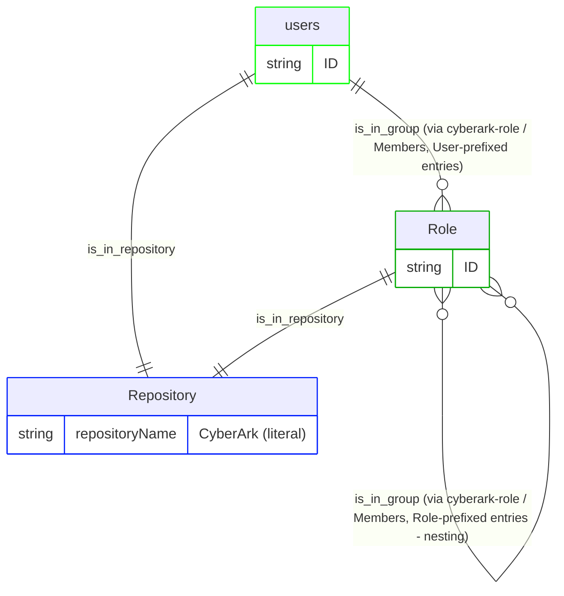
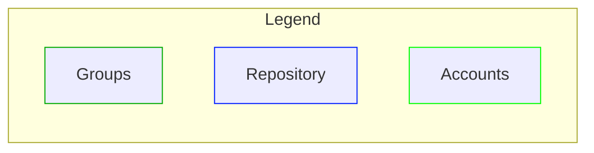

# CyberArk pipeline configuration

This document describes the RadiantOne IA graph pipeline that ingests CyberArk identity data into Identity Data Platform. It covers the membership model, configuration, vertices and edges, and release history. The pipeline is built using RadiantOne's IA graph pipeline templating system and reads CyberArk's Users and Roles. It models CyberArk Role membership, including nested role-in-role membership, as a pure group hierarchy in the Identity Data Platform graph. The model has no permission or resource vertices.

> This is the first version of the pipeline configuration, and it covers only users and roles (as groups).

This pipeline ships as a reusable mapping profile (`cyberark_v1`). Deploy it and reference it from a mapping overload (see the [Configuration walkthrough](#configuration-walkthrough) section of this document). For the connector's identity, supported versions, and data source properties, see the [readme](readme.md).

## Pipeline identity

This section describes how the pipeline fits into RadiantOne: its identity, what it depends on, and the platform versions it's been verified against. Refer to the following tables for more details. A mapping profile isn't a connector, so it doesn't carry the connector identity tables that the readme does. Instead, the following tables cover what's relevant to a pipeline.

<table>
  <tr>
    <th scope="row" align="left">Name</th><td>CyberArk pipeline (<code>cyberark_v1</code>)</td>
  </tr>
  <tr>
    <th scope="row" align="left">Source system</th><td>CyberArk (Privileged Access Management)</td>
  </tr>
  <tr>
    <th scope="row" align="left">Target platform</th><td>RadiantOne Identity Data Platform</td>
  </tr>
  <tr>
    <th scope="row" align="left">Deployment model</th><td>Reusable mapping profile + a short, environment-specific mapping overload example (see <a href="#configuration-walkthrough">Configuration walkthrough</a>)</td>
  </tr>
</table>

### Platform versions tested against

<table>
  <tr>
    <th scope="row" align="left">Identity Data Platform</th><td>2.4.0</td>
  </tr>
</table>

### Deployment scope

<table>
  <tr>
    <th scope="row" align="left">Current deployment</th><td>Single-instance: one CyberArk tenant per graph. <code>repositoryName</code>, <code>repositoryDisplayname</code>, and <code>repositoryDescription</code> are parameterized per-instance through <code>template-overload</code> (see <a href="#pipeline-configuration">Pipeline configuration</a>), so each CyberArk tenant can be given its own repository identity rather than colliding on the mapping profile's default <code>CyberArk</code> literal. Note that this alone doesn't make <code>cyberark_v1</code> safe to reference twice within the same overall mapping overload for two tenants running side by side. Source-object names, rule names, and edge names would still collide across two instances of the same mapping profile unless <code>template-transformations</code> is also applied.</td>
  </tr>
</table>

## Glossary

### The two systems involved

| Term | Plain-language meaning |
| --- | --- |
| **CyberArk** | A third-party privileged access management (PAM) product that tracks platform Users and the Roles that Users (and other Roles) are members of. It's the _source of truth_ that this pipeline reads from. |
| **RadiantOne Identity Data Platform** | The platform this pipeline runs on. Identity Data Management is the service that defines and runs pipelines (connectors, YAML configuration, ingestion). The identity observability graph and UI are where the resulting data lives and can be browsed. |

### CyberArk's own vocabulary

| Term | Plain-language meaning |
| --- | --- |
| **User** | A CyberArk platform user, a login identity that gains access by being listed as a member of one or more Roles. CyberArk's `vdUserck` object represents users at this level. |
| **Role** | A named collection of members (Users or other Roles) that behaves like a security group: whatever a Role's members inherit comes purely from being listed in that Role's `Members` attribute. CyberArk's `vdRoleck` object represents roles at this level. |
| **Member** | One entry in a Role's `Members` list. CyberArk prefixes each entry to say what kind of object it is: `"(User)<name>"` for a user, `"(Role)<name>"` for a role, so a single list can mix both kinds. This pipeline rebuilds that exact prefixed form (as `MemberIdentifier`) on both `rt_account` and `rt_group`, purely so it has something to match against the raw `Members` values. |

So the real-world chain this pipeline currently represents is as follows: **a CyberArk User's own Role memberships, plus whatever Roles those Roles are themselves nested inside.** All of it is placed into the single CyberArk repository. There is no permission or resource layer below Role in this version, and CyberArk's finer-grained constructs (Safes, privileged Accounts, Directory Services) aren't yet wired into the graph. See the note at the top of this document.

## Configuration walkthrough

To configure RadiantOne, complete the steps in the following sections.

### Configure RadiantOne for identity observability

1. [Use the connector to create a naming context](readme.md#configure-radiantone) for connecting to CyberArk.
2. Create a second proxy data source in Identity Data Management, of type **RadiantOne**, over the CyberArk data source's naming context. This pipeline mapping profile only consumes what that proxy data source exposes; it doesn't create or configure the data source itself.
    - This isn't one of the [data source types that identity observability reads change events from directly](https://developer.radiantlogic.com/idm/v7.4/connector-properties-guide/configure-connector-types-and-properties/); the proxy lets identity observability observe CyberArk data the same way it observes any LDAP source. Identity observability reads change events through the proxy, never directly through the connector data source. To configure the proxy data source, follow these steps:
      1. From the Data Sources page, click **+ New source** and select the **RadiantOne** Data Source Type. Give it a descriptive name, since this is the name you'll supply through `template-overload` when creating the mapping overload, for example, `cyberark-proxy` (see the [Pipeline configuration](#pipeline-configuration) section of this document).
      2. Enter the connection details and credentials for your Identity Data Management instance in **Host**, **Port**, **Bind DN**, and **Bind Password**.
      3. Set **Base DN** to the naming context where the CyberArk connector's data is exposed in the Directory Namespace (for example, `o=cyberark`).
      4. Click **Test Connection**, then **Save** to create the data source.
3. Load the mapping profile (<a href="resources/cyberark-privilege-cloud-mapping-profile-v1.yaml"><code>cyberark-privilege-cloud-mapping-profile-v1.yaml</code></a>) as `cyberark_v1` in Identity Data Management, containing the full model described in this document: both `source-objects`, all `vertices`, and all `edges`. **The mapping profile file must never contain a `templates:` block**. Its content is what gets referenced by a mapping overload's `ref:`; a mapping profile can't reference itself.
4. Create a mapping overload that references the mapping profile through `ref: cyberark_v1` and supplies the real data source name through `template-overload` - see the example <a href="resources/cyberark-privilege-cloud-mapping-overload-example-v1.yaml"><code>cyberark-privilege-cloud-mapping-overload-example-v1.yaml</code></a>. For the full list of overridable properties, see the [Pipeline configuration](#pipeline-configuration) section of this document.
5. For a single-instance deployment (the current use case, no multiple CyberArk tenants coexisting in the same graph), override the repository identity alongside the data source:

> ```yaml
> version: v1
> templates:
>   - ref: functions_v1
>
>   - ref: cyberark_v1
>     template-overload:
>       source-objects:
>         - name: cyberark-user
>           datasource: cyberark-proxy  # your-real-datasource name
>           meta-attributes:
>             - name: repositoryName
>               literal: CyberArk  # unique per CyberArk tenant
>             - name: repositoryDisplayname
>               literal: CyberArk
>             - name: repositoryDescription
>               literal: CyberArk repository
>         - name: cyberark-role
>           datasource: cyberark-proxy  # your-real-datasource name
>           meta-attributes:
>             - name: repositoryName
>               literal: CyberArk  # must be IDENTICAL to cyberark-user's value above
>             - name: repositoryDisplayname
>               literal: CyberArk
>             - name: repositoryDescription
>               literal: CyberArk repository
> ```
>
> Note: `datasource`, `repositoryName`, `repositoryDisplayname`, and `repositoryDescription` are all parameterized through `template-overload` here. The mapping profile still defines its own default literals for these fields (still carrying the `## -- TO OVERWRITE -- ##` markers). A mapping overload is expected to override them, as shown in the preceding example.

## Membership model

The chain described in the [Glossary](#glossary), User → Role → (parent Role) → Repository, is modeled in the graph as follows:

```text
User            -is_in_group->       Role        (direct membership - "(User)" members)
Role            -is_in_group->       Role        (nested membership - "(Role)" members)
User, Role      -is_in_repository->  Repository
```





## Pipeline configuration

A mapping overload is intended to override the following properties on the mapping profile through `template-overload` (see the example in step 4 of the [Configure RadiantOne for identity observability](#configure-radiantone-for-identity-observability) section of this document):

| Property | Required | Type | Allowed values | Description |
| --- | :---: | --- | --- | --- |
| `datasource` (on `cyberark-user`) | Yes | `string` | Any Identity Data Management data source name | Real (RadiantOne proxy) data source backing the `vdUserck` feed. |
| `datasource` (on `cyberark-role`) | Yes | `string` | Any Identity Data Management data source name | Real (RadiantOne proxy) data source backing the `vdRoleck` feed. |
| `repositoryName` (on `cyberark-user`) | Yes | `string` | Any string, unique per CyberArk tenant | Identifies this tenant's shared "CyberArk" `rt_repository` node. Must be set to the identical value as the matching `repositoryName` override on `cyberark-role` below; it's the vertex-uid both source-objects resolve to the same repository node through. |
| `repositoryName` (on `cyberark-role`) | Yes | `string` | Any string, unique per CyberArk tenant | Must be identical to the value used for `cyberark-user` above. |
| `repositoryDisplayname` (on `cyberark-user`) | No | `string` | Any string | Friendly label for the shared repository. |
| `repositoryDisplayname` (on `cyberark-role`) | No | `string` | Any string | Friendly label for the shared repository. |
| `repositoryDescription` (on `cyberark-user`) | No | `string` | Any string | Description for the shared repository. |
| `repositoryDescription` (on `cyberark-role`) | No | `string` | Any string | Description for the shared repository. |

### Vertices

| Vertex | Meaning in this model |
| --- | --- |
| `rt_account` | A CyberArk user (`vdUserck`), keyed on `ID` |
| `rt_group` | A CyberArk role (`vdRoleck`), keyed on `ID`, modeled as a group, not a permission; this pipeline has no `rt_permission` vertex |
| `rt_repository` | Shared across `vdUserck` and `vdRoleck`, both keyed on the literal `repositoryName`: one single "CyberArk" repository node |

### Edges

The following table summarizes the mechanism used to create each edge in this pipeline. Each edge uses one of two mechanisms:

- **Normalization**: the edge is created automatically because both vertices it connects are fed by the same source-object. No rules needed.
- **Key-based**: a rule matches the target using an actual foreign/reference key (`link-condition`), rather than resolving straight to a vertex-uid.

(This pipeline doesn't use the **Direct-link** mechanism at all. `Members` is a plain multivalued attribute on the proxy, not a fanned-out JSON field, so there was never a need for a derived source-object.)

| Edge | Source → Target | Mechanism | Purpose | Notes |
| --- | --- | --- | --- | --- |
| `is_in_repository` | `rt_account` → `rt_repository` | Normalization | Places every account in the CyberArk repository | Both vertices are fed by `cyberark-user`, so no rule is needed. |
| `is_in_repository` | `rt_group` → `rt_repository` | Normalization | Places every role in the CyberArk repository | Both vertices are fed by `cyberark-role`, so no rule is needed. |
| `is_in_group` | `rt_account` → `rt_group` | Key-based (`link-condition`) | Connects a user to every role it's a direct member of | Matches each `rt_account`'s `member_identifier` (computed as `"(User)" + Name`) against the firing role's raw `Members` list. Only `Members` entries with a `(User)` prefix can ever match, since that's the only prefix an account's `member_identifier` takes. |
| `is_in_group` (second instance, same name) | `rt_group` → `rt_group` | Key-based (`link-condition`, `event-vertex-role: TARGET`) | Builds role nesting: a role listed as a `(Role)`-prefixed member of another role becomes `is_in_group` of it | Recursive edge: the role firing the event is the TARGET side. Matches each `rt_group`'s own `member_identifier` (computed as `"(Role)" + Name`) against the firing role's `Members` list. |

## Change log

| Version | Date | Description |
| --- | --- | --- |
| 1.0 | 2026-08-17 | Initial version of this document. |

## Appendix A: Attribute reference

This is a complete inventory of every field this pipeline reads from CyberArk, every literal/computed value it injects, and every property it writes onto the graph - gathered directly from the current mapping profile file.

### Source-objects

Fields read from CyberArk, and values injected:

#### `cyberark-user` (reads CyberArk's `vdUserck`)

One record per CyberArk user.

| Field | Kind | Notes |
| --- | --- | --- |
| `DisplayName` | backend attribute (real data) | |
| `ID` | backend attribute (real data) | Used as `rt_account` vertex-uid. |
| `Mail` | backend attribute (real data) | |
| `MobileNumber` | backend attribute (real data) | |
| `Name` | backend attribute (real data) | Feeds both the `name` graph property and the `MemberIdentifier` computed attribute. |
| `RiskLevelRank` | backend attribute (real data) | |
| `Source` | backend attribute (real data) | |
| `Status` | backend attribute (real data) | Feeds the `disabled` computed attribute (see below); not otherwise mapped onto any graph property directly. |
| `repositoryName` | meta-attribute (literal) | `CyberArk` |
| `repositoryDisplayname` | meta-attribute (literal) | `CyberArk` |
| `repositoryDescription` | meta-attribute (literal) | `CyberArk repository` |
| `repositoryType` | meta-attribute (literal) | `Accounts` |
| `repositoryFamily` | meta-attribute (literal) | `CyberArk` |
| `disabled` | computed attribute | `evaluateExpression` on `Status == 'Suspended'` - resolves `true` only when the account's `Status` is exactly `Suspended`; any other value (`Active`, `Invited`, `Created`) resolves `false`. |
| `MemberIdentifier` | computed attribute | `evaluateExpression` on `"(User)" + Name` - rebuilds the `"(User)<name>"` form CyberArk uses inside a Role's `Members` list, so it can be matched against raw `Members` values. |

#### `cyberark-role` (reads CyberArk's `vdRoleck`)

One record per CyberArk role.

| Field | Kind | Notes |
| --- | --- | --- |
| `Description` | backend attribute (real data) | |
| `ID` | backend attribute (real data) | Used as `rt_group` vertex-uid. |
| `Members` | backend attribute (real data) | Raw list of member identifiers (`"(User)<name>"` / `"(Role)<name>"`); drives both `is_in_group` key-based rules. |
| `Name` | backend attribute (real data) | Feeds the `name`/`displayname` graph properties and the `MemberIdentifier` computed attribute. |
| `RoleRights` | backend attribute (real data) | |
| `RoleType` | backend attribute (real data) | |
| `repositoryName` | meta-attribute (literal) | `CyberArk` - also doubles as the shared `rt_repository` vertex-uid. |
| `repositoryDisplayname` | meta-attribute (literal) | `CyberArk` |
| `repositoryDescription` | meta-attribute (literal) | `CyberArk repository` |
| `repositoryType` | meta-attribute (literal) | `Accounts` |
| `repositoryFamily` | meta-attribute (literal) | `CyberArk` |
| `MemberIdentifier` | computed attribute | `evaluateExpression` on `"(Role)" + Name` - rebuilds the `"(Role)<name>"` form CyberArk uses inside a Role's `Members` list, so a role can be matched as another role's member. |

### Derived source-objects

None. No derived source-objects exist in the current mapping profile.

### Vertex properties

Properties written to the graph:

#### `rt_account`

| Property (graph) | Sourced from | Notes |
| --- | --- | --- |
| vertex-uid | `ID` | |
| `name` | `Name` | |
| `displayname` | `DisplayName` | |
| `email` | `Mail` | |
| `identifier` | `ID` | |
| `disabled` | `disabled` | Resolves from the `Status` backend attribute through the `evaluateExpression` computed attribute - see the note on `disabled` above. |
| `member_identifier` | `MemberIdentifier` | Marked `transient: true` - not a visible graph property; exists only so the `is_in_group` rule can match this account against a role's `Members` list. |

#### `rt_group`

| Property (graph) | Sourced from | Notes |
| --- | --- | --- |
| vertex-uid | `ID` | |
| `name` | `Name` | |
| `displayname` | `Name` | |
| `description` | `Description` | |
| `object_guid` | `ID` | The role's own id, kept as a secondary property alongside the vertex-uid |
| `member_identifier` | `MemberIdentifier` | Marked `transient: true`. Drives both `is_in_group` rules - as the matched value on the account-membership edge, and as the matched value on the role-nesting edge. |

#### `rt_repository`

Fed by two linkages (`cyberark-user`, `cyberark-role`), each producing this same set of properties from its own repository-prefixed literals:

| Property (graph) | Sourced from | Notes |
| --- | --- | --- |
| vertex-uid | `repositoryName` | |
| `name` | `repositoryName` | |
| `displayname` | `repositoryDisplayname` | |
| `description` | `repositoryDescription` | |
| `family` | `repositoryFamily` | |
| `type` | `repositoryType` | |

### Edge rules

Rule fields used:

| Edge | Rule | Mechanism | Fields used |
| --- | --- | --- | --- |
| `is_in_group` (account) | `user_membership` | Key-based (`link-condition`) | `field: member_identifier` EQUALS `value: Members` |
| `is_in_group` (role nesting) | `role_nesting` | Key-based (`link-condition`, `event-vertex-role: TARGET`) | `field: member_identifier` EQUALS `value: Members` |
