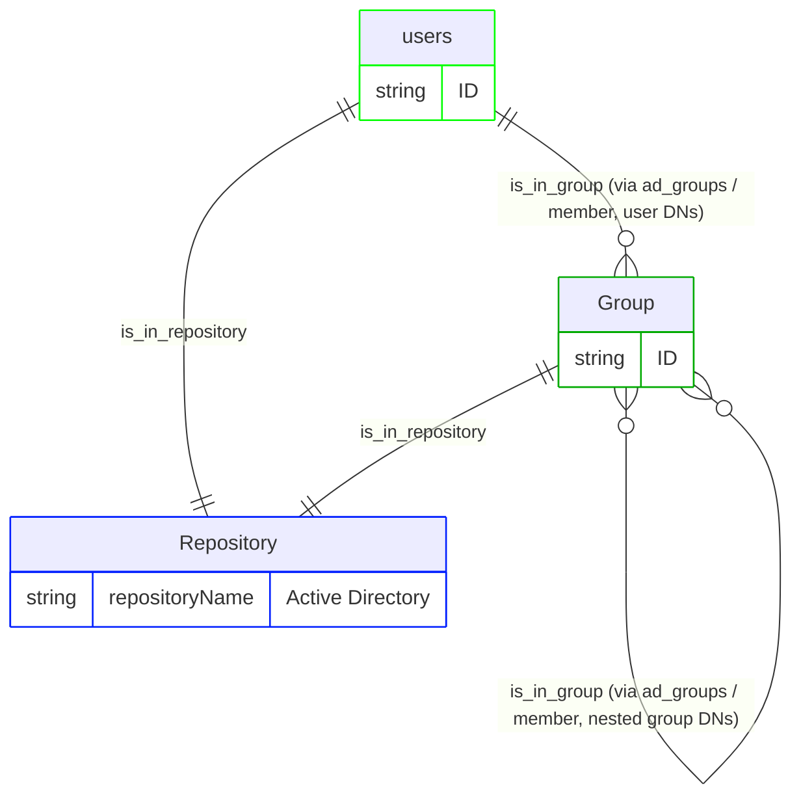
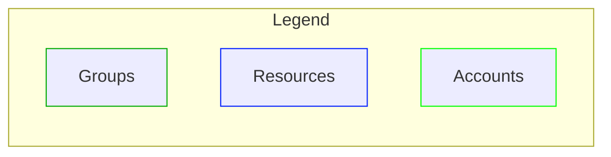

# Active Directory pipeline configuration

This document describes the RadiantOne IA graph pipeline that ingests Active Directory identity data into Identity Data Platform. It covers the membership model, configuration, vertices and edges, and release history. The pipeline is built using RadiantOne's IA graph pipeline templating system and reads AD's Users and Groups. It models AD group membership, including nested group-in-group membership, as a pure group hierarchy in the Identity Data Platform graph. The model has no permission or resource vertices.

**Note: this is the first version of the pipeline configuration and it addresses only Users and Groups.**

This pipeline ships as a reusable mapping profile (`active_directory_v1`). Deploy it and reference it from a mapping overload (see [Configuration walkthrough](#configuration-walkthrough)). For the connector's identity, supported versions, and data source properties, see the [readme](readme.md).

## Pipeline identity

This section describes how the pipeline fits into RadiantOne: its identity, what it depends on, and the platform versions it's been verified against. Refer to the following tables for more details. A mapping profile isn't a connector, so it doesn't carry the connector identity tables that the readme does. Instead, the following tables cover what's relevant to a pipeline.

<table>
  <tr>
    <th scope="row" align="left">Name</th><td>Active Directory pipeline (<code>active_directory_v1</code>)</td>
  </tr>
  <tr>
    <th scope="row" align="left">Source system</th><td>Microsoft Active Directory</td>
  </tr>
  <tr>
    <th scope="row" align="left">Target platform</th><td>RadiantOne Identity Data Platform</td>
  </tr>
  <tr>
    <th scope="row" align="left">Deployment model</th><td>Reusable mapping profile + a short, environment-specific mapping overload example (see <a href="#configuration-walkthrough">Configuration walkthrough</a>)</td>
  </tr>
</table>

### Platform versions tested against

<table>
  <tr>
    <th scope="row" align="left">Identity Data Platform</th><td> 2.4.0</td>
  </tr>
</table>

### Deployment scope

<table>
  <tr>
    <th scope="row" align="left">Current deployment</th><td>Single-instance: one Active Directory domain per graph. <code>repositoryName</code>, <code>repositoryDisplayname</code>, and <code>repositoryDescription</code> are parameterized per-instance through <code>template-overload</code> (see <a href="#pipeline-configuration">Pipeline configuration</a>), so each AD domain can be given its own repository identity rather than colliding on the mapping profile's default <code>"Active Directory"</code> literal. Note that this alone does not make <code>active_directory_v1</code> safe to reference twice within the same overall mapping overload for two domains running side by side. Source-object names, rule names, and edge names would still collide across two instances of the same mapping profile unless <code>template-transformations</code> is also applied.</td>
  </tr>
</table>

## Glossary

**The two systems involved**

| Term | Plain-language meaning |
| --- | --- |
| **Active Directory (AD)** | Microsoft's on-premises directory service. It's the *source of truth* this pipeline reads from. It tracks domain Users and the Groups that Users (and other Groups) are members of. |
| **RadiantOne Identity Data Platform** | The platform this pipeline runs on. Identity Data Management is the service that defines and runs pipelines (connectors, YAML configuration, ingestion). The identity observability graph and UI are where the resulting data lives and can be browsed. |

**AD's own vocabulary**

| Term | Plain-language meaning |
| --- | --- |
| **User** | An AD user account (`user` object class), a login identity that gains access by being listed as a member of one or more Groups. |
| **Group** | A named collection of members (Users or other Groups) that behaves like a security group: whatever a Group's members inherit comes purely from being listed in that Group's `member` attribute. AD's `group` object class represents groups at this level. Groups can nest inside other groups. |
| **Member** | One entry in a Group's `member` list, expressed as a real AD distinguished name (DN). |

So the real-world chain this pipeline currently represents is:
**an AD User's own Group memberships, plus whatever Groups those Groups are themselves nested inside.** All of it is placed into the single Active Directory repository. There is no permission or resource layer below Group in this version, and no identity layer at all. See the note at the top of this document.

## Configuration walkthrough

Complete steps in the following sections to configure RadiantOne.

### Preconditions

- An Active Directory data source already created and running in Identity Data Management (the built-in Active Directory data source type), pointed at the domain and successfully pulling data. This pipeline mapping profile only consumes what that data source exposes; it does not create or configure the data source itself (see the [readme](readme.md)).
- The real Identity Data Management data source name on hand, to supply through `template-overload` when creating the mapping overload (see [Pipeline configuration](#pipeline-configuration)).

### Configure RadiantOne

1. Load the mapping profile (<a href="resources/microsoft-active-directory-mapping-profile-v1.yaml"><code>microsoft-active-directory-mapping-profile-v1.yaml</code></a>) as `active_directory_v1` in Identity Data Management, containing the full model described in this document: both `source-objects`, all `vertices`, and all `edges`. **The mapping profile file must never contain a `templates:` block**. Its content *is* what gets referenced by a mapping overload's `ref:`; a mapping profile cannot reference itself.
2. Create a mapping overload that references the mapping profile through `ref: active_directory_v1` and supplies the real data source name through `template-overload` - see the example <a href="resources/microsoft-active-directory-mapping-overload-example-v1.yaml"><code>microsoft-active-directory-mapping-overload-example-v1.yaml</code></a>. For the full list of overridable properties, see the [Pipeline configuration](#pipeline-configuration) section.
3. For a single-instance deployment (the current use case, no multiple AD domains coexisting in the same graph), override the repository identity alongside the data source:

> ```yaml
> version: v1
> templates:
>   - ref: functions_v1
>
>   - ref: active_directory_v1
>     template-overload:
>       source-objects:
>         - name: ad_users
>           datasource: ActiveDirectory # your-real-datasource name
>           meta-attributes:
>             - name: repositoryName
>               literal: Active Directory  # unique per Active Directory tenant
>             - name: repositoryDisplayname
>               literal: Active Directory 
>             - name: repositoryDescription
>               literal: This is the account repository for Active Directory tenant 
>         - name: ad_groups
>           datasource: ActiveDirectory # your-real-datasource name
>           meta-attributes:
>             - name: repositoryName
>               literal: Active Directory  # must be IDENTICAL to ad_users' value above
>             - name: repositoryDisplayname
>               literal: Active Directory
>             - name: repositoryDescription
>               literal: This is the account repository for Active Directory tenant 
> ```
>
> Note: `datasource`, `repositoryName`, `repositoryDisplayname`, and `repositoryDescription` are all parameterized through `template-overload` here. The mapping profile still defines its own default literals for these fields (still carrying the `## -- TO OVERWRITE -- ##` markers). A mapping overload is expected to override them, as shown in the preceding example.

## Membership model

The chain described in the [Glossary](#glossary), Account → Group → (parent Group) → Repository, is modeled in the graph as follows:

```text
Account            -is_in_group->       Group        (direct membership - dn = member match)
Group              -is_in_group->       Group        (nested membership - dn = member match)
Account, Group     -is_in_repository->  Repository
```





## Pipeline configuration

A mapping overload is intended to override the following properties on the mapping profile through `template-overload` (see the example in step 2 of [Configure RadiantOne](#configure-radiantone)):

| Property | Required | Type | Allowed values | Description |
| --- | :---: | --- | --- | --- |
| `datasource` (on `ad_users`) | Yes | `string` | Any Identity Data Management data source name | Real data source backing the `user` feed. |
| `datasource` (on `ad_groups`) | Yes | `string` | Any Identity Data Management data source name | Real data source backing the `group` feed. |
| `repositoryName` (on `ad_users`) | Yes | `string` | Any string, unique per AD domain | Identifies this domain's shared `rt_repository` node. Must be set to the identical value as the matching `repositoryName` override on `ad_groups` below; it's the vertex-uid both source-objects resolve to the same repository node through. |
| `repositoryName` (on `ad_groups`) | Yes | `string` | Any string, unique per AD domain | Must be identical to the value used for `ad_users` above. |
| `repositoryDisplayname` (on `ad_users`) | No | `string` | Any string | Friendly label for this domain's repository. |
| `repositoryDisplayname` (on `ad_groups`) | No | `string` | Any string | Friendly label for this domain's repository. |
| `repositoryDescription` (on `ad_users`) | No | `string` | Any string | Description for this domain's repository. |
| `repositoryDescription` (on `ad_groups`) | No | `string` | Any string | Description for this domain's repository. |

### Vertices

| Vertex | Meaning in this model |
| --- | --- |
| `rt_account` | An AD user (`user`), keyed on `objectGUID` |
| `rt_group` | An AD group (`group`), keyed on `objectGUID`, modeled as a group, not a permission (this pipeline has no `rt_permission` vertex) |
| `rt_repository` | Shared across `ad_users` and `ad_groups`, both keyed on the literal `repositoryName`: one single "Active Directory" repository node |

### Edges

The following table summarizes the mechanism used to create each edge in this pipeline. Each edge uses one of two mechanisms:

- **Normalization**: the edge is created automatically because both vertices it connects are fed by the same source-object. No rules needed.
- **Key-based**: a rule matches the target using an actual foreign/reference key (`link-condition`), rather than resolving straight to a vertex-uid.

(This pipeline doesn't use the **Direct-link** mechanism at all. `member` is a plain multivalued attribute on the data source, not a fanned-out JSON field, so there was never a need for a derived source-object.)

| Edge | Source → Target | Mechanism | Purpose | Notes |
| --- | --- | --- | --- | --- |
| `is_in_repository` | `rt_account` → `rt_repository` | Normalization | Places every account in the Active Directory repository | Both vertices are fed by `ad_users`, so no rule is needed. |
| `is_in_repository` | `rt_group` → `rt_repository` | Normalization | Places every group in the Active Directory repository | Both vertices are fed by `ad_groups`, so no rule is needed. |
| `is_in_group` | `rt_account` → `rt_group` | Key-based (`link-condition`) | Connects a user to every group it's a direct member of | Matches each `rt_account`'s `dn` (sourced from `actualdn`) against the firing group's raw `member` list. Both sides are AD's own native distinguished names, normalized to a consistent form through `normalizeDns`. |
| `is_in_group` (second instance, same name) | `rt_group` → `rt_group` | Key-based (`link-condition`) | Builds group nesting: a group listed as a `member` of another group becomes `is_in_group` of it | Matches each `rt_group`'s own `dn` against the firing group's `member` list. |

## Change log

| Version | Date | Description |
| --- | --- | --- |
| 1.0 | 2026-09-09 | Initial version of this document. |

## Appendix A: Attribute reference

This is a complete inventory of every field this pipeline reads from Active Directory, every literal/computed value it injects, and every property it writes onto the graph - gathered directly from the current mapping profile file.

### Source-objects

Fields read from Active Directory, and values injected:

#### `ad_users` (reads AD's `user`)
One record per AD user.

| Field | Kind | Notes |
|---|---|---|
| `accountExpires` (`LONG`) | backend attribute (real data) | |
| `actualdn` | backend attribute (real data) | Re-declared as a computed attribute below (`normalizeDns`) to feed `dn`. |
| `badPasswordTime` (`LONG`) | backend attribute (real data) | Converted below to feed `bad_password_date`. |
| `badPwdCount` (`INTEGER`) | backend attribute (real data) | |
| `c` | backend attribute (real data) | Country abbreviation. |
| `co` | backend attribute (real data) | Country full name. |
| `cn` | backend attribute (real data) | Not mapped as its own property; used only as the fallback input to the computed `displayName` when AD's `displayName` is empty. |
| `comment` | backend attribute (real data) | |
| `company` | backend attribute (real data) | |
| `department` | backend attribute (real data) | |
| `departmentNumber` | backend attribute (real data) | |
| `description` | backend attribute (real data) | |
| `displayName` | backend attribute (real data) | Re-declared as a computed attribute below (`concat`, `IF_EMPTY`) to feed `displayname`. |
| `division` | backend attribute (real data) | |
| `employeeID` | backend attribute (real data) | |
| `employeeNumber` | backend attribute (real data) | |
| `employeeType` | backend attribute (real data) | |
| `givenName` | backend attribute (real data) | |
| `homePhone` | backend attribute (real data) | |
| `homePostalAddress` | backend attribute (real data) | |
| `initials` | backend attribute (real data) | |
| `l` | backend attribute (real data) | City. |
| `lastLogoff` | backend attribute (real data) | |
| `lastLogon` (`LONG`) | backend attribute (real data) | Converted below to feed `last_login_date`. |
| `logonCount` (`INTEGER`) | backend attribute (real data) | |
| `mail` | backend attribute (real data) | Re-declared as a computed attribute below (`normalizeValue`) to feed `email`. |
| `manager` | backend attribute (real data) | |
| `memberOf` | backend attribute (real data) | Not mapped onto any graph property in this version - group membership is instead driven from the group side (`ad_groups`' `member` attribute), not from the user's own `memberOf`. |
| `mobile` | backend attribute (real data) | |
| `name` | backend attribute (real data) | |
| `objectGUID` | backend attribute (real data) | Re-declared as a computed attribute below (`convertBase64ObjectGuidToUuid`) - the vertex-uid, `identifier`, and `object_guid` all resolve to the converted UUID-string form, not the raw AD value. |
| `objectSid` | backend attribute (real data) | |
| `ou` | backend attribute (real data) | |
| `preferredLanguage` | backend attribute (real data) | |
| `primaryGroupID` | backend attribute (real data) | Not mapped onto any graph property in this version - primary-group membership (e.g. "Domain Users") is not modeled by this pipeline's `is_in_group` edges, which are driven only by `ad_groups`' `member` list. |
| `pwdLastSet` (`LONG`) | backend attribute (real data) | Converted below to feed `password_last_set_date`. |
| `roomNumber` | backend attribute (real data) | |
| `sAMAccountName` | backend attribute (real data) | |
| `sn` | backend attribute (real data) | |
| `title` | backend attribute (real data) | |
| `userAccountControl` (`INTEGER`) | backend attribute (real data) | Consumed only as input to the computed account-status attributes below - never mapped directly onto a graph property itself. |
| `UserPrincipalName` | backend attribute (real data) | |
| `whenChanged` (`STRING`) | backend attribute (real data) | Re-declared as a computed attribute below (`convertLDAPGeneralizedDateTime`) to feed `last_modification_date`. |
| `whenCreated` (`STRING`) | backend attribute (real data) | Re-declared as a computed attribute below (`convertLDAPGeneralizedDateTime`) to feed `creation_date`. |
| `repositoryName` | meta-attribute (literal) | `Active Directory` - carries a `## -- TO OVERWRITE -- ##` marker |
| `repositoryDisplayname` | meta-attribute (literal) | `Active Directory` - carries a `## -- TO OVERWRITE -- ##` marker |
| `repositoryDescription` | meta-attribute (literal) | `This is the account repository for Active Directory` - carries a `## -- TO OVERWRITE -- ##` marker |
| `repositoryType` | meta-attribute (literal) | `Accounts` |
| `repositoryFamily` | meta-attribute (literal) | `AD` |
| `uacLockout` | meta-attribute (literal) | |
| `uacPwdExpired` | meta-attribute (literal) | |
| `uacDisabled` | meta-attribute (literal) | |
| `uacPwdNotRequired` | meta-attribute (literal) | |
| `uacSmartCardRequired` | meta-attribute (literal) | |
| `uacPwdCantChange` | meta-attribute (literal) | |
| `uacPwdDontExpire` | meta-attribute (literal) | |
| `empty` | meta-attribute (literal) | `""` - a constant used as the fallback auxiliary value in the `displayName` computation |
| `locked` | computed attribute | |
| `disabled` | computed attribute | |
| `password_not_required` | computed attribute | |
| `password_expired` | computed attribute | |
| `password_cant_change` | computed attribute | |
| `dont_expire_password` | computed attribute | |
| `smart_card_required` | computed attribute | |
| `privileged_account` | computed attribute | |
| `whenCreated` (2nd declaration, same name) | computed attribute | |
| `whenChanged` (2nd declaration, same name) | computed attribute | |
| `lastLogon` (2nd declaration) | computed attribute | |
| `lastLogon` (3rd declaration, same name) | computed attribute | |
| `pwdLastSet` (2nd declaration) | computed attribute | |
| `pwdLastSet` (3rd declaration, same name) | computed attribute | |
| `accountExpires` (x2) | computed attribute | |
| `badPasswordTime` (2nd declaration) | computed attribute | |
| `badPasswordTime` (3rd declaration, same name) | computed attribute | |
| `mail` (2nd declaration, same name) | computed attribute | |
| `actualdn` (2nd declaration, same name) | computed attribute | |
| `objectGUID` (2nd declaration, same name) | computed attribute | |
| `displayName` (2nd declaration, same name) | computed attribute | `concat`, `compute-strategy: IF_EMPTY` - falls back to `cn` (with an empty auxiliary value) whenever the raw `displayName` attribute is empty, so every account gets some display name. |

#### `ad_groups` (reads AD's `group`)
One record per AD group.

| Field | Kind | Notes |
|---|---|---|
| `actualdn` | backend attribute (real data) | Re-declared as a computed attribute below (`normalizeDns`) to feed `dn`. |
| `cn` | backend attribute (real data) | Not mapped as its own property; used only as the fallback input to the computed `displayName`. |
| `description` | backend attribute (real data) | |
| `displayName` | backend attribute (real data) | Re-declared as a computed attribute below (`concat`, `IF_EMPTY`) to feed `displayname`. |
| `managedBy` | backend attribute (real data) | |
| `member` | backend attribute (real data) | Raw multivalued list of AD member DNs; drives both `is_in_group` key-based rules. Re-declared as a computed attribute below to normalize its DN form. |
| `name` | backend attribute (real data) | |
| `objectGUID` | backend attribute (real data) | Re-declared as a computed attribute below (`convertBase64ObjectGuidToUuid`) - `name` and `object_guid` both resolve to the converted UUID-string form. |
| `objectSid` | backend attribute (real data) | |
| `sAMAccountName` | backend attribute (real data) | |
| `whenChanged` (`STRING`) | backend attribute (real data) | |
| `whenCreated` (`STRING`) | backend attribute (real data) | |
| `repositoryName` | meta-attribute (literal) | `Active Directory` - also doubles as the shared `rt_repository` vertex-uid; carries a `## -- TO OVERWRITE -- ##` marker |
| `repositoryDisplayname` | meta-attribute (literal) | `Active Directory` - carries a `## -- TO OVERWRITE -- ##` marker |
| `repositoryDescription` | meta-attribute (literal) | `This is the account repository for Active Directory` - carries a `## -- TO OVERWRITE -- ##` marker |
| `repositoryType` | meta-attribute (literal) | `Accounts` |
| `repositoryFamily` | meta-attribute (literal) | `AD` |
| `empty` | meta-attribute (literal) | `""` - constant used as the fallback auxiliary value in the `displayName` computation |
| `member` (2nd declaration, same name) | computed attribute | |
| `actualdn` (2nd declaration, same name) | computed attribute | |
| `membershipCreationTime` (declared twice, identical) | computed attribute | |
| `whenCreated` (2nd declaration, same name) | computed attribute | |
| `whenChanged` (2nd declaration, same name) | computed attribute | |
| `displayName` (2nd declaration, same name) | computed attribute | |
| `objectGUID` (2nd declaration, same name) | computed attribute | |

### Derived source-objects

None. No derived source-objects exist in the current mapping profile.

### Vertex properties

Properties written to the graph:

#### `rt_account`
| Property (graph) | Sourced from | Notes |
|---|---|---|
| vertex-uid | `objectGUID` (computed) | Resolves to the converted UUID-string form. |
| `comment` | `comment` | |
| `account_manager` | `manager` | |
| `given_name` | `givenName` | |
| `employee_number` | `employeeNumber` | |
| `employee_type` | `employeeType` | |
| `name` | `sAMAccountName` | |
| `displayname` | `displayName` (computed) | Falls back to `cn` when `displayName` is empty. |
| `full_name` | `name` | |
| `surname` | `sn` | |
| `samaccountname` | `sAMAccountName` | |
| `identifier` | `objectGUID` (computed) | Same converted UUID-string value as the vertex-uid. |
| `description` | `description` | |
| `email` | `mail` (computed) | Normalized via `normalizeValue`. |
| `creation_date` | `whenCreated` (computed) | Converted from LDAP generalized time. |
| `last_modification_date` | `whenChanged` (computed) | Converted from LDAP generalized time. |
| `object_guid` | `objectGUID` (computed) | Same converted UUID-string value as the vertex-uid. |
| `object_sid` | `objectSid` | |
| `dn` | `actualdn` (computed) | Normalized via `normalizeDns`. Drives both `is_in_group` rules as the matched value on the account side. |
| `login_count` | `logonCount` | |
| `disabled` | `disabled` (computed) | Derived from the `ACCOUNTDISABLE` bit of `userAccountControl`. |
| `locked` | `locked` (computed) | Derived from the `LOCKOUT` bit of `userAccountControl`. |
| `password_not_required` | `password_not_required` (computed) | Derived from the `PASSWD_NOTREQD` bit. |
| `password_cant_change` | `password_cant_change` (computed) | Derived from the `PASSWD_CANT_CHANGE` bit. |
| `privileged_account` | `privileged_account` (computed) | Inferred from `userAccountControl` via `inferPrivilegedAccountFromUac`. |
| `dont_expire_password` | `dont_expire_password` (computed) | Derived from the `DONT_EXPIRE_PASSWORD` bit. |
| `password_expired` | `password_expired` (computed) | Derived from the `PASSWORD_EXPIRED` bit. |
| `smart_card_required` | `smart_card_required` (computed) | Derived from the `SMARTCARD_REQUIRED` bit. |
| `last_login_date` | `lastLogon` (computed) | |
| `password_last_set_date` | `pwdLastSet` (computed) | |
| `bad_password_date` | `badPasswordTime` (computed) | |

#### `rt_group`
| Property (graph) | Sourced from | Notes |
|---|---|---|
| vertex-uid | `objectGUID` (computed) | Resolves to the converted UUID-string form. |
| `name` | `objectGUID` (computed) | Uses the converted GUID rather than `displayName`; `displayname` (below) carries the friendly label. |
| `external_identifier` | `sAMAccountName` | |
| `displayname` | `displayName` (computed) | Falls back to `cn` when `displayName` is empty. |
| `description` | `description` | |
| `creation_date` | `whenCreated` (computed) | |
| `last_modification_date` | `whenChanged` (computed) | |
| `object_guid` | `objectGUID` (computed) | Same converted UUID-string value as the vertex-uid and `name`. |
| `object_sid` | `objectSid` | |
| `dn` | `actualdn` (computed) | Normalized via `normalizeDns`. Drives both `is_in_group` rules as the matched value on the group side. |

#### `rt_repository`
Fed by two linkages (`ad_users`, `ad_groups`), each producing this same set of properties from its own repository-prefixed literals:

| Property (graph) | Sourced from | Notes |
|---|---|---|
| vertex-uid | `repositoryName` | |
| `name` | `repositoryName` | |
| `displayname` | `repositoryDisplayname` | |
| `description` | `repositoryDescription` | |
| `type` | `repositoryType` | |
| `family` | `repositoryFamily` | |

### Edge rules

Rule fields used:

| Edge | Rule | Mechanism | Field(s) used |
|---|---|---|---|
| `is_in_group` (account) | `ad_account_group_is_in_group` | Key-based (`link-condition`) | `field: dn` EQUALS `value: member` |
| `is_in_group` (group nesting) | `ad_group_group_is_in_group` | Key-based (`link-condition`) | `field: dn` EQUALS `value: member` |
