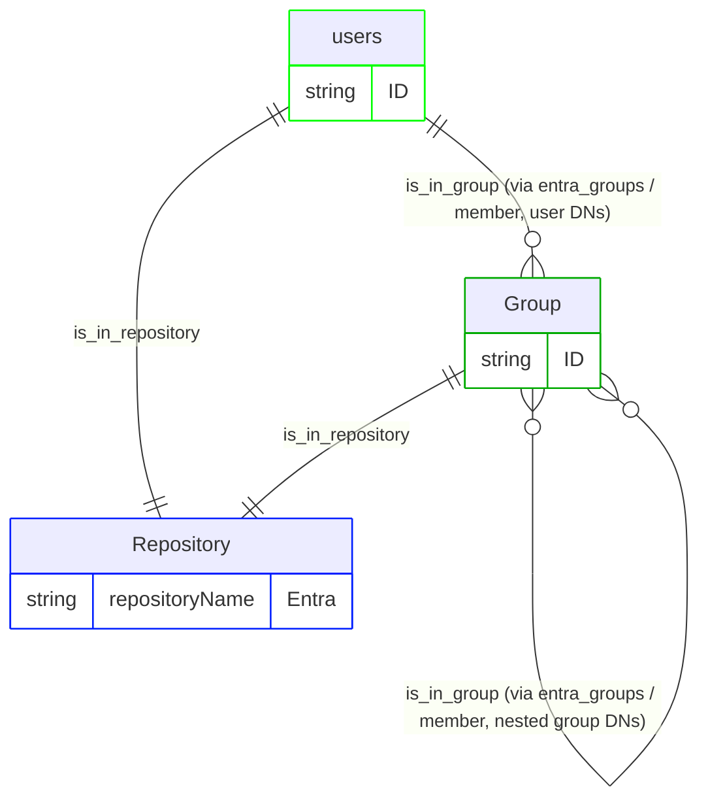
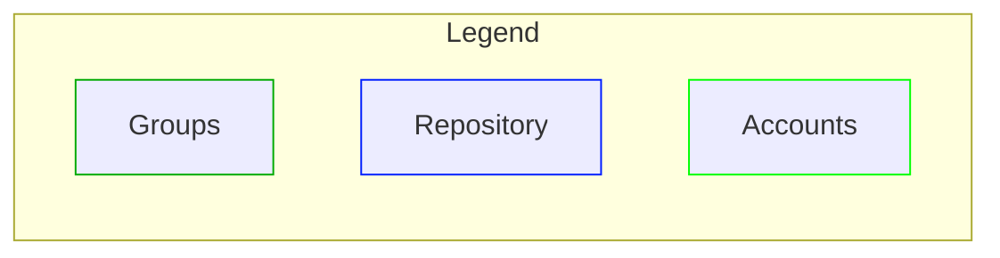

# Entra ID pipeline configuration

This document describes the RadiantOne IA graph pipeline that ingests Microsoft Entra ID identity data into Identity Data Platform. It covers the membership model, configuration, vertices and edges, and release history. The pipeline is built using RadiantOne's IA graph pipeline templating system and reads Entra's Users and Groups. It models Entra group membership, including nested group-in-group membership, as a pure group hierarchy in the Identity Data Platform graph, with no permission or resource vertices anywhere in the model.

> This is the first version of the pipeline configuration and it addresses only Users and Groups.

This pipeline ships as a reusable mapping profile (`entra_v1`). Deploy it and reference it from a mapping overload (see the [Configuration walkthrough](#configuration-walkthrough) section of this document). For the connector's identity, supported versions, and data source properties, see the [readme](readme.md).

## Pipeline identity

This section describes how the pipeline fits into RadiantOne: its identity, what it depends on, and the platform versions it's been verified against. Refer to the following tables for more details. A mapping profile isn't a connector, so it doesn't carry the connector identity tables that the readme does. Instead, the following tables cover what's relevant to a pipeline.

<table>
  <tr>
    <th scope="row" align="left">Name</th><td>Entra ID pipeline (<code>entra_v1</code>)</td>
  </tr>
  <tr>
    <th scope="row" align="left">Source system</th><td>Microsoft Entra ID</td>
  </tr>
  <tr>
    <th scope="row" align="left">Target platform</th><td>RadiantOne Identity Data Platform</td>
  </tr>
  <tr>
    <th scope="row" align="left">Deployment model</th><td>Reusable mapping profile + a short, environment-specific mapping overload example (see <a href="#configuration-walkthrough">Configuration walkthrough</a>)</td>
  </tr>
</table>

### Platform versions tested against

<table>
  <tr>
    <th scope="row" align="left">Identity Data Platform</th><td> 2.4.0</td>
  </tr>
</table>

### Deployment scope

<table>
  <tr>
    <th scope="row" align="left">Current deployment</th><td>Single-instance: one Entra tenant per graph. <code>repositoryName, repositoryDisplayname,</code> and <code>repositoryDescription</code> are parameterized per-instance through <code>template-overload</code> (see <a href="#pipeline-configuration">Pipeline configuration</a>), so each Entra tenant can be given its own repository identity rather than colliding on the mapping profile's default <code>"Entra"</code> literal. Note that this alone doesn't make <code>entra_v1</code> safe to reference twice within the same overall mapping overload for two tenants running side by side. Source-object names, rule names, and edge names would still collide across two instances of the same mapping profile unless <code>template-transformations</code> is also applied.</td>
  </tr>
</table>

## Glossary

### The two systems involved

| Term | Plain-language meaning |
| --- | --- |
| **Entra ID** | Microsoft's cloud identity platform (formerly Azure AD). It's the *source of truth* that this pipeline reads from. It tracks tenant Users and the Groups that Users (and other Groups) are members of. |
| **RadiantOne Identity Data Platform** | The platform this pipeline runs on. Identity Data Management is the service that defines and runs pipelines (connectors, YAML configuration, ingestion). The identity observability graph and UI are where the resulting data lives and can be browsed. |

### Entra's own vocabulary

| Term | Plain-language meaning |
| --- | --- |
| **User** | An Entra tenant user (`azureaduser` object class), a login identity that gains access by being listed as a member of one or more Groups. |
| **Group** | A named collection of members (Users, or other Groups) that behaves like a security group: whatever a Group's members inherit comes purely from being listed in that Group's `member` attribute. Entra's `azureadgroup` object represents groups at this level. Groups can nest inside other groups. |
| **Member** | One entry in a Group's `member` list. |

So the real-world chain this pipeline currently represents is as follows: **an Entra User's own Group memberships, plus whatever Groups those Groups are themselves nested inside**. All of it is placed into the single Entra repository. There is no permission or resource layer below Group in this version, and no identity layer at all. See the note at the top of this document.

## Configuration walkthrough

To configure RadiantOne, complete the steps in the following sections.

### Configure RadiantOne for identity observability

1. [Use the connector to create a naming context](readme.md#configure-radiantone) for connecting to Microsoft Entra ID.
2. Create a second proxy data source in Identity Data Management, of type **RadiantOne**, over the Microsoft Entra ID data source's naming context. This pipeline mapping profile only consumes what that proxy data source exposes; it doesn't create or configure the data source itself.
    - This isn't one of the [data source types that identity observability reads change events from directly](https://developer.radiantlogic.com/idm/v7.4/connector-properties-guide/configure-connector-types-and-properties/); the proxy lets identity observability observe Entra data the same way it observes any LDAP source. Identity observability reads change events through the proxy, never through the connector data source directly. To configure the proxy data source, follow these steps:
      1. From the Data Sources page, click **+ New source** and select the **RadiantOne** Data Source Type. Give it a descriptive name, since this is the name you'll supply through `template-overload` when creating the mapping overload, for example, `entra-proxy` (see the [Pipeline configuration](#pipeline-configuration) section of this document).
      2. Enter the connection details and credentials for your Identity Data Management instance in **Host**, **Port**, **Bind DN**, and **Bind Password**.
      3. Set **Base DN** to the naming context where the Microsoft Entra ID connector's data is exposed in the Directory Namespace (for example, `o=entra`).
      4. Click **Test Connection**, then **Save** to create the data source.
3. Load the mapping profile (<a href="resources/microsoft-entra-id-mapping-profile-v1.yaml"><code>microsoft-entra-id-mapping-profile-v1.yaml</code></a>) as `entra_v1` in Identity Data Management, containing the full model described in this document: both `source-objects`, all `vertices`, and all `edges`. **The mapping profile file must never contain a `templates:` block**. Its content is what gets referenced by a mapping overload's `ref:`; a mapping profile can't reference itself.
4. Create a mapping overload that references the mapping profile through `ref: entra_v1` and supplies the real data source name through `template-overload` - see the example <a href="resources/microsoft-entra-id-mapping-overload-example-v1.yaml"><code>microsoft-entra-id-mapping-overload-example-v1.yaml</code></a>. For the full list of overridable properties, see the [Pipeline configuration](#pipeline-configuration) section.
5. For a single-instance deployment (the current use case, no multiple Entra tenants coexisting in the same graph), override the repository identity alongside the data source:

> ```yaml
> version: v1
> templates:
>   - ref: functions_v1
>
>   - ref: entra_v1
>     template-overload:
>       source-objects:
>         - name: entra_users
>           datasource: entra-proxy  # your-real-datasource name
>           meta-attributes:
>             - name: repositoryName
>               literal: Entra  # unique per Entra tenant
>             - name: repositoryDisplayname
>               literal: Entra
>             - name: repositoryDescription
>               literal: This is the repository for the Entra tenant 
>         - name: entra_groups
>           datasource: entra-proxy  # your-real-datasource name
>           meta-attributes:
>             - name: repositoryName
>               literal: Entra  # must be IDENTICAL to entra_users' value above
>             - name: repositoryDisplayname
>               literal: Entra
>             - name: repositoryDescription
>               literal: This is the repository for the Entra tenant 
> ```


> Note: `datasource`, `repositoryName`, `repositoryDisplayname`, and `repositoryDescription` are parameterized via `template-overload` here. The mapping profile still defines its own default literals for the repository fields (still carrying the `## -- TO OVERWRITE -- ##` markers). A mapping overload is expected to override them, as shown in the preceding example.

## Membership Model

The chain described in the [Glossary](#glossary), Account → Group → (parent Group) → Repository, is modeled in the graph as follows:

```text
Account            -is_in_group->       Group        (direct membership - dn = member match)
Group              -is_in_group->       Group        (nested membership - dn = member match)
Account, Group     -is_in_repository->  Repository
```





## Pipeline configuration

A mapping overload is intended to override the following properties on the mapping profile through `template-overload` (see the example in step 4 of the [Configure RadiantOne for identity observability](#configure-radiantone-for-identity-observability) section of this document):

| Property | Required | Type | Allowed values | Description |
| --- | :---: | --- | --- | --- |
| `datasource` (on `entra_users`) | Yes | `string` | Any Identity Data Management data source name | Real (RadiantOne proxy) data source backing the `azureaduser` feed. |
| `datasource` (on `entra_groups`) | Yes | `string` | Any Identity Data Management data source name | Real (RadiantOne proxy) data source backing the `azureadgroup` feed. |
| `repositoryName` (on `entra_users`) | Yes | `string` | Any string, unique per Entra tenant | Identifies this tenant's shared `rt_repository` node. Must be set to the identical value as the matching `repositoryName` override on `entra_groups` below; it's the vertex-uid both source-objects resolve to the same repository node through. |
| `repositoryName` (on `entra_groups`) | Yes | `string` | Any string, unique per Entra tenant | Must be identical to the value used for `entra_users` above. |
| `repositoryDisplayname` (on `entra_users`) | No | `string` | Any string | Friendly label for this tenant's repository. |
| `repositoryDisplayname` (on `entra_groups`) | No | `string` | Any string | Friendly label for this tenant's repository. |
| `repositoryDescription` (on `entra_users`) | No | `string` | Any string | Description for this tenant's repository. |
| `repositoryDescription` (on `entra_groups`) | No | `string` | Any string | Description for this tenant's repository. |

### Vertices

| Vertex | Meaning in this model |
| --- | --- |
| `rt_account` | An Entra user (`azureaduser`), keyed on `id` |
| `rt_group` | An Entra group (`azureadgroup`), keyed on `id`, modeled as a group, not a permission (this pipeline has no `rt_permission` vertex) |
| `rt_repository` | Shared across `entra_users` and `entra_groups`, both keyed on the literal `repositoryName`: one single "Entra" repository node |

### Edges

The following table summarizes the mechanism used to create each edge in this pipeline. Each edge uses one of two mechanisms:

- **Normalization**: the edge is created automatically because both vertices it connects are fed by the same source-object. No rules needed.
- **Key-based**: a rule matches the target using an actual foreign/reference key (`link-condition`), rather than resolving straight to a vertex-uid.

(This pipeline doesn't use the **Direct-link** mechanism at all. `member` is a plain multivalued attribute on the proxy, not a fanned-out JSON field, so there was never a need for a derived source-object.)

| Edge | Source → Target | Mechanism | Purpose | Notes |
| --- | --- | --- | --- | --- |
| `is_in_repository` | `rt_account` → `rt_repository` | Normalization | Places every account in the Entra repository | Both vertices are fed by `entra_users`, so no rule is needed. |
| `is_in_repository` | `rt_group` → `rt_repository` | Normalization | Places every group in the Entra repository | Both vertices are fed by `entra_groups`, so no rule is needed. |
| `is_in_group` | `rt_account` → `rt_group` | Key-based (`link-condition`) | Connects a user to every group it's a direct member of | Matches each `rt_account`'s implicit entry `dn` against the firing group's raw `member` list. |
| `is_in_group` (second instance, same name) | `rt_group` → `rt_group` | Key-based (`link-condition`) | Builds group nesting: a group listed as a `member` of another group becomes `is_in_group` of it | Matches each `rt_group`'s own `dn` against the firing group's `member` list.|


## Change log

| Version | Date | Description |
| --- | --- | --- |
| 1.0 | 2026-09-09 | Initial version of this document. |

## Appendix A: Attribute reference

This is a complete inventory of every field this pipeline reads from Entra, every literal/computed value it injects, and every property it writes onto the graph - gathered directly from the current mapping profile file.

### Source-objects

Fields read from Entra ID, and values injected:

#### `entra_users` (reads Entra's `azureaduser`)

One record per Entra user.

| Field | Kind | Notes |
| --- | --- | --- |
| `accountEnabled` | backend attribute (real data) | Feeds the `disabled` computed attribute. |
| `city` | backend attribute (real data) | |
| `companyName` | backend attribute (real data) | |
| `country` | backend attribute (real data) | |
| `department` | backend attribute (real data) | |
| `displayName` | backend attribute (real data) | Feeds `displayname`. |
| `employeeId` | backend attribute (real data) | Feeds `employee_number`. |
| `faxNumber` | backend attribute (real data) | |
| `givenName` | backend attribute (real data) | Feeds `given_name`. |
| `id` | backend attribute (real data) | Used as `rt_account` vertex-uid; also feeds `identifier`. |
| `jobTitle` | backend attribute (real data) | |
| `mail` | backend attribute (real data) | Feeds `email`. |
| `mailNickname` | backend attribute (real data) | |
| `manager` | backend attribute (real data) | Feeds `account_manager`. |
| `mobilePhone` | backend attribute (real data) | |
| `officeLocation` | backend attribute (real data) | |
| `postalCode` | backend attribute (real data) | |
| `state` | backend attribute (real data) | |
| `streetAddress` | backend attribute (real data) | |
| `surname` | backend attribute (real data) | Feeds `surname`. |
| `userPrincipalName` | backend attribute (real data) | Feeds `name` and `external_identifier`; also the input to the `internal` computed attribute (guest detection). |
| `userType` | backend attribute (real data) | |
| `repositoryName` | meta-attribute (literal) | `Entra` - carries a `## -- TO OVERWRITE -- ##` marker. |
| `repositoryDescription` | meta-attribute (literal) | `This is a RL Entra test environment` - carries a `## -- TO OVERWRITE -- ##` marker. |
| `repositoryDisplayname` | meta-attribute (literal) | `Entra` - carries a `## -- TO OVERWRITE -- ##` marker. |
| `repositoryType` | meta-attribute (literal) | `Accounts` |
| `repositoryFamily` | meta-attribute (literal) | `Entra` |
| `guest_regex` | meta-attribute (literal) | `#(EXT)#` |
| `first_regex_group` | meta-attribute (literal, `INTEGER`) | `1` - which regex capture group to extract. |
| `guest_mapping` | meta-attribute (literal list) | `EXT,false` (comma-separated) - maps an extracted `EXT` marker to `internal: false`. |
| `disabled` | computed attribute | `evaluateExpression` on `"{!accountEnabled}"` - negates `accountEnabled`, so `accountEnabled: true` resolves `disabled: false` and vice versa. |
| `internal` (1st declaration) | computed attribute | `extractValueFromRegex` on `userPrincipalName` using `guest_regex` / `first_regex_group`. |
| `internal` (2nd declaration, same name) | computed attribute | `mapValue` on `internal` / `guest_mapping` - maps an extracted `EXT` to `false`. |

#### `entra_groups` (reads Entra's `azureadgroup`)

One record per Entra group.

| Field | Kind | Notes |
| --- | --- | --- |
| `id` | backend attribute (real data) | Used as `rt_group` vertex-uid; also feeds `external_identifier`. |
| `displayName` | backend attribute (real data) | Feeds `displayname`. |
| `description` | backend attribute (real data) | Feeds `description`. |
| `member` | backend attribute (real data) | Raw multivalued list of member DNs (`user=...,ou=user,o=Entra`. / `group=...,ou=group,o=Entra`); drives both `is_in_group` key-based rules. Re-declared as a computed attribute below to normalize its DN form. |
| `createdDateTime` | backend attribute (real data) | |
| `entrydn` | backend attribute (real data) | Feeds `dn`. |
| `owners` | backend attribute (real data) |  No ownership edge exists in this pipeline. |
| `repositoryName` | meta-attribute (literal) | `Entra` - also doubles as the shared `rt_repository` vertex-uid; carries a `## -- TO OVERWRITE -- ##` marker. |
| `repositoryDescription` | meta-attribute (literal) | `This is a RL Entra test environment` - carries a `## -- TO OVERWRITE -- ##` marker. |
| `repositoryDisplayname` | meta-attribute (literal) | `Entra` - carries a `## -- TO OVERWRITE -- ##` marker. |
| `repositoryType` | meta-attribute (literal) | `Accounts` |
| `repositoryFamily` | meta-attribute (literal) | `Entra` |
| `membershipCreationTime` | computed attribute | `getDateTimeNow` - timestamps when a membership edge is created. |
| `member` | computed attribute | `normalizeDns` on `member` - normalizes the raw `member` DN values into a consistent form for matching against `dn`. |

### Derived source-objects

None. No derived source-objects exist in the current mapping profil.

### Vertex properties

Properties written to the graph:

#### `rt_account`

| Property (graph) | Sourced from | Notes |
| --- | --- | --- |
| vertex-uid | `id` | |
| `displayname` | `displayName` | |
| `employee_number` | `employeeId` | |
| `given_name` | `givenName` | |
| `identifier` | `id` | |
| `internal` | `internal` (computed) | |
| `email` | `mail` | |
| `account_manager` | `manager` | |
| `surname` | `surname` | |
| `name` | `userPrincipalName` | |
| `disabled` | `disabled` (computed) | |
| `external_identifier` | `userPrincipalName` | |

#### `rt_group`

| Property (graph) | Sourced from | Notes |
| --- | --- | --- |
| vertex-uid | `id` | |
| `name` | `id` | Uses the raw GUID rather than `displayName`; `displayname` (below) carries the friendly label. |
| `external_identifier` | `id` | |
| `displayname` | `displayName` | |
| `description` | `description` | |
| `dn` | `entrydn` | Drives both `is_in_group` rules as the matched value on the group side. |

#### `rt_repository`

Fed by two linkages (`entra_users`, `entra_groups`), each producing this same set of properties from its own repository-prefixed literals:

| Property (graph) | Sourced from | Notes |
| --- | --- | --- |
| vertex-uid | `repositoryName` | |
| `name` | `repositoryName` | |
| `displayname` | `repositoryDisplayname` | |
| `description` | `repositoryDescription` | |
| `type` | `repositoryType` | |
| `family` | `repositoryFamily` | |

### Edge rules

Rule fields used:

| Edge | Rule | Mechanism | Fields used |
| --- | --- | --- | --- |
| `is_in_group` (account) | `entra_account_group_is_in_group` | Key-based (`link-condition`) | `field: dn` EQUALS `value: member` |
| `is_in_group` (group nesting) | `entra_group_group_is_in_group` | Key-based (`link-condition`) | `field: dn` EQUALS `value: member` |
