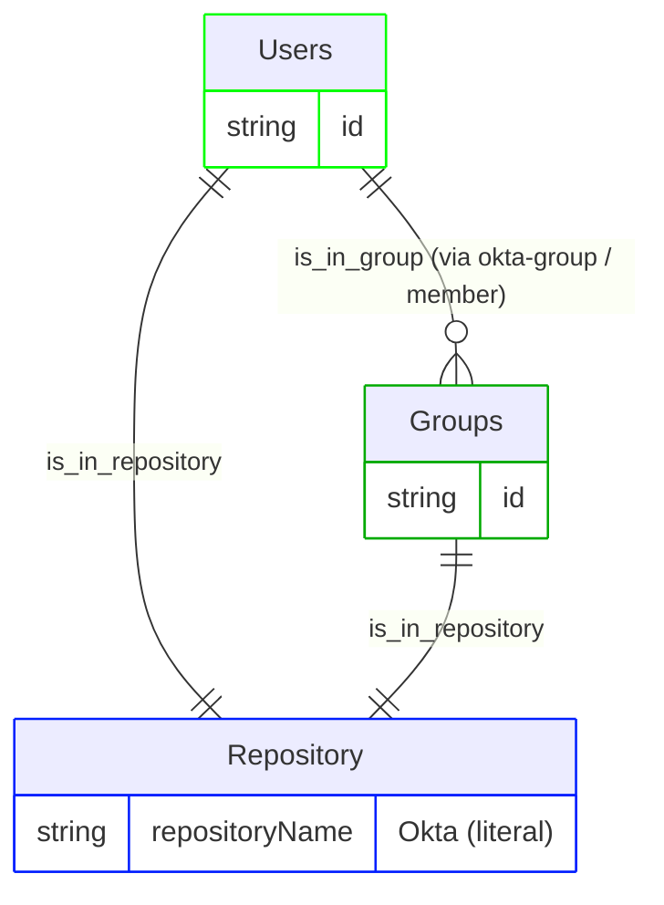
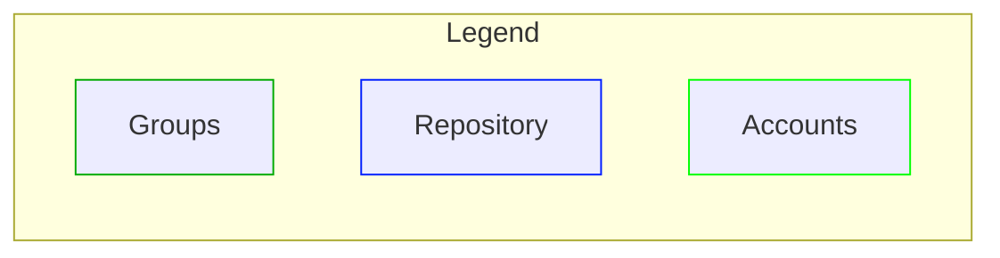

# Okta pipeline configuration

This document describes the RadiantOne IA graph pipeline that ingests Okta identity data into Identity Data Platform. It covers the membership model, configuration, vertices and edges, and release history. The pipeline is built using RadiantOne's IA graph pipeline templating system and reads Okta's Users and Groups. It models Okta group membership as a flat set of groups in the Identity Data Platform graph, with no permission or resource vertices.

> This is the first version of the pipeline configuration and it addresses only Users and Groups.

This pipeline ships as a reusable mapping profile (`okta_v1`). Deploy it and reference it from a mapping overload (see the [Configuration walkthrough](#configuration-walkthrough) section of this document). For the connector's identity, supported versions, and data source properties, see the [readme](readme.md).

## Pipeline identity

This section describes how the pipeline fits into RadiantOne: its identity, what it depends on, and the platform versions it's been verified against. Refer to the following tables for more details. A mapping profile isn't a connector, so it doesn't carry the connector identity tables that the readme does. Instead, the following tables cover what's relevant to a pipeline.

<table>
  <tr>
    <th scope="row" align="left">Name</th><td>Okta pipeline (<code>okta_v1</code>)</td>
  </tr>
  <tr>
    <th scope="row" align="left">Source system</th><td>Okta</td>
  </tr>
  <tr>
    <th scope="row" align="left">Target platform</th><td>RadiantOne Identity Data Platform</td>
  </tr>
  <tr>
    <th scope="row" align="left">Deployment model</th><td>Reusable mapping profile + a short, environment-specific mapping overload example (see <a href="#configuration-walkthrough">Configuration walkthrough</a>)</td>
  </tr>
</table>

### Platform versions tested against

<table>
  <tr>
    <th scope="row" align="left">Identity Data Platform</th><td>2.4.0</td>
  </tr>
</table>

### Deployment scope

<table>
  <tr>
    <th scope="row" align="left">Current deployment</th><td>Single-instance: one Okta tenant per graph. <code>repositoryName</code>, <code>repositoryDisplayname</code>, and <code>repositoryDescription</code> are parameterized per-instance through <code>template-overload</code> (see <a href="#pipeline-configuration">Pipeline configuration</a>), so each Okta tenant can be given its own repository identity rather than colliding on the mapping profile's default <code>Okta</code> literal. Note that this alone doesn't make <code>okta_v1</code> safe to reference twice within the same overall mapping overload for two tenants running side by side. Source-object names, rule names, and edge names would still collide across two instances of the same mapping profile unless <code>template-transformations</code> is also applied.</td>
  </tr>
</table>

## Glossary

### The two systems involved

| Term | Plain-language meaning |
| --- | --- |
| **Okta** | The source system that tracks Users and the Groups they belong to. It's the _source of truth_ that this pipeline reads from. |
| **RadiantOne Identity Data Platform** | The platform this pipeline runs on. Identity Data Management is the service that defines and runs pipelines (connectors, YAML configuration, ingestion). The identity observability graph and UI are where the resulting data lives and can be browsed. |

### Okta's own vocabulary

| Term | Plain-language meaning |
| --- | --- |
| **User** | A User in Okta is a digital identity representing a human or service account managed within the Okta identity and access management platform (exposed here as `okta-user`, backend object `oktauser`). |
| **Group** | A Group is a collection of users (exposed here as `okta-group`, backend object `oktagroup`). Membership is tracked through the group's `member` attribute, which lists the users belonging to it. |
| **Member** | One entry in a Group's `member` list. |

So the real-world chain this pipeline represents is as follows: **an Okta User → the Groups they belong to (via that Group's membership list).** All of it is placed into the single Okta repository. There is no permission or resource layer below Group in this version, and no identity layer at all. See the note at the top of this document.

## Configuration walkthrough

To configure RadiantOne, complete the steps in the following sections.

### Configure RadiantOne for identity observability

1. [Use the connector to create a naming context](readme.md#configure-radiantone) for connecting to Okta.
2. Create a second proxy data source in Identity Data Management, of type **RadiantOne**, over the Okta data source's naming context. This pipeline mapping profile only consumes what that proxy data source exposes; it doesn't create or configure the data source itself.
    - This isn't one of the [data source types that identity observability reads change events from directly](https://developer.radiantlogic.com/idm/v7.4/connector-properties-guide/configure-connector-types-and-properties/); the proxy lets identity observability observe Okta data the same way it observes any LDAP source. Identity observability reads change events through the proxy, never through the connector data source directly. To configure the proxy data source, follow these steps:
      1. From the Data Sources page, click **+ New source** and select the **RadiantOne** Data Source Type. Give it a descriptive name, since this is the name you'll supply through `template-overload` when creating the mapping overload, for example, `okta-proxy` (see the [Pipeline configuration](#pipeline-configuration) section of this document).
      2. Enter the connection details and credentials for your Identity Data Management instance in **Host**, **Port**, **Bind DN**, and **Bind Password**.
      3. Set **Base DN** to the naming context where the Okta connector's data is exposed in the Directory Namespace (for example, `o=Okta`).
      4. Click **Test Connection**, then **Save** to create the data source.
3. Load the mapping profile (<a href="resources/okta-mapping-profile-v1.yaml"><code>okta-mapping-profile-v1.yaml</code></a>) as `okta_v1` in Identity Data Management, containing the full model described in this document: all `source-objects`, `vertices`, and `edges`. **The mapping profile file must never contain a `templates:` block**. Its content is what gets referenced by a mapping overload's `ref:`; a mapping profile can't reference itself.
4. Create a mapping overload that references the mapping profile through `ref: okta_v1` and supplies the real data source name through `template-overload` - see the example <a href="resources/okta-mapping-overload-example-v1.yaml"><code>okta-mapping-overload-example-v1.yaml</code></a>. For the full list of overridable properties, see the [Pipeline configuration](#pipeline-configuration) section of this document.
5. For a single-instance deployment (the current use case, no multiple Okta tenants coexisting in the same graph), override the repository identity alongside the data source:

> ```yaml
> version: v1
> templates:
>   - ref: functions_v1
>
>   - ref: okta_v1
>     template-overload:
>       source-objects:
>         - name: okta-user
>           datasource: okta-proxy  # your-real-datasource name
>           meta-attributes:
>             - name: repositoryName
>               literal: Okta  # unique per Okta tenant
>             - name: repositoryDisplayname
>               literal: Okta
>             - name: repositoryDescription
>               literal: This is the repository for the Okta tenant
>         - name: okta-group
>           datasource: okta-proxy  # your-real-datasource name
>           meta-attributes:
>             - name: repositoryName
>               literal: Okta  # must be IDENTICAL to okta-user's value above
>             - name: repositoryDisplayname
>               literal: Okta
>             - name: repositoryDescription
>               literal: This is the repository for the Okta tenant
> ```
>
> Note: `datasource`, `repositoryName`, `repositoryDisplayname`, and `repositoryDescription` are all parameterized through `template-overload` here, on both source-objects. The mapping profile still defines its own default literals for these fields (still carrying the `## -- TO OVERWRITE -- ##` markers). A mapping overload is expected to override them, as shown in the preceding example.

## Membership model

The chain described in the [Glossary](#glossary), Account → Group → Repository, is modeled in the graph as follows:

```text
Account                     -is_in_group->        Group
Account, Group              -is_in_repository->   Repository
```





## Pipeline configuration

A mapping overload is intended to override the following properties on the mapping profile through `template-overload` (see the example in step 4 of the [Configure RadiantOne for identity observability](#configure-radiantone-for-identity-observability) section of this document):

| Property | Required | Type | Allowed values | Description |
| --- | :---: | --- | --- | --- |
| `datasource` (on `okta-user`) | Yes | `string` | Any Identity Data Management data source name | Real (RadiantOne proxy) data source backing the `oktauser` feed. |
| `datasource` (on `okta-group`) | Yes | `string` | Any Identity Data Management data source name | Real (RadiantOne proxy) data source backing the `oktagroup` feed. |
| `repositoryName` (on `okta-user`) | Yes | `string` | Any string, unique per Okta tenant | Identifies this tenant's shared `rt_repository` node. Must be set to the identical value as the matching `repositoryName` override on `okta-group` below; it's the vertex-uid both source-objects resolve to the same repository node through. |
| `repositoryName` (on `okta-group`) | Yes | `string` | Any string, unique per Okta tenant | Must be identical to the value used for `okta-user` above. |
| `repositoryDisplayname` (on `okta-user`) | No | `string` | Any string | Friendly label for this tenant's repository. |
| `repositoryDisplayname` (on `okta-group`) | No | `string` | Any string | Friendly label for this tenant's repository. |
| `repositoryDescription` (on `okta-user`) | No | `string` | Any string | Description for this tenant's repository. |
| `repositoryDescription` (on `okta-group`) | No | `string` | Any string | Description for this tenant's repository. |

### Vertices

| Vertex | Meaning in this model |
| --- | --- |
| `rt_account` | An Okta user (`oktauser`), keyed on `id` |
| `rt_group` | An Okta group (`oktagroup`), keyed on `id` |
| `rt_repository` | Shared across `oktauser` and `oktagroup`, both keyed on the literal `repositoryName`; one single "Okta" repository node |

This pipeline doesn't model roles, entitlements, or applications as separate objects, so there's no `rt_permission` or `rt_resource` vertex here.

### Edges

The following table summarizes the mechanism used to create each edge in this pipeline. Each edge uses one of two mechanisms:

- **Normalization**: the edge is created automatically because both vertices it connects are fed by the same source-object. No rules needed.
- **Key-based**: a rule matches the target using an actual foreign/reference key (`link-condition`), rather than resolving straight to a vertex-uid.

(This pipeline doesn't use the **Direct-link** mechanism at all. Every multivalued attribute it consumes is a plain attribute on the proxy, not a fanned-out JSON field, so there was never a need for a derived source-object.)

| Edge | Source → Target | Mechanism | Purpose | Notes |
| --- | --- | --- | --- | --- |
| `is_in_repository` | `rt_account` → `rt_repository` | Normalization | Places every account in the Okta repository | Both vertices are fed by `okta-user`, so no rule is needed. |
| `is_in_repository` | `rt_group` → `rt_repository` | Normalization | Places every group in the Okta repository | Both vertices are fed by `okta-group`, so no rule is needed. |
| `is_in_group` | `rt_account` → `rt_group` | Key-based (`link-condition`) | Connects an account to every group whose `member` list includes that account | Rule `okta_account_is_in_group` matches the account's `name` property (mapped from `profile-login`) against each value in the group's `member` attribute. Scoped to fire only on `okta-group` `INSERT`/`UPDATE`/`DELETE` events (`event-sources: [okta-group]`). Also writes a `created_at` edge property, sourced from the computed `membershipCreationTime` attribute. |

## Change log

| Version | Date | Description |
| --- | --- | --- |
| 1.0 | 2026-09-22 | Initial version of this document. |

## Appendix A: Attribute reference

This is a complete inventory of every field this pipeline reads from Okta, every literal/computed value it injects, and every property it writes onto the graph - gathered directly from the current mapping profile file.

### Source-objects

Fields read from Okta, and values injected:

#### `okta-user` (reads Okta's `oktauser`)

One record per Okta user.

| Field | Kind | Notes |
| --- | --- | --- |
| `activated` | backend attribute (real data) | |
| `created` | backend attribute (real data) | Feeds the `creation_datetime` computed attribute. |
| `id` | backend attribute (real data) | Used as `rt_account` vertex-uid. |
| `lastlogin` | backend attribute (real data) | Feeds the `last_login_datetime` computed attribute. |
| `lastupdated` | backend attribute (real data) | Feeds the `last_modification_datetime` computed attribute. |
| `password` | backend attribute (real data) | |
| `passwordchanged` | backend attribute (real data) | |
| `profile-city` | backend attribute (real data) | |
| `profile-costcenter` | backend attribute (real data) | |
| `profile-countrycode` | backend attribute (real data) | |
| `profile-department` | backend attribute (real data) | |
| `profile-displayname` | backend attribute (real data) | Also has a computed fallback - see below. |
| `profile-division` | backend attribute (real data) | |
| `profile-email` | backend attribute (real data) | Mapped onto `rt_account.email`. |
| `profile-employeenumber` | backend attribute (real data) | Mapped onto `rt_account.employee_number`. |
| `profile-firstname` | backend attribute (real data) | Mapped onto `rt_account.given_name`; also feeds the `profile-displayname` fallback. |
| `profile-lastname` | backend attribute (real data) | Mapped onto `rt_account.surname`; also feeds the `profile-displayname` fallback (auxiliary attribute). |
| `profile-locale` | backend attribute (real data) | |
| `profile-login` | backend attribute (real data) | Mapped onto `rt_account.name`; drives the `is_in_group` key-based rule. |
| `profile-manager` | backend attribute (real data) | Mapped onto `rt_account.account_manager`. |
| `profile-managerid` | backend attribute (real data) | |
| `profile-middlename` | backend attribute (real data) | |
| `profile-mobilephone` | backend attribute (real data) | |
| `profile-nickname` | backend attribute (real data) | |
| `profile-organization` | backend attribute (real data) | |
| `profile-postaladdress` | backend attribute (real data) | |
| `profile-primaryphone` | backend attribute (real data) | |
| `profile-profileurl` | backend attribute (real data) | |
| `profile-state` | backend attribute (real data) | |
| `profile-streetaddress` | backend attribute (real data) | |
| `profile-timezone` | backend attribute (real data) | |
| `profile-title` | backend attribute (real data) | |
| `profile-usertype` | backend attribute (real data) | |
| `profile-zipcode` | backend attribute (real data) | |
| `status` | backend attribute (real data) | Feeds the `disabled` computed attribute via `mapValue` against `disabled_map`. |
| `statuschanged` | backend attribute (real data) | |
| `transitioningtostatus` | backend attribute (real data) | |
| `disabled` | computed attribute | `mapValue` of `status` against `disabled_map` (`"DEPROVISIONED,true,SUSPENDED,true"`); when that yields no match, `normalizeValue` (`IF_EMPTY`) falls back to `disabled_default` (`"false"`). |
| `profile-displayname` | computed attribute | `concatWithSeparator` (`IF_EMPTY`) of `profile-firstname` and `profile-lastname`, joined by `name_separator` (`" "`); only applied when Okta didn't already supply a `profile-displayname` value. |
| `creation_datetime` | computed attribute | `convertDate` on `created` (`"yyyy-MM-dd'T'HH:mm:ss.SSSX"`). |
| `last_modification_datetime` | computed attribute | `convertDate` on `lastupdated` (`"yyyy-MM-dd'T'HH:mm:ss.SSSX"`). |
| `last_login_datetime` | computed attribute | `convertDate` on `lastlogin` (`"yyyy-MM-dd'T'HH:mm:ss.SSSX"`). |
| `repositoryName` | meta-attribute (literal) | `Okta` ## -- TO OVERWRITE -- ## |
| `repositoryDisplayname` | meta-attribute (literal) | `Okta` ## -- TO OVERWRITE -- ## |
| `repositoryDescription` | meta-attribute (literal) | `This is the repository for the Okta tenant` ## -- TO OVERWRITE -- ## |
| `repositoryType` | meta-attribute (literal) | `Accounts` |
| `repositoryFamily` | meta-attribute (literal) | `Okta` |
| `disabled_map` | meta-attribute (literal) | `"DEPROVISIONED,true,SUSPENDED,true"` (list separator: `,`) |
| `disabled_default` | meta-attribute (literal) | `"false"` |
| `name_separator` | meta-attribute (literal) | `" "` |

#### `okta-group` (reads Okta's `oktagroup`)

One record per Okta group.

| Field | Kind | Notes |
| --- | --- | --- |
| `created` | backend attribute (real data) | Feeds the `creation_datetime` computed attribute. |
| `id` | backend attribute (real data) | Used as `rt_group` vertex-uid. |
| `lastmembershipupdated` | backend attribute (real data) | |
| `lastupdated` | backend attribute (real data) | Feeds the `last_modification_datetime` computed attribute. |
| `member` | backend attribute (real data) | Drives the `is_in_group` key-based rule; also feeds the `membershipCreationTime` computed attribute. |
| `profile-description` | backend attribute (real data) | Mapped onto `rt_group.description`. |
| `profile-name` | backend attribute (real data) | Mapped onto `rt_group.name` and `rt_group.displayname`. |
| `type` | backend attribute (real data) | Mapped onto `rt_group.group_type`. |
| `membershipCreationTime` | computed attribute | `getDateTimeNow` on the `member` attribute (`active: false`); feeds the `is_in_group` edge's `created_at` property. |
| `creation_datetime` | computed attribute | `convertDate` on `created`. |
| `last_modification_datetime` | computed attribute | `convertDate` on `lastupdated`. |
| `repositoryName` | meta-attribute (literal) | `Okta` ## -- TO OVERWRITE -- ## |
| `repositoryDisplayname` | meta-attribute (literal) | `Okta` ## -- TO OVERWRITE -- ## |
| `repositoryDescription` | meta-attribute (literal) | `This is the repository for the Okta tenant` ## -- TO OVERWRITE -- ## |
| `repositoryType` | meta-attribute (literal) | `Accounts` |
| `repositoryFamily` | meta-attribute (literal) | `Okta` |

### Derived source-objects

None. No derived source-objects exist in the current mapping profile.

### Vertex properties

Properties written to the graph:

#### `rt_account`

| Property (graph) | Sourced from | Notes |
| --- | --- | --- |
| vertex-uid | `id` | |
| `name` | `profile-login` | |
| `displayname` | `profile-displayname` | |
| `email` | `profile-email` | |
| `given_name` | `profile-firstname` | |
| `surname` | `profile-lastname` | |
| `identifier` | `id` | Same value as the vertex-uid. |
| `account_manager` | `profile-manager` | |
| `employee_number` | `profile-employeenumber` | |
| `disabled` | `disabled` (computed) | Derived from `status` through `mapValue`, with a `false` default. |
| `creation_date` | `creation_datetime` (computed) | |
| `last_modification_date` | `last_modification_datetime` (computed) | |
| `last_login_date` | `last_login_datetime` (computed) | |

#### `rt_group`

| Property (graph) | Sourced from | Notes |
| --- | --- | --- |
| vertex-uid | `id` | |
| `name` | `profile-name` | |
| `displayname` | `profile-name` | Same source attribute as `name`. |
| `description` | `profile-description` | |
| `external_identifier` | `id` | Same value as the vertex-uid. |
| `creation_date` | `creation_datetime` (computed) | |
| `last_modification_date` | `last_modification_datetime` (computed) | |
| `group_type` | `type` | |

#### `rt_repository`

Fed by two linkages (`okta-user`, `okta-group`), each producing this same set of properties from its own repository-prefixed literals:

| Property (graph) | Sourced from | Notes |
| --- | --- | --- |
| vertex-uid | `repositoryName` | |
| `name` | `repositoryName` | |
| `displayname` | `repositoryDisplayname` | |
| `description` | `repositoryDescription` | |
| `family` | `repositoryFamily` | |
| `type` | `repositoryType` | |

### Edge rules

Rule fields used:

| Edge | Rule | Mechanism | Fields used |
| --- | --- | --- | --- |
| `is_in_group` | `okta_account_is_in_group` | Key-based (`link-condition`), scoped to `okta-group` `INSERT`/`UPDATE`/`DELETE` events | `field: name` EQUALS `value: member` |
