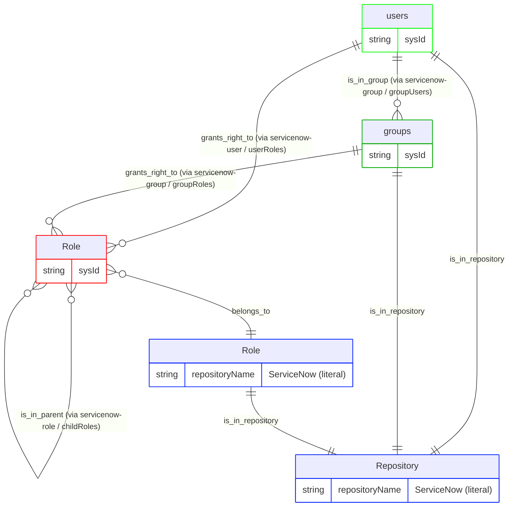
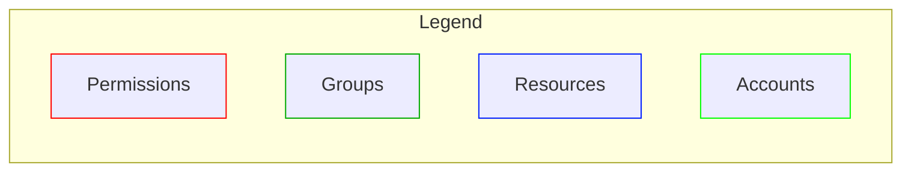

# ServiceNow pipeline configuration

This document describes the RadiantOne IA graph pipeline that ingests ServiceNow identity data into Identity Data Platform. It covers the entitlement model, configuration, vertices and edges, and release history. The pipeline is built using RadiantOne's IA graph pipeline templating system and reads ServiceNow's Users, Groups, and Roles. It models direct role grants, group-inherited role grants, and role hierarchy as a permission model in the Identity Data Platform graph, with a single shared resource node, which links to a single shared repository node, standing in for the ServiceNow application as a whole.

This pipeline ships as a reusable mapping profile (`servicenow_v1`). Deploy it and reference it from a mapping overload (see the [Configuration walkthrough](#configuration-walkthrough) section of this document). For the connector's identity, supported versions, and data source properties, see the [readme](readme.md).

## Pipeline identity

This section describes how the pipeline fits into RadiantOne: its identity, what it depends on, and the platform versions it's been verified against. Refer to the following tables for more details. A mapping profile isn't a connector, so it doesn't carry the connector identity tables that the readme does. Instead, the following tables cover what's relevant to a pipeline.

<table>
  <tr>
    <th scope="row" align="left">Name</th><td>ServiceNow pipeline (<code>servicenow_v1</code>)</td>
  </tr>
  <tr>
    <th scope="row" align="left">Source system</th><td>ServiceNow</td>
  </tr>
  <tr>
    <th scope="row" align="left">Target platform</th><td>RadiantOne Identity Data Platform</td>
  </tr>
  <tr>
    <th scope="row" align="left">Deployment model</th><td>Reusable mapping profile + a short, environment-specific mapping overload example (see <a href="#configuration-walkthrough">Configuration walkthrough</a>)</td>
  </tr>
</table>

### Platform versions tested against

<table>
  <tr>
    <th scope="row" align="left">Identity Data Platform</th><td>2.4.0</td>
  </tr>
</table>

### Deployment scope

<table>
  <tr>
    <th scope="row" align="left">Current deployment</th><td>Single-instance: one ServiceNow tenant per graph. <code>repositoryName</code>, <code>repositoryDisplayname</code>, and <code>repositoryDescription</code> are parameterized per-instance through <code>template-overload</code> (see <a href="#pipeline-configuration">Pipeline configuration</a>), so each ServiceNow tenant can be given its own repository identity rather than colliding on the mapping profile's default <code>ServiceNow</code> literal. Note that this alone doesn't make <code>servicenow_v1</code> safe to reference twice within the same overall mapping overload for two tenants running side by side. Source-object names, rule names, and edge names would still collide across two instances of the same mapping profile unless <code>template-transformations</code> is also applied.</td>
  </tr>
</table>

## Glossary

### The two systems involved

| Term | Plain-language meaning |
| --- | --- |
| **ServiceNow** | The source system that tracks Users, the Groups they belong to, and the Roles assigned to either Users or Groups. It's the _source of truth_ that this pipeline reads from. |
| **RadiantOne Identity Data Platform** | The platform this pipeline runs on. Identity Data Management is the service that defines and runs pipelines (connectors, YAML configuration, ingestion). The identity observability graph and UI are where the resulting data lives and can be browsed. |

### ServiceNow's own vocabulary

| Term | Plain-language meaning |
| --- | --- |
| **User** | A User in ServiceNow represents an individual who has access to the instance (`sys_user`, exposed here as `vdUserSN`). |
| **Group** | A Group is a collection of users organized based on department, role, or function (`sys_user_group`, exposed here as `vdGroupSN`). |
| **Role** | A named permission (`sys_user_role`, exposed here as `vdRoleSN`). Roles can be assigned directly to a User (`sys_user_has_role`) or to a Group (`sys_group_has_role`), and a Role can also include other Roles as children (role hierarchy, through `childRoles`); having the parent role automatically grants whatever it includes. |

So the real-world chain this pipeline represents is as follows: **a ServiceNow User (or a Group they belong to) → the Roles they're granted, directly or through the Group → the parent Roles those Roles are included by → the single ServiceNow application/resource every Role belongs to.** All of it is placed into a single shared repository node, standing in for the ServiceNow application as a whole.

## Configuration walkthrough

To configure RadiantOne, complete the steps in the following sections.

### Configure RadiantOne for identity observability

1. [Use the connector to create a naming context](readme.md#configure-radiantone) for connecting to ServiceNow.
2. Create a second proxy data source in Identity Data Management, of type **RadiantOne**, over the ServiceNow data source's naming context. This pipeline mapping profile only consumes what that proxy data source exposes; it doesn't create or configure the data source itself.
    - This isn't one of the [data source types that identity observability reads change events from directly](https://developer.radiantlogic.com/idm/v7.4/connector-properties-guide/configure-connector-types-and-properties/); the proxy lets identity observability observe ServiceNow data the same way it observes any LDAP source. Identity observability reads change events through the proxy, never through the connector data source directly. To configure the proxy data source, follow these steps:
      1. From the Data Sources page, click **+ New source** and select the **RadiantOne** Data Source Type. Give it a descriptive name, since this is the name you'll supply through `template-overload` when creating the mapping overload, for example, `servicenow-proxy` (see the [Pipeline configuration](#pipeline-configuration) section of this document).
      2. Enter the connection details and credentials for your Identity Data Management instance in **Host**, **Port**, **Bind DN**, and **Bind Password**.
      3. Set **Base DN** to the naming context where the ServiceNow connector's data is exposed in the Directory Namespace (for example, `o=ServiceNow`).
      4. Click **Test Connection**, then **Save** to create the data source.
3. Load the mapping profile (<a href="resources/servicenow-mapping-profile-v1.yaml"><code>servicenow-mapping-profile-v1.yaml</code></a>) as `servicenow_v1` in Identity Data Management, containing the full model described in this document: all `source-objects`, `vertices`, and `edges`. **The mapping profile file must never contain a `templates:` block**. Its content is what gets referenced by a mapping overload's `ref:`; a mapping profile can't reference itself.
4. Create a mapping overload that references the mapping profile through `ref: servicenow_v1` and supplies the real data source name through `template-overload` - see the example <a href="resources/servicenow-mapping-overload-example-v1.yaml"><code>servicenow-mapping-overload-example-v1.yaml</code></a>. For the full list of overridable properties, see the [Pipeline configuration](#pipeline-configuration) section of this document.
5. For a single-instance deployment (the current use case, no multiple ServiceNow tenants coexisting in the same graph), override the repository identity alongside the data source:

> ```yaml
> version: v1
> templates:
>   - ref: functions_v1
>
>   - ref: servicenow_v1
>     template-overload:
>       source-objects:
>         - name: servicenow-user
>           datasource: servicenow-proxy  # your-real-datasource name
>           meta-attributes:
>             - name: repositoryName
>               literal: ServiceNow  # unique per ServiceNow tenant
>             - name: repositoryDisplayname
>               literal: ServiceNow
>             - name: repositoryDescription
>               literal: ServiceNow repository
>         - name: servicenow-group
>           datasource: servicenow-proxy  # your-real-datasource name
>           meta-attributes:
>             - name: repositoryName
>               literal: ServiceNow  # must be IDENTICAL to servicenow-user's value above
>             - name: repositoryDisplayname
>               literal: ServiceNow
>             - name: repositoryDescription
>               literal: ServiceNow repository
>         - name: servicenow-role
>           datasource: servicenow-proxy  # your-real-datasource name
>           meta-attributes:
>             - name: repositoryName
>               literal: ServiceNow  # must be IDENTICAL to servicenow-user's value above
>             - name: repositoryDisplayname
>               literal: ServiceNow
>             - name: repositoryDescription
>               literal: ServiceNow repository
> ```
>
> Note: `datasource`, `repositoryName`, `repositoryDisplayname`, and `repositoryDescription` are all parameterized through `template-overload` here, on all three source-objects - `servicenow-role` needs the repository literals too, since they double as the `rt_resource` vertex-uid (see the [Vertices](#vertices) section of this document). The mapping profile still defines its own default literals for these fields (still carrying the `## -- TO OVERWRITE -- ##` markers). A mapping overload is expected to override them, as shown in the preceding example.

## Entitlement model

The chain described in the [Glossary](#glossary), Account/Group → Role → (parent Role) → Resource, is modeled in the graph as follows:

```text
Account, Group             -grants_right_to->     Role
Account                    -is_in_group->         Group
Role                       -is_in_parent->        Role        (role hierarchy)
Role                       -belongs_to->          Resource
Account, Group, Resource   -is_in_repository->    Repository
```





## Pipeline configuration

A mapping overload is intended to override the following properties on the mapping profile through `template-overload` (see the example in step 4 of the [Configure RadiantOne for identity observability](#configure-radiantone-for-identity-observability) section of this document):

| Property | Required | Type | Allowed values | Description |
| --- | :---: | --- | --- | --- |
| `datasource` (on `servicenow-user`) | Yes | `string` | Any Identity Data Management data source name | Real (RadiantOne proxy) data source backing the `vdUserSN` feed. |
| `datasource` (on `servicenow-group`) | Yes | `string` | Any Identity Data Management data source name | Real (RadiantOne proxy) data source backing the `vdGroupSN` feed. |
| `datasource` (on `servicenow-role`) | Yes | `string` | Any Identity Data Management data source name | Real (RadiantOne proxy) data source backing the `vdRoleSN` feed. |
| `repositoryName` (on `servicenow-user`) | Yes | `string` | Any string, unique per ServiceNow tenant | Identifies this tenant's shared `rt_repository`/`rt_resource` node. Must be set to the identical value as the matching `repositoryName` override on `servicenow-group` and `servicenow-role` below; it's the vertex-uid all three source-objects resolve to the same repository (and resource) node through. |
| `repositoryName` (on `servicenow-group`) | Yes | `string` | Any string, unique per ServiceNow tenant | Must be identical to the value used for `servicenow-user` above. |
| `repositoryName` (on `servicenow-role`) | Yes | `string` | Any string, unique per ServiceNow tenant | Must be identical to the value used for `servicenow-user` above. |
| `repositoryDisplayname` (on `servicenow-user`) | No | `string` | Any string | Friendly label for this tenant's repository. |
| `repositoryDisplayname` (on `servicenow-group`) | No | `string` | Any string | Friendly label for this tenant's repository. |
| `repositoryDisplayname` (on `servicenow-role`) | No | `string` | Any string | Friendly label for this tenant's repository. |
| `repositoryDescription` (on `servicenow-user`) | No | `string` | Any string | Description for this tenant's repository. |
| `repositoryDescription` (on `servicenow-group`) | No | `string` | Any string | Description for this tenant's repository. |
| `repositoryDescription` (on `servicenow-role`) | No | `string` | Any string | Description for this tenant's repository. |

### Vertices

| Vertex | Meaning in this model |
| --- | --- |
| `rt_account` | A ServiceNow user (`vdUserSN`), keyed on `sysId` |
| `rt_group` | A ServiceNow group (`vdGroupSN`), keyed on `sysId` |
| `rt_permission` | A ServiceNow role (`vdRoleSN`), keyed on `sysId`; one distinct node per role |
| `rt_resource` | The same `vdRoleSN` feed again, but keyed on the literal `repositoryName`; collapses into one single shared "ServiceNow" node standing in for the application as a whole, not one resource per role |
| `rt_repository` | Shared across `vdUserSN`, `vdGroupSN`, and `vdRoleSN`, all keyed on the literal `repositoryName`; one single "ServiceNow" repository node |

### Edges

The following table summarizes the mechanism used to create each edge in this pipeline. Each edge uses one of two mechanisms:

- **Normalization**: the edge is created automatically because both vertices it connects are fed by the same source-object. No rules needed.
- **Key-based**: a rule matches the target using an actual foreign/reference key (`link-condition`), rather than resolving straight to a vertex-uid.

(This pipeline doesn't use the **Direct-link** mechanism at all. Every multivalued attribute it consumes is a plain attribute on the proxy, not a fanned-out JSON field, so there was never a need for a derived source-object.)

| Edge | Source → Target | Mechanism | Purpose | Notes |
| --- | --- | --- | --- | --- |
| `is_in_repository` | `rt_account` → `rt_repository` | Normalization | Places every account in the ServiceNow repository | Both vertices are fed by `servicenow-user`, so no rule is needed. |
| `is_in_repository` | `rt_group` → `rt_repository` | Normalization | Places every group in the ServiceNow repository | Both vertices are fed by `servicenow-group`, so no rule is needed. |
| `is_in_repository` | `rt_resource` → `rt_repository` | Normalization | Places the single shared resource in the ServiceNow repository | Required so permissions have a path to the repository at all; they don't connect to it directly, only through the resource. |
| `is_in_group` | `rt_account` → `rt_group` | Key-based (`link-condition`) | Connects an account to every group whose `groupUsers` lists that account's username | Matches the account's `name` property (mapped from `userName`) against each value in the group's `groupUsers`. |
| `grants_right_to` | `rt_account` → `rt_permission` | Key-based (`link-condition`) | Connects an account to every role directly assigned to it | Matches the permission's `name` against each value in the account's `userRoles`. |
| `grants_right_to` | `rt_group` → `rt_permission` | Key-based (`link-condition`) | Connects a group to every role it grants its members | Matches the permission's `name` against each value in the group's `groupRoles`. |
| `belongs_to` | `rt_permission` → `rt_resource` | Normalization | Links every role to the single shared "ServiceNow" resource | Both vertices are fed by `servicenow-role`, so no rule is needed. |
| `is_in_parent` | `rt_permission` → `rt_permission` | Key-based (`link-condition`, `event-vertex-role: TARGET`) | Builds the role hierarchy: a role's `childRoles` become `is_in_parent` of that role | Recursive edge: the role firing the event is the parent/target side; the child is resolved by matching `childRoles`'s values against `rt_permission.name`. |

## Change log

| Version | Date | Description |
| --- | --- | --- |
| 1.0 | 2026-08-06 | Initial version of this document. |

## Appendix A: Attribute reference

This is a complete inventory of every field this pipeline reads from ServiceNow, every literal/computed value it injects, and every property it writes onto the graph - gathered directly from the current mapping profile file.

### Source-objects

Fields read from ServiceNow, and values injected:

#### `servicenow-user` (reads ServiceNow's `vdUserSN`)

One record per ServiceNow user.

| Field | Kind | Notes |
| --- | --- | --- |
| `active` | backend attribute (real data) | Feeds the `disabled` computed attribute. |
| `email` | backend attribute (real data) | |
| `employeeNumber` | backend attribute (real data) | |
| `federatedId` | backend attribute (real data) | |
| `firstName` | backend attribute (real data) | |
| `identityType` | backend attribute (real data) | |
| `lastName` | backend attribute (real data) | |
| `middleName` | backend attribute (real data) | |
| `mobilePhone` | backend attribute (real data) | |
| `name` | backend attribute (real data) | |
| `source` | backend attribute (real data) | |
| `sysId` | backend attribute (real data) | Used as `rt_account` vertex-uid. |
| `title` | backend attribute (real data) | |
| `userName` | backend attribute (real data) | |
| `userRoles` | backend attribute (real data) | Drives the `grants_right_to` key-based rule. |
| `disabled` | computed attribute | `evaluateExpression` on `{!active}` |
| `repositoryName` | meta-attribute (literal) | `ServiceNow` |
| `repositoryDisplayname` | meta-attribute (literal) | `ServiceNow` |
| `repositoryDescription` | meta-attribute (literal) | `ServiceNow repository` |
| `repositoryType` | meta-attribute (literal) | `Accounts` |
| `repositoryFamily` | meta-attribute (literal) | `ServiceNow` |

#### `servicenow-group` (reads ServiceNow's `vdGroupSN`)

One record per ServiceNow group.

| Field | Kind | Notes |
| --- | --- | --- |
| `active` | backend attribute (real data) | |
| `description` | backend attribute (real data) | |
| `groupRoles` | backend attribute (real data) | Drives the `grants_right_to` (group) key-based rule. |
| `groupUsers` | backend attribute (real data) | Drives the `is_in_group` key-based rule. |
| `includeMembers` | backend attribute (real data) | |
| `name` | backend attribute (real data) | |
| `source` | backend attribute (real data) | |
| `sysId` | backend attribute (real data) | Used as `rt_group` vertex-uid. |
| `type` | backend attribute (real data) | Mapped onto `rt_group.group_type`. |
| `repositoryName` | meta-attribute (literal) | `ServiceNow` |
| `repositoryDisplayname` | meta-attribute (literal) | `ServiceNow` |
| `repositoryDescription` | meta-attribute (literal) | `ServiceNow repository` |
| `repositoryType` | meta-attribute (literal) | `Accounts` |
| `repositoryFamily` | meta-attribute (literal) | `ServiceNow` |

#### `servicenow-role` (reads ServiceNow's `vdRoleSN`)

One record per ServiceNow role. Feeds both `rt_permission` and `rt_resource` and contributes to `rt_repository`.

| Field | Kind | Notes |
| --- | --- | --- |
| `canDelegate` | backend attribute (real data) | |
| `childRoles` | backend attribute (real data) | Drives the `is_in_parent` key-based rule. |
| `description` | backend attribute (real data) | |
| `elevatedPrivilege` | backend attribute (real data) | |
| `federatedId` | backend attribute (real data) | |
| `grantable` | backend attribute (real data) | |
| `includesRoles` | backend attribute (real data) | |
| `name` | backend attribute (real data) | |
| `scopedAdmin` | backend attribute (real data) | |
| `suffix` | backend attribute (real data) | |
| `sysCreatedBy` | backend attribute (real data) | |
| `sysId` | backend attribute (real data) | Used as `rt_permission` vertex-uid. |
| `sysPolicy` | backend attribute (real data) | |
| `repositoryName` | meta-attribute (literal) | `ServiceNow`; also doubles as the `rt_resource` and `rt_repository` shared vertex-uid. |
| `repositoryDisplayname` | meta-attribute (literal) | `ServiceNow` |
| `repositoryDescription` | meta-attribute (literal) | `ServiceNow repository` |
| `repositoryType` | meta-attribute (literal) | `Accounts` |
| `repositoryFamily` | meta-attribute (literal) | `ServiceNow` |
| `permissionType` | meta-attribute (literal) | `Role` |
| `resourceType` | meta-attribute (literal) | `Profile` |

### Derived source-objects

None. No derived source-objects exist in the current mapping profile.

### Vertex properties

Properties written to the graph:

#### `rt_account`

| Property (graph) | Sourced from | Notes |
| --- | --- | --- |
| vertex-uid | `sysId` | |
| `name` | `userName` | |
| `displayname` | `name` | |
| `email` | `email` | |
| `given_name` | `firstName` | |
| `surname` | `lastName` | |
| `identifier` | `sysId` | Same value as the vertex-uid. |
| `disabled` | `disabled` (computed) | Derived from `active` through `evaluateExpression`. |

#### `rt_group`

| Property (graph) | Sourced from | Notes |
| --- | --- | --- |
| vertex-uid | `sysId` | |
| `name` | `name` | |
| `displayname` | `name` | |
| `description` | `description` | |
| `group_type` | `type` | |

#### `rt_permission`

| Property (graph) | Sourced from | Notes |
| --- | --- | --- |
| vertex-uid | `sysId` | |
| `name` | `name` | |
| `displayname` | `name` | |
| `description` | `description` | |
| `family` | `repositoryFamily` | |
| `type` | `permissionType` | |

#### `rt_repository`

Fed by three linkages (`servicenow-user`, `servicenow-group`, `servicenow-role`), each producing this same set of properties from its own repository-prefixed literals:

| Property (graph) | Sourced from | Notes |
| --- | --- | --- |
| vertex-uid | `repositoryName` | |
| `name` | `repositoryName` | |
| `displayname` | `repositoryDisplayname` | |
| `description` | `repositoryDescription` | |
| `family` | `repositoryFamily` | |
| `type` | `repositoryType` | |

#### `rt_resource`

Fed by `servicenow-role` only, keyed on the same constant as `rt_repository`:

| Property (graph) | Sourced from | Notes |
| --- | --- | --- |
| vertex-uid | `repositoryName` | Same literal used as `rt_repository`'s vertex-uid - see the [Deployment scope](#deployment-scope) section of this document. |
| `name` | `repositoryName` | |
| `displayname` | `repositoryDisplayname` | |
| `family` | `repositoryFamily` | |
| `type` | `resourceType` | |

### Edge rules

Rule fields used:

| Edge | Rule | Mechanism | Fields used |
| --- | --- | --- | --- |
| `is_in_group` | `user_membership` | Key-based (`link-condition`) | `field: name` EQUALS `value: groupUsers` |
| `grants_right_to` (account) | `user_role_assignment` | Key-based (`link-condition`) | `field: name` EQUALS `value: userRoles` |
| `grants_right_to` (group) | `group_role_assignment` | Key-based (`link-condition`) | `field: name` EQUALS `value: groupRoles` |
| `is_in_parent` | `role_hierarchy` | Key-based (`link-condition`, `event-vertex-role: TARGET`) | `field: name` EQUALS `value: childRoles` |
